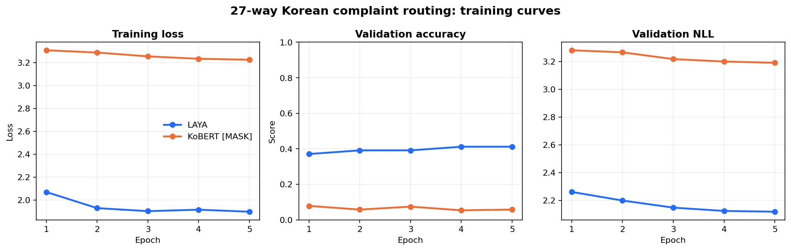

# LAYA Korean Eval

Docker Compose로 LAYA Multilingual의 **한국어 분류 성능, 추론 지연, 메모리, 추가 학습 전후 변화**를 측정하는 독립 실험 프로젝트입니다. 생성형 챗봇 평가나 공식 LAYA 벤치마크는 아닙니다.

전체 배경, Jev와의 차이, 아키텍처, 한국어 NSMC 실험, 27개 민원 유형 후속 실험, 300개 유형 확장안과 Jev 한국어 전망을 한 문서로 읽으려면 [standalone Technical Deep Dive](docs/laya-technical-deep-dive/blog.html)를 내려받아 브라우저에서 여세요. 수정 가능한 [Markdown 원고](docs/laya-technical-deep-dive/blog.md)와 [출처 목록](docs/laya-technical-deep-dive/sources.md)도 함께 제공합니다.

후속편에서는 EmbeddingGemma 2를 text-only 검색기로 붙여 같은 민원 시험지를 다시 평가했습니다. 256차원 검색 단독은 27개 유형에서 71.6%, 검색 top-3를 기존 LAYA가 재순위화한 결과는 50.6%였습니다. 새 9개 유형은 설명만 index에 추가해 59.3% top-1을 얻었습니다. [2편 standalone 글](docs/laya-embeddinggemma2-retrieval-part2/blog.html), [원고](docs/laya-embeddinggemma2-retrieval-part2/blog.md), [실험 결과](results/embeddinggemma2-retrieval-2026-10-07/README.md)를 제공합니다.

### EmbeddingGemma 2 검색 실험 빠른 실행

```bash
docker compose build retrieval
docker compose --profile setup run --rm prepare-retrieval
docker compose run --rm retrieval python -u research/run_embedding_retrieval.py \
  --model evaluation/models/embeddinggemma-2-914f7f89142e \
  --taxonomy datasets/complaints/taxonomy.json \
  --cases datasets/complaints/cases.json \
  --out evaluation/my-retrieval-run
```

`prepare-retrieval`만 네트워크를 사용합니다. `retrieval`은 이미지·음성 encoder를 끈 270M text-only 구성으로 offline 실행합니다. 모델 snapshot revision은 `914f7f89142e33e77833254d9c9b90c3cef7303b`로 고정했습니다.

## 빠른 시작

Docker Desktop의 Linux 컨테이너(또는 Linux Docker Engine)와 Docker Compose v2가 필요합니다. CPU 전용이며 컨테이너에는 CPU 4개 quota와 메모리 8GiB를 할당합니다. 기본 모델과 학습 모델을 저장할 디스크 공간도 필요합니다.

```bash
git clone https://github.com/sungreong/laya-korean-eval.git
cd laya-korean-eval
docker compose build
docker compose --profile setup run --rm prepare
docker compose --profile test run --rm test
docker compose run --rm evaluate python examples/quickstart.py
docker compose run --rm evaluate
docker compose run --rm evaluate python research/analyze_results.py
```

`prepare`는 고정된 LAYA 소스, NSMC 데이터, 모델을 다운로드합니다. **준비 서비스만 외부 네트워크에 연결**하며 평가와 테스트 서비스는 네트워크를 차단합니다. 모델·다운로드 데이터·새 결과는 Git에서 제외됩니다. 준비 명령을 다시 실행하면 데이터는 다시 준비하고, 모델 파일은 해시가 일치할 때 재사용합니다.

모델 파일은 최초 실행에서 기록한 SHA256과 크기를 검증한 뒤 저장합니다. `analyze_results.py`는 완료된 실행의 한국어/영어 질문과 학습 전후 결과에 대해 paired bootstrap 및 McNemar 검정을 추가합니다. 여러 가설에 대한 보정을 하지 않은 탐색적 분석입니다. 새 결과 경로를 썼다면 이 명령에도 같은 `LAYA_RESULTS_DIR`를 전달하세요.

평가 결과는 `evaluation/results/summary.json`, 문항별 예측은 같은 디렉터리에 저장됩니다. 완료된 실행은 `status: complete`입니다. 학습 모델은 `evaluation/models/finetuned/`에 저장합니다. 기존 결과나 모델 경로는 덮어쓰지 않습니다. 재실행은 새 경로를 지정하세요.

```bash
docker compose run --rm -e LAYA_RESULTS_DIR=evaluation/run-02 -e LAYA_FINETUNED_DIR=evaluation/models/run-02 evaluate
```

## 무엇을 측정하나

1. 동일 학습 표본을 사용한 문자 TF-IDF + Logistic Regression 기준선.
2. 동일 한국어 리뷰에 한국어 질문과 영어 질문을 적용한 LAYA 분류 성능.
3. 별도 업무의 한국어·부정·문맥·혼합 언어·전문용어·번역투 진단.
4. 질문 위치와 입력 한도에 따른 장문 잘림, 한영 예문 토큰 수.
5. 인코더를 동결한 판단 헤드 학습과 확률 보정 전후 비교.

정확도, Macro F1, Wilson 95% 구간, ECE, Brier score, 고확신 응답의 coverage/accuracy, 질문당 p50/p95 지연시간과 프로세스 메모리를 기록합니다. 지연시간은 워밍업 후 토큰화부터 응답 구성까지 포함합니다. 모델 로딩 시간은 별도로 기록합니다.

## 공개한 파일럿 결과

2026-10-05 Docker CPU 실행. NSMC 학습 200 / 보정 80 / 평가 200개, seed 42. [실험 계획](research/evaluation-protocol.md), [측정 결과](results/pilot-2026-10-05/summary.json).

| 조건 | 정확도 |
|---|---:|
| TF-IDF + Logistic Regression | 70% |
| LAYA, 한국어 질문 | 66% |
| LAYA, 영어 질문·한국어 리뷰 | 73% |
| 판단 헤드 2 epoch 학습 후, 한국어 질문 | 66% |

이 수치는 한국어 전체 능력이나 서비스 품질을 대표하지 않는 소규모 파일럿입니다. 학습으로 정확도가 개선되지 않은 결과도 그대로 공개합니다. 자체 진단 24개는 독립 검수가 없고, Jev 직접 호출, 일반적인 고정-head KoBERT, GPU 및 다중 seed 평가는 수행하지 않았습니다. 블로그의 Jev 수치는 외부 공개 연구이며 이 저장소의 LAYA 시험과 같은 데이터에서 나온 직접 비교가 아닙니다. LAYA는 문장을 생성하지 않으므로 한국어 생성 품질은 평가 대상이 아닙니다.

## 코드 구조

```text
research/run_evaluation.py       전체 실험 실행
research/metrics.py              평가 지표 계산
research/prepare_all.py          소스·데이터·모델 준비
research/prepare_source.py       고정된 upstream 소스 다운로드
research/prepare_eval.py         고정 seed 데이터 분할·자체 진단
research/download_checkpoint.py  고정 revision 모델 다운로드
examples/quickstart.py           단일 문의 추론
examples/train_domain.py         사용자 데이터 학습·보정 예제
tests/                          지표·실행본 해시·데이터 분할 검증
results/pilot-2026-10-05/         최초 실측 결과와 실행본
```

공개 결과의 `executed-run_evaluation.py`는 최초 실행을 증명하는 보존본입니다. 직접 실행하지 마세요. 현재 실행 파일은 지표 함수를 분리하고 CPU 자동 감지, 실행 상태 및 덮어쓰기 방지를 추가했습니다. 원본 실행본의 해시는 테스트로 확인합니다. 공개 결과 경로와 현재 생성 결과 경로는 구분합니다.

## 내 데이터로 추가 학습

### 학습 표본 확대와 epoch 비교

2026-10-07에 학습 리뷰를 200개에서 1,000개로 늘려 판단 헤드를 5 epoch 학습했습니다. 별도 검증셋 200개로 epoch를 선택했고, 선택한 5 epoch 모델을 FP16으로 저장·재로딩한 뒤 시험했습니다. 학습과 검증 약 22.5분, 전체 실행 약 28.4분이 걸렸습니다.

| 조건 | 기존 시험 200개 | 새 시험 500개 |
|---|---:|---:|
| 기본 LAYA, 한국어 질문 | 66.0% | 68.6% |
| 1,000개·5 epoch 학습 모델 | 66.5% | 68.4% |
| TF-IDF+LR, 학습 1,000개 | 77.5% | 75.2% |

검증 정확도는 학습 전 65.5%, 1~5 epoch 각각 65.5%, 66.0%, 66.0%, 66.5%, 66.5%였습니다. 정확도가 동률이면 NLL이 낮은 시점을 선택했습니다. 시험셋은 선택에 사용하지 않았습니다. 새 시험셋의 변화는 -0.2%p, paired bootstrap 95% 구간 약 -0.81~+0.40%p로 **뚜렷한 개선을 확인하지 못했습니다**. 단일 seed·인코더 동결 실험이므로 전체 인코더 학습 결과로 일반화할 수 없습니다.

[실험 계획](research/scaling-protocol.md), [결과](results/scaling-2026-10-07/summary.json), [표본 ID와 출처 해시](results/scaling-2026-10-07/provenance.json).

```bash
docker compose run --rm evaluate python research/run_scaling.py --train-size 1000 --epochs 5 --out evaluation/scale-1000-e5
```

출력 경로가 이미 있으면 새 경로를 지정하세요. 기존 학습 200개를 유지한 채 실제 NSMC 리뷰를 추가하며, 임의로 생성한 리뷰 정답은 쓰지 않습니다. `selected-model/`이 선택·저장된 체크포인트입니다.

### 업무 데이터 학습 템플릿

데이터는 `state`, `questions`, `gold` 필드가 있는 JSONL입니다. 준비 후 `evaluation/data/train.jsonl`을 예제로 참고하세요. 고객·대화·원본 문서 단위로 학습/보정/시험을 분리하세요.

```bash
docker compose run --rm evaluate python examples/train_domain.py --base evaluation/models/base --train evaluation/data/train.jsonl --calibration evaluation/data/calibration.jsonl --test evaluation/data/test.jsonl --out evaluation/models/my-domain --freeze-encoder
```

이 예제는 학습·보정·저장만 수행하며, 전달한 test 자료는 중복 검사에만 사용합니다. **사용자 데이터의 test 정확도를 자동 산출하지 않습니다.** 전체 전후 성능 비교는 `research/run_evaluation.py`에 구현되어 있으며 현재 NSMC 감정 분류 형식에 맞춰져 있습니다. 다른 업무에는 질문과 정답 추출 부분을 맞춰야 합니다.

기본 모델은 유지됩니다. 추가 학습 모델이 다른 기존 업무의 성능을 보존하는지는 별도 평가해야 합니다. 결과에 기록된 추가 학습 추론은 메모리의 FP32 가중치를 사용하며, upstream 저장 함수가 내보내는 FP16 체크포인트를 재로딩한 성능은 별도 검증하지 않았습니다.

## 테스트와 재현성

Docker 테스트는 지표의 경계 조건, 공개 예측으로부터 지표 재계산, 원 실행본 SHA256, 준비된 표본의 해시와 분할 간 중복을 확인합니다. GitHub Actions는 모델을 다운로드하지 않는 경량 테스트만 실행하며, 이는 모델 성능 평가를 대체하지 않습니다.

공개 전 전체 파이프라인 재실행 결과는 [VALIDATION.md](VALIDATION.md)에 기록했습니다.

최초 표본은 Windows에서 준비했으므로 파일 해시는 CRLF 기준입니다. 데이터 검증은 줄바꿈만 해당 표현으로 맞춘 뒤 비교합니다. 문항 내용과 순서는 같아야 하며, 실행본 SHA256 검증은 줄바꿈도 변환하지 않습니다.

Python 3.12, PyTorch 2.8.0 CPU, Transformers 4.56.1과 직접 의존성 버전을 고정했습니다. 전이 의존성 전체를 잠그지는 않았으므로 장기 재현 시 Docker 이미지도 보관하세요. 최초 측정 장비는 Ryzen 7 PRO 7840U이고, 새 실행은 실제 CPU 정보를 기록합니다. 지연시간은 장비와 실행 순서에 따라 달라집니다.

외부 소스·모델·데이터의 출처와 조건은 [THIRD_PARTY.md](THIRD_PARTY.md)에 정리했습니다.

## 대→중→소 민원 유형 분류

[민원 진단 데이터](datasets/complaints/README.md)는 생활환경, 도로·교통, 행정·복지의 대분류 3개와 각 대분류의 중분류 3개, 각 중분류의 소분류 3개로 구성합니다. 총 27개 소분류입니다.

콜센터/인터넷 상담을 가정한 가상 요약 90개를 작성했습니다. 명확한 표현, 간접 표현, 복합 맥락을 각 소분류당 하나씩 배치한 81개와 정보 부족으로 추가 확인이 필요한 9개입니다. 애매한 9개는 단일 정답 정확도에서 제외하고 허용 경로 집합을 따로 기록합니다. 공식 민원 체계나 독립 검수된 실서비스 데이터가 아닙니다.

```bash
docker compose run --rm evaluate python research/run_complaints.py --model evaluation/models/base --out evaluation/complaints-base
docker compose run --rm evaluate python research/run_complaints.py --model evaluation/scale-1000-e5/selected-model --out evaluation/complaints-trained
```

두 번째 명령은 앞의 확대 학습을 먼저 실행해야 합니다. 학습 모델은 **민원이 아니라 영화 리뷰 감정 분류로 학습한 모델**입니다. 두 모델 모두 이 민원 90개에는 학습하지 않았습니다.

2026-10-07 Docker CPU 측정, 단일 정답 81개 기준:

| 모델·방식 | 대분류 | 대+중 경로 | 전체 대+중+소 경로 |
|---|---:|---:|---:|
| 기본 모델·27개 일괄 선택 | 56.8% | 45.7% | 24.7% (20/81) |
| 기본 모델·대→중→소 순차 선택 | 60.5% | 38.3% | 24.7% (20/81) |
| 감정 학습 모델·27개 일괄 선택 | 58.0% | 46.9% | 27.2% (22/81) |
| 감정 학습 모델·대→중→소 순차 선택 | 60.5% | 38.3% | 24.7% (20/81) |

기본 모델의 난이도별 전체 경로 정확도:

| 사례 유형 | 일괄 선택 | 순차 선택 |
|---|---:|---:|
| 명확한 표현 27개 | 44.4% | 33.3% |
| 간접 표현 27개 | 18.5% | 18.5% |
| 복합 맥락 27개 | 11.1% | 22.2% |

순차 선택은 예측한 부모 아래로만 내려갑니다. 기본 모델에서 대분류를 틀린 32개는 하위 단계에서 복구할 수 없었고, 중분류에서 18개, 소분류에서 11개가 추가로 틀렸습니다. 27개 일괄 선택도 후보 수는 정상적으로 처리했으나 세부 구별 정확도가 낮았습니다. 네 조건 모두 입력/후보 잘림은 0건이었습니다.

실제 출력 예시:

- “승인된 복지 지원금이 예정일에 입금되지 않음”: 기본 순차 모델은 `행정·복지 → 복지지원 → 지급 누락·지연`으로 정답을 골랐습니다. 일괄 모델은 `도로·교통 → 대중교통 → 버스 운행`으로 틀렸습니다.
- “차도에 포트홀이 생겨 도로 보수를 요청”: 기본 모델의 두 방식 모두 `도로·교통 → 도로시설 → 도로 배수`로 오분류했습니다. 정답은 `노면·보도 파손`입니다.
- “복지 신청이 진행되지 않으며 화면 오류인지 서류 문제인지 불명확”: 단일 정답이 없습니다. 일괄 모델은 `온라인 민원 장애`, 순차 모델은 `신청·제출 서류`를 골랐습니다. 두 경로 모두 가능한 해석이지만, 실제 상담에서는 추가 질문이 필요합니다.

애매한 9개에서는 모든 조건이 허용 경로 집합에 5개를 맞혔습니다. 이를 55.6%의 확정 분류 정확도로 해석하면 안 됩니다. 평가에서 강제로 하나를 고르게 했으므로 보류·재질문 판단 능력은 검증하지 않았습니다.

이 설정의 정확도로 자동 민원 배정을 바로 도입하기는 어렵다는 것이 이번 진단의 해석입니다. 특히 다른 도메인의 감정 학습으로 민원 분류가 충분히 개선됐다고 볼 수 없습니다. 실제 업무 분류표와 독립 검수한 민원 라벨로 학습/검증/시험을 분리하는 후속 실험이 필요합니다. 분류명, 설명, 후보 순서와 한국어 지시문 민감도는 아직 비교하지 않았습니다.

[기본 모델 결과](results/complaints-2026-10-07/base/summary.json), [감정 학습 모델 결과](results/complaints-2026-10-07/trained/summary.json). 각 폴더의 `*_predictions.json`에 입력, 정답, 예측 경로, 단계별 후보 확률과 token 사용량을 보존했습니다.

## 민원 도메인 추가 학습과 실제 `[MASK]` KoBERT 비교

민원 유형별 합성 학습 729개와 validation 243개를 새로 만들었습니다. 27개 소분류마다 학습 27개, validation 9개로 균형을 맞췄습니다. 콜센터 대화체, 인터넷 민원 문장, 짧은 메모, 긴 맥락, 간접 요청, 해결된 과거 문제, 한영 혼합, 모바일 축약, 복합 이슈를 섞었습니다. 기존 90개 시험셋과 완전 동일한 문장은 없습니다.

두 실험 모두 인코더를 동결하고 5 epoch을 실행했습니다. LAYA는 원래 decision head를 학습했고, KoBERT 실험은 실제 tokenizer의 `[MASK]` token(ID 4)을 후보마다 넣은 뒤 해당 hidden vector를 하나의 공유 MLP로 점수화했습니다. KoBERT용 구현은 **공식 LAYA나 공식 KoBERT 분류 방법이 아닌 이 저장소의 실험적 adapter**입니다.

```text
민원 요약 + 지시문 + ([MASK] 후보 설명 × N)
        ↓ KoBERT encoder (frozen)
각 [MASK] 위치의 768차원 hidden vector
        ↓ 같은 MLP scorer를 모든 후보에 공유
N개 logit → softmax → 한 후보 선택
```

KoBERT는 입력 한도가 512 token이라 27개 후보 설명을 그대로 넣은 574-token 질문을 처리하지 못했습니다. 최종 구현은 민원 본문에 최대 128 token을 먼저 예약하고, 각 후보 설명에 같은 token 예산을 배정합니다. 실제 시험의 27개 일괄 방식에서는 후보당 14 token을 썼고 예시 입력 하나에서 후보 설명 100 token이 잘렸습니다. 모든 예측 trace에는 실제 marker token ID, 후보 예산과 잘린 token 수를 기록했습니다.



validation 결과:

| Epoch | LAYA 정확도 | LAYA NLL | KoBERT `[MASK]` 정확도 | KoBERT NLL |
|---:|---:|---:|---:|---:|
| 학습 전 | — | — | 6.2% | 3.296 |
| 1 | 37.0% | 2.261 | **7.8%** | 3.280 |
| 2 | 39.1% | 2.199 | 5.8% | 3.265 |
| 3 | 39.1% | 2.148 | 7.4% | 3.217 |
| 4 | 41.2% | 2.124 | 5.3% | 3.199 |
| 5 | **41.2%** | **2.118** | 5.8% | **3.190** |

정확도를 우선하고 동률이면 NLL이 낮은 모델을 선택했습니다. LAYA는 5 epoch, KoBERT는 1 epoch이 선택됐습니다. LAYA 학습·validation·저장에는 CPU 4개에서 약 2시간 51분, KoBERT에는 약 1시간 20분이 걸렸습니다.

학습에 쓰지 않은 단일 정답 시험 81개 결과:

| 모델·방식 | 대분류 | 대+중 경로 | 전체 대+중+소 경로 | p50 지연 |
|---|---:|---:|---:|---:|
| 기본 LAYA·27개 일괄 | 56.8% | 45.7% | 24.7% (20/81) | 1.45초 |
| 기본 LAYA·순차 | **60.5%** | 38.3% | 24.7% (20/81) | 1.11초 |
| 민원 학습 LAYA·27개 일괄 | **67.9%** | **56.8%** | **32.1% (26/81)** | 1.61초 |
| 민원 학습 LAYA·순차 | 58.0% | 33.3% | 23.5% (19/81) | 0.96초 |
| KoBERT `[MASK]`·27개 일괄 | 33.3% | 11.1% | 4.9% (4/81) | 0.72초 |
| KoBERT `[MASK]`·순차 | 33.3% | 17.3% | 6.2% (5/81) | 0.71초 |

민원 학습 LAYA의 일괄 방식은 기본 LAYA보다 6개를 더 맞히고 기존 정답을 잃지 않아 +7.4%p였습니다. 탐색적 paired bootstrap 95% 구간은 +2.5~+13.6%p, exact McNemar p=0.031입니다. 반면 순차 방식은 학습 전 20/81(24.7%)에서 학습 후 19/81(23.5%)로 1건 낮아졌습니다. 표본이 작고 같은 작성자가 만든 합성 자료이며 여러 비교에 대한 보정을 하지 않았으므로, 이를 실서비스 개선 또는 저하 폭으로 일반화하면 안 됩니다.

KoBERT 결과는 `[MASK]` token을 추출해 계산하는 구현이 **기술적으로 가능함**을 확인하지만, KoBERT에 LAYA의 입출력 형식만 붙이면 같은 능력이 생기지는 않는다는 결과입니다. KoBERT의 한국어 사전학습 목표와 LAYA의 다중 후보 decision-head 학습 목표가 다르고, 512-token 한도 때문에 후보 설명도 손실됐습니다. 고정된 27개 유형만 운영한다면 일반적인 KoBERT `[CLS] → 27 logits` 분류기나 계층별 전용 분류기가 더 단순하고 유리할 가능성이 큽니다. 후보 정의가 추론 때 바뀌는 환경에서만 `[MASK]` 공유 scorer의 유연성이 의미가 있으며, 그 경우에도 decision 형식의 대규모 사전학습이나 encoder 일부/전체 학습을 추가로 검증해야 합니다.

위 1차 수치는 작성자 합성 자료, 단일 정답 시험 81개, 독립 검수 없음, CPU 4개, encoder 동결과 단일 seed 조건의 테스트 케이스입니다. 1차 학습 입력에는 27개 소분류의 이름과 자연어 설명을 후보로 제공했지만, `flat27`만 학습했으며 대·중·소 단계별 supervision은 사용하지 않았습니다. 아래 2차 실험에서 단계별 학습과 unseen-category holdout을 추가했습니다. 두 단계 모두 LAYA와 KoBERT 전체의 우열이나 실서비스 품질을 결론 내릴 근거로 사용하면 안 됩니다.

재현 명령:

```bash
python research/prepare_complaint_training.py
docker compose build
docker compose --profile setup run --rm prepare python research/prepare_kobert.py
docker compose run --rm evaluate python research/train_complaints.py --epochs 5 --out evaluation/complaint-training-diverse-e5
docker compose run --rm evaluate python research/run_complaints.py --model evaluation/complaint-training-diverse-e5/selected-model --out evaluation/complaints-domain-trained
docker compose run --rm evaluate python research/train_kobert_mask.py --epochs 5 --head-layers 0 --head-lr 0.001 --out evaluation/kobert-mask-direct-e5
docker compose run --rm evaluate python research/run_kobert_complaints.py --checkpoint evaluation/kobert-mask-direct-e5/selected-model --out evaluation/kobert-mask-direct-test
```

[학습 계획](research/complaint-training-protocol.md), [LAYA 학습 결과](results/complaint-training-2026-10-07/laya/train/summary.json), [LAYA 시험 결과](results/complaint-training-2026-10-07/laya/test/summary.json), [KoBERT 학습 결과](results/complaint-training-2026-10-07/kobert/train/summary.json), [KoBERT 시험 결과](results/complaint-training-2026-10-07/kobert/test/summary.json), [대응표본 비교](results/complaint-training-2026-10-07/comparison.json)에 원 측정값과 문항별 예측을 보존했습니다. 모델 체크포인트는 크기 때문에 Git에 포함하지 않습니다.

## 대·중·소 계층 학습과 predicted-prefix 평가

1차 `flat27` 학습 뒤 같은 729개 학습 문장을 `major3`, `middle3`, `leaf3` 과제로 확장했습니다. 한 epoch은 네 과제 각 243개, 총 972개 task row로 균형 표집합니다. `middle3`에는 정답 대분류, `leaf3`에는 정답 대·중분류를 prefix로 넣어 학습합니다. 실제 시험에서는 gold가 아니라 모델이 앞 단계에서 고른 값을 다음 입력에 넘깁니다.

```text
학습: gold 대분류 → 중분류 과제, gold 대·중분류 → 소분류 과제
추론: predicted 대분류 → 중분류 입력, predicted 대·중분류 → 소분류 입력
```

학습·validation과 기존 시험은 서로 다른 문장입니다. 여기에 학습에서 완전히 제외한 새 소분류 3개, 새 중분류 3개, 새 대분류 3개를 추론 때만 추가한 27개 holdout도 만들었습니다.

최종 체크포인트로 기존 독립 시험 90건 전체를 다시 추론했습니다. 이전 실행의 예측값은 재사용하지 않았습니다. LAYA와 KoBERT에서 일괄·순차·순차+predicted-prefix 세 방법을 모두 새로 실행했으며, 단일 정답 81건은 정확도에 사용하고 정보 부족 9건은 별도 분석에 보존했습니다. 미등록 유형 27건 역시 두 최종 모델과 세 방법으로 전부 다시 예측했습니다.

| 모델·방식 | 기존 독립 시험 전체 경로 | 미등록 유형 전체 경로 |
|---|---:|---:|
| 계층+prefix LAYA·일괄 | 34.6% (28/81) | 29.6% (8/27, 후보 36개) |
| 계층+prefix LAYA·순차 | 23.5% (19/81) | 22.2% (6/27) |
| 계층+prefix LAYA·순차+predicted prefix | 23.5% (19/81) | 18.5% (5/27) |
| 계층+prefix KoBERT·일괄 | 6.2% (5/81) | 0.0% (0/27, 후보 36개) |
| 계층+prefix KoBERT·순차 | 12.3% (10/81) | 25.9% (7/27) |
| 계층+prefix KoBERT·순차+predicted prefix | 16.0% (13/81) | 11.1% (3/27) |


이 실험은 새 후보를 출력층 수정 없이 추가할 수 있음을 확인했지만, 새 후보 정확도가 안정적이라는 증거는 아닙니다. 유형별 표본이 3개이고, 합성 자료·단일 seed·동결 encoder 조건입니다. prefix는 앞 선택을 명시하지만 잘못된 부모도 다음 단계에 전달하므로 결과가 항상 좋아지지 않았습니다. 원 요약과 문항별 trace는 [`results/hierarchical-prefix-2026-10-07`](results/hierarchical-prefix-2026-10-07)에 있습니다.

### Top-2 계층 후보를 12개까지 유지한 후속 실험

대분류 Top-2, 각 부모의 중분류 Top-2를 유지하고 네 경로 아래 소분류 세 개를 모두 모아 12개의 전체 경로를 재평가했다. 정답은 62/81(76.5%)에서 최종 후보 안에 남았지만 최종 Top-1은 7/81(8.6%)였다. 기존 flat-27 점수를 동일한 후보에 제한한 사후 분석도 26/81(32.1%)로 제한 없는 flat-27 28/81(34.6%)보다 낮았다. p50 지연은 2.059초로 flat-27 1.394초와 hard cascade 0.849초보다 길었다.

이번 모델은 `대 > 중 > 소` 전체 경로 설명 12개를 한 번에 비교하는 형식으로 학습되지 않았다. 따라서 높은 후보 생존율이 최종 정확도로 이어지지 않았다. 결과·전체 trace·분석은 [`results/beam12-2026-10-07`](results/beam12-2026-10-07)에 있다.
