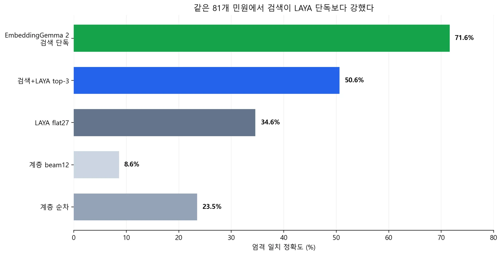
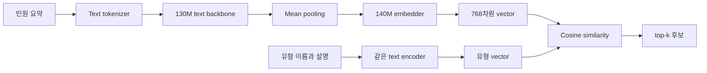
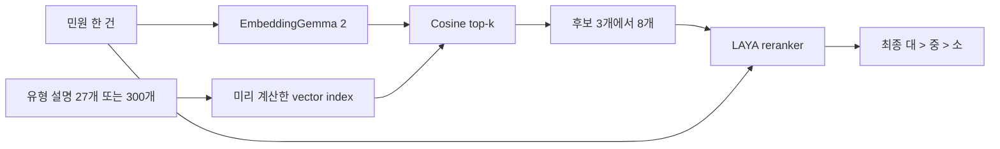
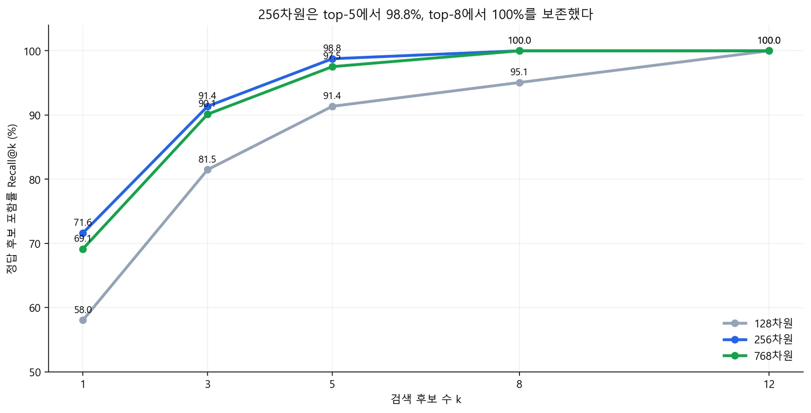
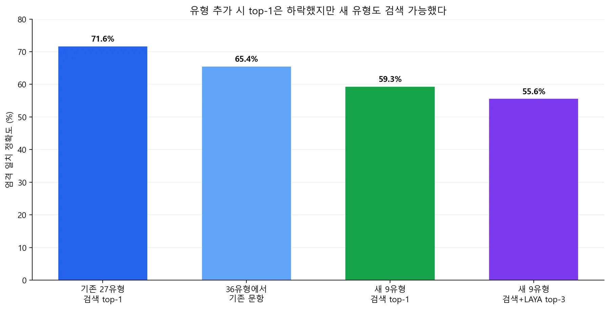

# LAYA 한국어 민원 분류 2편: EmbeddingGemma 2 검색을 붙이면 좋아질까

**27개 유형에서 막힌 LAYA 앞에 의미 검색기를 놓고, 새 유형까지 실제로 다시 측정했다.**

1편의 결론은 불편했다. 민원 유형 설명을 잘 작성하고 LAYA를 추가 학습해도 27개 소분류를 한 번에 고른 정확도는 **34.6%(28/81)**였다. 대→중→소 순차 분류는 **23.5%**, top-k 계층 후보를 12개 남긴 beam 방식은 정답 후보를 76.5% 보존했지만 최종 정확도가 **8.6%**였다. 후보를 만드는 규칙과 최종 LAYA 판별이 모두 흔들렸다.

이번에는 사용자가 제안한 [EmbeddingGemma 2](https://ai.google.dev/gemma/docs/embeddinggemma/model_card_2)를 검색기로 붙였다. 명칭은 ‘Embedding Gamma’가 아니라 Google DeepMind의 **EmbeddingGemma 2**다. 공식 모델 카드는 텍스트·이미지·영상·음성을 같은 768차원 공간에 놓는 7억 4천만 파라미터 모델로 설명한다. 이 실험은 민원 텍스트만 필요하므로 이미지·음성 encoder를 끄고 **2억 7천만 파라미터 text-only 구성**을 사용했다.

## 먼저 결론

- **EmbeddingGemma 2 검색 단독이 가장 좋았다.** 기존 27개 유형의 엄격 일치 정확도는 256차원에서 **71.6%(58/81)**였다. 같은 시험지의 LAYA flat 34.6%보다 **37.0%p**, 약 **2.07배** 높다.
- **후보 검색 목적도 달성했다.** 256차원에서 정답이 top-3 안에 든 비율은 91.4%, top-5는 98.8%, top-8은 100%였다. 27개를 8개로 줄여도 이번 시험에서는 정답을 잃지 않았다.
- **검색 뒤에 기존 LAYA를 붙이자 오히려 50.6%로 내려갔다.** top-3 후보에는 정답이 74건 있었지만 LAYA가 그중 41건만 최종 선택했다. 검색기가 병목을 줄였고, 기존 LAYA reranker가 새 병목이 됐다.
- **새 유형에는 가능성이 보였다.** 학습에 없던 9개 유형 27건을 36개 전체 후보에서 검색했을 때 256차원 top-1은 **59.3%(16/27)**, top-8 정답 포함률은 100%였다. LAYA top-3 재순위화를 붙이면 **55.6%(15/27)**였다.
- **지금의 권장안은 `EmbeddingGemma 2 top-1 + 낮은 확신만 별도 처리`다.** LAYA를 무조건 2차 판별기로 붙일 근거는 이번 결과에서 나오지 않았다. 실제 도입 전에는 실제 민원, 사람이 검수한 정답, 300개 유형, 경쟁 embedding 모델, 임계값 보정으로 다시 시험해야 한다.



그림 1. 같은 합성 민원 엄격 평가 81건에서 측정한 정확도. 서로 다른 실행에서 얻은 값이며, 작은 자체 진단 데이터이므로 일반 성능 순위로 일반화할 수 없다.

## 왜 2편에서 검색 모델을 꺼냈나

민원 300개 유형을 한 번에 LAYA에 넣는다고 가정해 보자. 각 유형에 이름과 경계 설명이 붙으면 입력이 길어진다. 서로 비슷한 후보가 늘고, 모델은 제한된 token 예산 안에서 300개를 동시에 비교해야 한다. 계층을 따라 하나씩 고르면 한 번의 입력은 짧아지지만, 대분류에서 정답 경로를 버리는 순간 뒤 단계는 복구할 수 없다.

1편의 beam12 실험은 이 문제를 완화하려고 대분류 top-2와 중분류 top-2를 남겼다. 계산상 최대 `2 × 2 × 3 = 12`개 소분류 후보가 남는다. 그러나 정답 후보 보존율이 76.5%였고, 최종 LAYA가 그 후보를 제대로 고르는 비율도 낮았다. **계층 규칙으로 후보를 만들기보다 문장 의미와 유형 설명을 직접 비교해 후보를 찾자**는 것이 이번 가설이다.

이때 embedding 모델이 적합하다. 민원과 유형 설명을 각각 고정 길이 숫자 벡터로 바꾸고 가까운 유형부터 정렬할 수 있다. 새 유형이 생기면 설명 벡터 하나를 추가하면 된다. 전체 분류층을 다시 만들지 않아도 검색 후보에 들어올 수 있다는 점이 LAYA의 동적 후보 철학과도 맞는다.

## EmbeddingGemma 2는 무엇인가

EmbeddingGemma 2는 답변 문장을 생성하는 Gemma 챗봇이 아니다. 입력의 의미를 **벡터 한 개**로 압축하는 embedding 모델이다. 가까운 의미의 입력은 벡터 공간에서도 가까워지도록 학습됐다. 검색, RAG, 분류, 군집화에 사용할 수 있다.

공식 모델 카드 기준 전체 모델은 다음 모듈로 구성된다.

| 구성 | 역할 | 파라미터 |
| --- | --- | ---: |
| Text backbone | text token의 문맥 표현 생성 | 130M |
| Embedder | 문맥 표현을 검색용 vector로 변환 | 140M |
| Vision encoder | 이미지·영상 입력 처리 | 170M |
| Audio encoder | 음성 입력 처리 | 300M |
| 전체 | 네 modality를 하나의 vector 공간에 정렬 | 740M |

텍스트 쪽은 24개 layer, model dimension 512, hidden dimension 2,048, 4 attention head, 8,192 token context를 사용한다. local과 global attention 비율은 5:1이고, mean pooling 뒤 512→768 projection으로 최종 embedding을 만든다. 이 숫자는 [Google 공식 모델 카드](https://ai.google.dev/gemma/docs/embeddinggemma/model_card_2)의 기술 사양이다.



그림 2. 이번 text-only 검색 경로. 이미지·영상·음성 encoder는 load하지 않았다.

### MRL: 하나의 768차원 벡터를 256차원으로 줄일 수 있는 이유

EmbeddingGemma 2는 Matryoshka Representation Learning, 줄여서 MRL을 적용했다. 큰 인형 안에 작은 인형이 들어가듯, 768개 숫자의 앞부분만 사용해도 의미가 남도록 학습한다. 공식 지원 길이는 768, 512, 256, 128차원이다.

768차원 벡터 `e`를 256차원으로 줄일 때는 단순히 앞 256개를 잘라 끝내면 안 된다. 길이가 달라졌으므로 다시 L2 정규화한다.

```text
e_256 = e[0:256] / ||e[0:256]||₂
score(query, label) = e_query_256 · e_label_256
```

두 벡터를 모두 단위 길이로 만들면 내적이 cosine similarity와 같다. 이번 실험은 모델을 한 번 실행해 768차원을 얻은 뒤, 128·256·768차원으로 잘라 각각 재정규화했다. 그래서 세 차원의 query encoder 지연은 같다. 실제 운영에서는 `truncate_dim`을 이용할 수 있다.

공식 multilingual MTEB v2 평균은 768차원 61.36, 256차원 60.41, 128차원 57.89다. 이는 여러 검색·분류 과제의 집계이며 한국어 민원 정확도가 아니다. 이번 작은 데이터에서는 오히려 256차원이 768차원보다 2건 더 맞았다. 표본 오차와 과제 적합성의 영향이 있으므로 “256이 항상 우수하다”는 결론은 내릴 수 없다.

### Task prefix는 장식이 아니다

공식 문서는 검색처럼 query와 document 역할이 다른 비대칭 과제에서 서로 다른 형식을 권장한다.

```text
query:    task: search result | query: {민원 요약}
document: title: {대 > 중 > 소} | text: {유형 설명}
```

SentenceTransformers에서는 query에 `prompt_name="SearchQuery"`를 적용했다. 문서에는 제목과 본문을 직접 구성했다. 유형 이름만 `L17`처럼 넣지 않고 `도로·교통 > 대중교통 > 버스 무정차`와 구분 기준을 함께 넣은 이유다. **새 유형 일반화의 단위는 라벨 번호가 아니라 사람이 작성한 의미 설명**이다.

## LAYA와 무엇이 다르고, 왜 함께 쓸 수 있나

둘 다 encoder 기반이지만 비교 방식이 다르다.

### EmbeddingGemma 2: bi-encoder 검색

민원과 유형 설명을 서로 따로 읽는다. 유형 vector는 분류 체계가 바뀔 때 한 번 계산해 저장할 수 있다. 요청이 오면 민원 vector만 새로 만들고 저장된 유형 vector와 비교한다.

```text
v_query = Encoder(민원)
v_i     = Encoder(유형_i)       # 미리 계산 가능
score_i = cosine(v_query, v_i)
```

후보 수를 `K`, vector 차원을 `D`라고 하면 사전 계산 뒤의 정확한 전수 검색 비용은 대략 `O(KD)`다. 300개 × 256차원은 76,800번의 곱셈 수준이라 작다. 수십만·수백만 후보에서는 ANN vector index를 쓴다. query encoding 비용은 후보 수와 직접 비례하지 않는다.

### LAYA: 후보를 함께 읽는 decision encoder

LAYA는 민원, 질문, 후보 설명을 하나의 입력에 구성한다. 각 후보 token 위치의 문맥 표현을 공통 head가 채점한다. 후보끼리와 민원 사이의 상호작용을 attention 안에서 볼 수 있지만, 후보가 늘면 입력 길이와 비교 난도가 함께 커진다.

```text
scores = LAYA(민원 + 질문 + 후보1 설명 + ... + 후보K 설명)
answer = argmax(scores)
```

Transformer 한 layer의 self-attention은 결합 sequence 길이 `N`에 대해 핵심 항이 `O(N²)`이다. 후보 설명을 더할수록 `N`이 길어지고 memory도 attention matrix와 함께 증가한다. 실제 구현의 길이 제한과 batching 때문에 단순 K배 지연이라고 말할 수는 없지만, 유형 300개를 긴 설명과 함께 한 번에 넣는 설계는 불리하다.

### 둘을 연결하면

EmbeddingGemma 2가 300개 중 의미상 가까운 3∼8개를 고르고, LAYA가 그 후보를 민원과 함께 정밀 비교하는 구조를 만들 수 있다. 정보 검색에서 흔히 쓰는 **retrieve then rerank** 패턴이다.



그림 3. 검증한 2단계 구조. 좋은 설계처럼 보이지만, 실제 결과에서는 reranker가 검색 top-1을 이기지 못했다.

## Docker Compose로 분리한 실행 환경

기존 LAYA와 EmbeddingGemma 2는 의존성이 달랐다. 하나의 image에서 package version을 억지로 맞추면 기존 재현 환경이 바뀐다. 그래서 같은 Compose 프로젝트 안에서 두 container를 분리했다.

| Service | 하는 일 | Network | CPU / memory |
| --- | --- | --- | --- |
| `prepare-retrieval` | 고정 revision의 모델 snapshot 받기 | 준비할 때만 허용 | 4 CPU / 8 GiB |
| `retrieval` | EmbeddingGemma 2 text 검색 | 차단 | 4 CPU / 8 GiB |
| `evaluate` | 기존 LAYA 학습·평가·reranking | 차단 | 4 CPU / 8 GiB |

검색 image는 Python 3.12 slim, CPU용 PyTorch 2.8.0, torchvision 0.23.0, Transformers 5.19.0, SentenceTransformers 6.1.0을 고정했다. 모델 revision도 `914f7f89142e33e77833254d9c9b90c3cef7303b`로 고정했다. 재현 중 upstream `main`이 바뀌어 결과가 달라지는 일을 막기 위해서다.

```yaml
services:
  retrieval:
    build:
      context: .
      dockerfile: Dockerfile.retrieval
    image: laya-korean-retrieval:local
    cpus: 4.0
    mem_limit: 8g
    network_mode: none
    volumes:
      - ./:/work

  evaluate:
    build: .
    image: laya-korean-eval:local
    cpus: 4.0
    mem_limit: 8g
    network_mode: none
    volumes:
      - ./:/work
```

설치와 실행은 다음 순서다.

```powershell
git clone https://github.com/sungreong/laya-korean-eval.git
cd laya-korean-eval

# 네트워크를 허용한 준비용 service에서 정확한 revision을 받는다.
docker compose --profile setup run --rm prepare-retrieval

# 이후 평가는 offline container에서 실행한다.
docker compose run --rm retrieval python -u research/run_embedding_retrieval.py `
  --model evaluation/models/embeddinggemma-2-914f7f89142e `
  --taxonomy datasets/complaints/taxonomy.json `
  --cases datasets/complaints/cases.json `
  --out evaluation/my-retrieval-run
```

전체 snapshot은 약 **1.526GB**였다. text-only 설정은 runtime에서 vision과 audio encoder를 load하지 않아 유효 모델 크기를 270M으로 줄이지만, 이번 Hugging Face snapshot 파일 자체는 multimodal weight를 함께 받았다. 배포 artifact까지 작게 만들려면 text weight만 안전하게 분리해 다시 검증하는 작업이 필요하다.

## 한국어 민원 실험

### Introduction — 검증할 가설

이번 질문은 세 가지다.

1. **가설 H1:** 계층 규칙보다 유형 설명의 semantic retrieval이 한국어 민원의 정답 후보를 더 잘 보존한다.
2. **가설 H2:** EmbeddingGemma 2가 만든 작은 후보군을 LAYA가 재평가하면 검색 top-1보다 최종 정확도가 높아진다.
3. **가설 H3:** 학습에 없던 유형도 설명만 추가하면 일정 수준 검색할 수 있다.

영어 multilingual benchmark를 한국어 민원 성능으로 옮겨 쓰지 않고, 1편과 동일한 한국어 합성 시험지에서 직접 측정했다.

### Methods — 모델, 데이터, 입력, metric

**Model.** EmbeddingGemma 2 revision `914f7f…303b`를 CPU float32 text-only로 실행했다. LAYA reranker는 1편의 계층·prefix 학습에서 선택한 checkpoint를 그대로 썼다. 이번 편에서는 EmbeddingGemma 2를 추가 학습하지 않았다. 따라서 결과는 label description을 이용한 zero-shot 검색 성능이다.

**Dataset.** 3개 대분류 × 대분류별 3개 중분류 × 중분류별 3개 소분류로 만든 27개 유형을 사용했다. 평가 입력은 콜센터·인터넷 상담 민원 요약 90건이다. 그중 정답 소분류가 하나로 정해진 엄격 평가 81건과 정보가 부족해 여러 답이 허용되는 9건을 분리했다. 일반화 평가는 학습에서 제외한 소분류 9개에 각 3건씩, 총 27건이다. 모든 데이터는 이 프로젝트에서 작성한 합성 자료이며 실제 시민 민원이나 공공기관 품질을 대표하지 않는다.

**Document.** 각 유형을 다음처럼 만들었다.

```text
title: 도로·교통 > 대중교통 > 버스 무정차
text: 정류장에 승객이 기다리고 있었으나 버스가 정차하지 않고 통과한 경우...
```

**Query.** 원문 전체가 아니라 상담원이 정리한 한국어 민원 요약과 `SearchQuery` prefix를 사용했다. channel 정보는 LAYA reranker에는 넣었지만 EmbeddingGemma query에는 넣지 않았다.

**Sampling parameter.** 생성 모델이 아니므로 temperature·top-p가 없다. 동일 vector에 대한 cosine ranking은 결정적이다.

**Hardware.** Windows host의 Docker Desktop Linux CPU container, service당 4 CPU와 memory 8GiB 제한이다. GPU는 사용하지 않았다. main36과 unseen36 retrieval은 두 container를 동시에 실행했으므로 그 latency는 단독 main27 실행과 공정하게 비교하지 않았다.

**Metric.** top-1 엄격 일치 정확도, Recall@k, Mean Reciprocal Rank를 측정했다. reranker에는 최종 정확도와 `정답이 후보에 있을 때 LAYA가 맞힌 비율`을 함께 기록했다.

**Baseline.** 1편의 동일 81건 LAYA flat27 34.6%, 대→중→소 순차 23.5%, beam12 8.6%와 비교했다. 새 유형에는 1편의 LAYA flat36 29.6%도 참고했다.

**Procedure.** 유형 vector는 한 번에 batch encoding했다. 각 민원을 한 건씩 encoding해 128·256·768차원으로 잘라 재정규화하고 27개 또는 36개 유형과 cosine score를 계산했다. 256차원 top-3·5·8·12 후보는 기존 LAYA에게 다시 주어 최종 하나를 선택하게 했다. model warm-up은 latency에서 제외했다.

### Results — 측정값

#### 1) 27개 기존 유형: 검색 단독

| 차원 | top-1 | Recall@3 | Recall@5 | Recall@8 | Recall@12 | MRR |
| ---: | ---: | ---: | ---: | ---: | ---: | ---: |
| 128 | 58.0% (47/81) | 81.5% | 91.4% | 95.1% | 100% | 0.719 |
| **256** | **71.6% (58/81)** | **91.4%** | **98.8%** | **100%** | **100%** | **0.824** |
| 768 | 69.1% (56/81) | 90.1% | 97.5% | 100% | 100% | 0.806 |



그림 4. 후보 검색의 목적은 최종 top-1뿐 아니라 작은 k 안에 정답을 남기는 것이다.

단독 main27 실행에서 model load 6.79초, 27개 document encoding 6.73초가 걸렸다. warm-up 뒤 query encoding p50은 **155ms**, p95는 **582ms**였다. document encoding 뒤 process RSS는 약 **1.05GB**였다. Docker·OS 전체 memory 사용량과 같지는 않다.

#### 2) 27개 기존 유형: 검색 뒤 LAYA 재순위화

| 후보 수 | 정답 후보 포함 | 최종 정확도 | 정답이 후보에 있을 때 LAYA 정확도 | end-to-end p50 |
| ---: | ---: | ---: | ---: | ---: |
| **3** | 91.4% (74/81) | **50.6% (41/81)** | 55.4% | 573ms |
| 5 | 98.8% (80/81) | 45.7% (37/81) | 46.3% | 581ms |
| 8 | 100% (81/81) | 46.9% (38/81) | 46.9% | 745ms |
| 12 | 100% (81/81) | 37.0% (30/81) | 37.0% | 951ms |

후보가 늘수록 recall은 좋아졌지만 최종 LAYA 정확도는 좋아지지 않았다. top-3가 가장 좋은 rerank 결과였다. 그래도 LAYA flat27보다 16.0%p 높았고, beam12보다 42.0%p 높았다. 그러나 검색 단독 top-1보다는 21.0%p 낮았다.

#### 3) 유형을 27개에서 36개로 늘렸을 때

기존 81건을 새 9개 유형이 포함된 36개 후보로 다시 검색했다. 256차원 top-1은 **65.4%(53/81)**로 27개 후보의 71.6%보다 6.2%p 낮아졌다. Recall@3은 90.1%, Recall@5는 96.3%, Recall@8은 100%였다. LAYA top-3 재순위화는 **50.6%(41/81)**로 27개 후보 실험과 같았다.

후보 수가 늘면 비슷한 설명끼리 경쟁하므로 top-1 하락은 자연스럽다. 이번에는 top-8 보존율이 유지됐지만 300개에서도 같다고 추정할 수는 없다.

#### 4) 학습에 없던 9개 유형

| 방식 | 후보 | 엄격 정확도 | 정답 후보 포함률 |
| --- | ---: | ---: | ---: |
| EmbeddingGemma 2, 128d | 36개 top-1 | 63.0% (17/27) | 63.0% |
| EmbeddingGemma 2, 256d | 36개 top-1 | 59.3% (16/27) | 59.3% |
| EmbeddingGemma 2, 768d | 36개 top-1 | 63.0% (17/27) | 63.0% |
| 검색 256d + LAYA | top-3 rerank | 55.6% (15/27) | 88.9% |
| 1편 LAYA flat36 | 36개 전체 | 29.6% (8/27) | 해당 없음 |

256차원 검색에서 Recall@3은 88.9%, Recall@5는 92.6%, Recall@8은 100%였다. 새 유형의 label description만 index에 추가해도 정답 후보를 찾았다는 점은 H3에 긍정적인 신호다. 표본은 27건뿐이고 유형별 3건이라 신뢰구간이 넓다.



그림 5. 유형 설명만으로 새 유형을 검색할 수 있었지만, 59.3%를 production 정확도로 해석할 수는 없다.

### Discussion — 왜 검색은 좋아졌고 reranking은 떨어졌나

**H1은 이번 데이터에서 지지됐다.** 계층 경로를 한 단계씩 맞히는 방식은 초반 오류가 누적된다. EmbeddingGemma 2는 대분류 경계를 먼저 통과하지 않아도 민원과 모든 소분류 설명을 직접 비교한다. “버스가 정류장을 그냥 지나갔다”와 “무정차 통과”가 가까우면 대·중 단계의 별도 결정을 거치지 않고 후보에 들어간다.

**H2는 기각됐다.** 기존 LAYA checkpoint는 임의의 검색 top-k 후보만 정밀하게 비교하도록 별도 학습한 모델이 아니다. 1편에서 flat·계층·prefix 형식이 섞인 합성 데이터로 한 epoch 학습했다. 검색 점수도 LAYA에 전달하지 않았다. LAYA는 후보 순서와 설명만 보고 다시 선택했으며, 이미 맞았던 EmbeddingGemma top-1을 뒤집어 오답으로 만드는 경우가 많았다.

후보를 3개에서 12개로 늘릴수록 조건부 정확도가 55.4%에서 37.0%로 내려간 것도 같은 문제를 보여 준다. recall만 최대로 만들면 좋은 최종 시스템이 되는 것이 아니다. **retriever의 정답 보존율과 reranker의 조건부 정확도를 곱한 상한 구조**를 함께 봐야 한다.

```text
최종 정확도
= P(정답이 후보에 있음) × P(reranker가 정답 선택 | 정답이 후보에 있음)
```

top-3에서는 `74/81 × 41/74 = 41/81`, 즉 50.6%다. 후보 검색은 이미 91.4%까지 해냈고 남은 손실 대부분은 reranker에서 발생했다.

**H3은 제한적으로 지지됐다.** 새 유형 9개의 학습 example을 EmbeddingGemma에 보여 주지 않았는데도 설명만으로 59.3∼63.0% top-1을 얻었다. 이는 고정 output head를 교체하지 않고 유형을 추가할 수 있다는 장점을 실제로 확인한 것이다. 하지만 사람이 만든 설명과 시험 문장이 어휘를 공유했을 가능성이 있고, 9유형 × 3문항은 너무 작다.

### 왜 이런 결과가 나왔는가

이번 과제는 겉으로는 27개 분류지만, 입력과 정답의 관계는 사실상 **짧은 민원 query와 유형 설명 document 사이의 검색**에 가깝다. EmbeddingGemma 2는 바로 그 관계를 학습한 모델이다. 반면 LAYA는 민원·질문·27개 후보를 한 sequence에서 비교하는 범용 decision model이다. 범용성이 특정 과제의 적합성을 자동으로 이기는 것은 아니다.

첫째, **학습 목적과 평가 방식이 일치했다.** EmbeddingGemma 2는 query와 관련 document를 가까이 두는 contrastive embedding 모델이고, 평가는 cosine top-1이었다. 공식 `SearchQuery` prefix와 `title: ... | text: ...` document 형식도 그대로 적용했다. LAYA에는 같은 수준으로 민원 taxonomy에 특화된 retrieval 학습을 하지 않았다.

둘째, **flat leaf 검색은 계층 오류를 누적하지 않는다.** “버스가 정류장에 서지 않고 지나갔다”는 문장이 `도로·교통`과 `대중교통`을 별도로 통과하지 않아도 `버스 무정차` 설명과 직접 가까워질 수 있다. hard cascade는 대분류 하나를 틀리는 순간 올바른 leaf를 잃는다.

셋째, **합성 시험 문장과 유형 설명의 언어가 가까웠다.** 두 자료를 같은 taxonomy 정의에서 만들었기 때문에 관련 어휘와 표현이 공유됐을 가능성이 있다. EmbeddingGemma 2에는 유리한 조건이다. 실제 상담원이 쓴 축약어·오탈자·간접 표현·복수 요구에서는 간격이 커질 수 있다. 이 결과가 실제 민원 71.6%를 보장하지 않는 가장 중요한 이유다.

넷째, **현재 LAYA는 검색 hard negative를 고르도록 학습되지 않았다.** EmbeddingGemma가 top-3에 남긴 후보는 서로 가장 비슷한 세 유형이다. 쉬운 무관 후보를 많이 본 모델보다 이런 미세 경계를 집중 학습한 reranker가 필요하다. 검색 점수까지 버리고 LAYA 점수만으로 순서를 다시 정하면서 맞았던 top-1을 뒤집었다.

마지막으로 256차원이 768차원보다 높았던 차이는 2건에 불과하다. 축소된 vector가 불필요한 특징을 줄여 regularization처럼 작동했을 수 있지만, 표본 변동일 수도 있다. 독립 평가와 여러 seed 없이 “한국어는 256차원이 더 좋다”고 일반화하면 안 된다.

## EmbeddingGemma 2를 민원 데이터로 추가 학습한다면

Google은 2026년 10월 7일 [EmbeddingGemma 2 text fine-tuning 공식 가이드](https://ai.google.dev/gemma/docs/embeddinggemma/fine-tuning-embeddinggemma-with-sentence-transformers)를 공개했다. 공식 경로는 `SentenceTransformerTrainer`와 `MultipleNegativesRankingLoss`를 이용한 contrastive triplet 학습이다. open weight와 Apache 2.0 license이므로 자체 데이터로 fine-tuning하고 배포할 수 있다. 이번 글에서는 이 학습을 실행하지 않았으며, 아래는 공식 방법을 민원 분류에 맞게 옮긴 **후속 실험 설계**다.

### 학습 표본은 라벨 하나가 아니라 세 문장으로 만든다

각 행은 `(anchor, positive, negative)` triplet이다.

| 필드 | 민원 데이터에서의 의미 | 예시 |
| --- | --- | --- |
| `anchor` | 실제 상담 요약 또는 독립적으로 작성한 paraphrase | 버스가 손을 들었는데 정류장을 그냥 지나감 |
| `positive` | 정답 유형의 경로·포함 기준·제외 기준 | 도로·교통 > 대중교통 > 버스 무정차: 승객이 기다리는 정류장을 통과한 경우 |
| `negative` | 의미가 비슷하지만 틀린 유형 설명 | 버스 배차 지연: 예정 시각보다 늦게 도착하거나 배차 간격이 긴 경우 |

negative는 무작위 다른 대분류보다 **실제 검색에서 위로 올라온 오답**이 중요하다. 현재 baseline prediction JSON에서 각 anchor의 2∼5위를 hard negative로 수집할 수 있다. 같은 중분류 sibling, 표현이 겹치는 다른 대분류, 기존 모델이 높은 점수를 준 오답을 섞는다.

```json
{"anchor":"버스가 정류장에서 손을 들었는데 서지 않고 통과했습니다.",
 "positive":"title: 도로·교통 > 대중교통 > 버스 무정차 | text: 승객이 기다리는 정류장을 버스가 정차하지 않고 통과한 민원",
 "negative":"title: 도로·교통 > 대중교통 > 버스 배차 지연 | text: 버스가 예정 시각보다 늦거나 배차 간격이 긴 민원"}
```

같은 민원을 단어만 조금 바꾼 문장으로 train과 test에 나누면 누출이 생긴다. 실제 상담 원문 단위로 먼저 split하고, 같은 사건·상담·template에서 나온 변형은 한 split에만 둬야 한다. 새 유형 대응력을 보려면 일부 leaf 전체를 train에서 빼는 **label-holdout set**도 별도로 유지한다.

### loss가 실제로 하는 계산

한 batch의 각 query `qᵢ`와 정답 document `dᵢ⁺`를 가깝게 만들고, 명시적으로 넣은 hard negative와 다른 행의 document를 멀게 만든다.

```text
Lᵢ = -log exp(sim(qᵢ,dᵢ⁺)/τ)
          / Σⱼ exp(sim(qᵢ,dⱼ)/τ)
```

이때 batch 안의 다른 positive도 현재 query에는 negative로 사용된다. 같은 label description이 batch에 중복되면 사실은 정답인 문장을 오답으로 밀어내는 false negative가 생긴다. Sentence Transformers는 이런 loss에 `BatchSamplers.NO_DUPLICATES`를 권장한다. 민원 데이터에서는 한 batch에 같은 leaf의 동일 positive가 중복되지 않도록 sampling하거나, 여러 정답 설명을 가진 경우 relevance-aware 학습으로 바꿔야 한다. [Sentence Transformers sampler 문서](https://sbert.net/docs/package_reference/sentence_transformer/sampler.html)

### 공식 예제를 민원 검색에 맞춘 최소 코드

공식 예제는 text-only일 때 vision·audio encoder를 끄고 271,002,624개 parameter를 load한다. GPU에서는 `float16`을 쓰면 안 되고 `bfloat16`을 사용한다. 공식 가이드는 L4 또는 A100 같은 BF16 GPU를 전제로 한다. CPU float32 학습은 메모리보다 시간이 현실적인 병목이 될 가능성이 크다.

```python
from datasets import Dataset
from sentence_transformers import (
    SentenceTransformer,
    SentenceTransformerTrainer,
    SentenceTransformerTrainingArguments,
    losses,
)
from sentence_transformers.training_args import BatchSamplers

model = SentenceTransformer(
    "google/embeddinggemma-2",
    config_kwargs={"vision_config": None, "audio_config": None},
)

train = Dataset.from_json("complaint_triplets.train.jsonl")
valid = Dataset.from_json("complaint_triplets.valid.jsonl")

loss = losses.MultipleNegativesRankingLoss(model)
args = SentenceTransformerTrainingArguments(
    output_dir="models/embeddinggemma2-complaints",
    prompts={"anchor": model.prompts["SearchQuery"]},
    num_train_epochs=3,
    learning_rate=2e-5,
    per_device_train_batch_size=16,
    per_device_eval_batch_size=16,
    batch_sampler=BatchSamplers.NO_DUPLICATES,
    bf16=True,
    fp16=False,
    eval_strategy="epoch",
    save_strategy="epoch",
    load_best_model_at_end=True,
)

trainer = SentenceTransformerTrainer(
    model=model,
    args=args,
    train_dataset=train,
    eval_dataset=valid,
    loss=loss,
)
trainer.train()
model.save_pretrained("models/embeddinggemma2-complaints/selected-model")
```

위 `3 epoch`, batch 16, learning rate `2e-5`는 시작점이지 검증된 민원 최적값이 아니다. Google의 작은 공식 예시는 5 epoch, batch 1, `2e-5`를 사용하지만, 문서도 production에는 수백∼수천 triplet을 권장한다. 실제 학습에서는 epoch별 validation Recall@k와 MRR로 checkpoint를 선택해야 한다. training loss가 계속 내려가는지만 보고 고르면 안 된다.

### 전체 fine-tuning과 LoRA 중 무엇을 고를까

| 방법 | 장점 | 부담과 위험 | 이 프로젝트의 권장 순서 |
| --- | --- | --- | --- |
| 전체 text encoder 학습 | domain 경계를 가장 직접적으로 바꿈 | GPU memory·저장량이 크고 일반 의미 표현을 잊을 수 있음 | 충분한 실제 triplet과 GPU가 있을 때 비교군 |
| LoRA/PEFT adapter | 학습·배포할 parameter가 적고 업무별 adapter 분리 가능 | EmbeddingGemma 2에서 목표 module과 품질을 직접 검증해야 함 | 자원이 작을 때 우선 pilot |
| encoder 고정 + 별도 reranker | 기존 embedding index를 유지하면서 어려운 후보만 학습 | 2단계 지연과 운영 복잡도 | 검색 top-1을 이기도록 hard negative 전용 학습 |

Sentence Transformers는 `SentenceTransformer.add_adapter()`를 통한 LoRA/PEFT 학습을 공식 지원한다. 다만 제공된 예제가 곧 EmbeddingGemma 2 민원 성능을 보장하지는 않는다. 이 글에서는 LoRA를 실행하지 않았으므로 **지원되는 일반 경로**로만 제시한다. [Sentence Transformers PEFT 가이드](https://www.sbert.net/examples/sentence_transformer/training/peft/README.html)

### 256차원 성능을 유지하려면

768차원만 대상으로 fine-tuning한 뒤 앞 256차원을 잘라 쓰면 기존 MRL 성질이 얼마나 유지될지 다시 검증해야 한다. 여러 출력 차원을 동시에 보존하려면 기본 ranking loss를 `MatryoshkaLoss`로 감싸 768·512·256·128차원의 loss를 함께 계산하는 방식을 비교할 수 있다. 이는 Sentence Transformers가 제공하는 방법이지만, 이 프로젝트에서 EmbeddingGemma 2에 실행해 확인한 결과는 아니다. [Sentence Transformers loss 문서](https://sbert.net/docs/package_reference/sentence_transformer/losses.html)

### 학습 전후에 반드시 함께 볼 지표

1. 기존 27유형 top-1, Recall@3·5·8, MRR
2. 새 label-holdout 유형의 zero-shot 성능
3. 쉬운 문장과 애매한 문장별 성능
4. top-1과 top-2 score margin, open-set 거부율
5. 유형별 최소 recall과 혼동 matrix
6. 128·256·768차원별 성능
7. 일반 한국어 검색 세트의 회귀와 기존 유형 forgetting

fine-tuning의 성공 기준도 “training 정확도 상승”이 아니다. 독립 test에서 71.6%를 넘고, Recall@k를 유지하며, 새 유형과 일반 한국어 의미 검색이 크게 나빠지지 않아야 한다. LAYA reranker를 다시 학습한다면 EmbeddingGemma top-3에 정답이 있는 74건 중 현재 41건인 조건부 정답 수가 얼마나 늘었는지를 별도로 본다.

## 그래도 ‘판단 단계’가 필요하다는 생각은 남는다

이번 실험을 시작할 때의 기대는 명확했다. **EmbeddingGemma 2가 관련 후보를 빠르게 찾고, LAYA가 문맥과 후보를 함께 읽어 미세한 차이를 판단하면 두 장점이 결합돼 정확도가 올라갈 것**이라고 예상했다. 실제 결과는 반대였다. EmbeddingGemma 2 top-1만 사용한 71.6%가 검색+LAYA top-3의 50.6%보다 높았다. 범용 embedding 하나가 추가 학습한 decision model과 결합한 구조보다 크게 앞선 것은 예상 밖이었고, 이번 후속 실험에서 가장 흥미로운 결과다.

그렇다고 판단 모델이 필요 없다는 결론은 아니다. EmbeddingGemma top-1도 81건 중 23건을 틀렸다. 그런데 그 23건 가운데 **16건은 정답이 이미 top-3 안에 있었다.** 다시 말해 검색 top-1은 58건을 맞혔지만, 완벽한 top-3 판단기가 있다면 최대 74건, **91.4%**까지 갈 수 있는 후보 정보가 남아 있었다. top-5에는 80건의 정답이 있으므로 이론적 상한은 **98.8%**다.

| 단계 | 정답 수 | 정확도 | 의미 |
| --- | ---: | ---: | --- |
| EmbeddingGemma top-1 | 58/81 | 71.6% | 현재 가장 좋은 실제 결과 |
| EmbeddingGemma top-3 후보 보존 | 74/81 | 91.4% | 좋은 판단기가 회수할 수 있는 이론적 상한 |
| EmbeddingGemma top-5 후보 보존 | 80/81 | 98.8% | 후보를 더 넓혔을 때의 이론적 상한 |
| 현재 LAYA top-3 판단 | 41/81 | 50.6% | 후보 정보 활용에 실패한 실제 결과 |

이 차이는 “판단이 쓸모없다”보다 **현재 판단기가 이 후보군에 맞지 않았다**는 뜻에 가깝다. Sentence Transformers의 공식 retrieve-and-rerank 문서도 bi-encoder가 넓은 corpus에서 후보를 찾고, cross-encoder가 query와 후보를 함께 읽어 정밀하게 다시 점수화하는 구성을 설명한다. cross-encoder는 두 문장 사이 attention을 직접 계산할 수 있어 일반적으로 더 정밀하지만 모든 문서를 처리하기에는 느리므로 작은 후보군에 사용한다. [Retrieve & Re-Rank](https://sbert.net/examples/sentence_transformer/applications/retrieve_rerank/README.html)

Google의 Decision Maker 지침도 EmbeddingGemma 계열을 고처리량 bi-encoder, LAYA 계열을 context와 label을 함께 보는 cross-encoder로 구분한다. cross-encoder는 모든 후보가 256∼512 token window에 들어가는 **약 8개 이하의 compact option set**에 적합하다고 안내한다. 이는 결합 방향 자체가 잘못됐다기보다, LAYA를 어떤 데이터와 후보 형식으로 학습했는지가 중요하다는 근거다. [Decision Maker architecture](https://developers.google.com/edge/mediapipe/solutions/decision/decision_maker), [schema best practices](https://developers.google.com/edge/mediapipe/solutions/decision/decision_maker/best-practices)

### 다음 결합은 항상 덮어쓰는 구조가 아니어야 한다

이번 구현은 LAYA가 검색 순위를 무조건 새로 정했다. 개선 실험은 다음 세 방법을 분리해 비교해야 한다.

1. **선택적 판단:** EmbeddingGemma top-1과 top-2의 margin이 충분히 크면 top-1을 유지한다. margin이 작거나 score가 낮은 사례만 reranker로 보낸다.
2. **점수 결합:** embedding cosine과 calibration한 reranker score를 validation에서 정한 가중치로 합친다. reranker가 검색 근거를 완전히 버리지 못하게 한다.
3. **hard-negative 전용 학습:** 각 민원의 EmbeddingGemma top-3·5 오답을 모아 query–candidate pair의 정답 여부를 학습한다. 무관한 쉬운 후보보다 실제로 헷갈린 sibling 유형을 집중해서 보여 준다.

```text
if top1_score - top2_score >= threshold:
    final = embedding_top1
else:
    final = rerank(top_k, embedding_scores)
```

이 구조라면 쉬운 58건의 검색 정답을 보존하면서 애매한 후보만 판단 모델에 맡길 수 있다. 목표는 reranker 사용 자체가 아니라, **현재 58건에서 top-3 상한 74건 사이의 16건을 얼마나 안전하게 회수하는가**다. validation에서 threshold를 정하고, test에서는 고정한 뒤 정확도·사람 검토율·지연시간을 함께 보고 판단해야 한다.

## 대→중→소 분류를 계속 써야 한다면

검색 결과가 좋다고 계층을 버릴 필요는 없다. 계층은 운영 규칙, 담당 조직, 설명 가능성에 유용하다. 다만 **예측 순서를 강제하는 hard cascade** 대신 검색된 leaf의 경로를 이용해 대·중 후보 점수를 모으는 편이 낫다.

예를 들어 top-8 leaf를 얻은 뒤 같은 대분류에 속한 cosine score를 합산하거나 log-sum-exp로 집계한다. 그러면 최종 소분류 후보는 8개를 유지하면서 대분류와 중분류도 함께 제시할 수 있다.

```text
leaf top-8: L17, L18, L12, L29, L16, L10, L14, L32
major score(도로·교통) = aggregate(score(L17), score(L18), ...)
middle score(대중교통) = aggregate(score(L17), score(L18), score(L16))
```

최종 후보가 “2×2×2라서 반드시 8개”가 되는 것은 아니다. 서로 다른 경로의 자식 수와 중복 제거에 따라 달라진다. 이번 권장 구조에서는 먼저 leaf top-k를 고정하므로 k=8이면 최종 후보도 최대 8개다. 대·중은 leaf 결과에서 파생한 보고값이며 정답 leaf를 미리 잘라내는 gate가 아니다.

## 300개 유형으로 늘어날 때 예상되는 변화

이번에 실제로 측정한 최대 후보 수는 36개다. 300개 결과는 아직 없다. 다만 계산 구조는 예상할 수 있다.

- **저장량:** float32 256차원 × 300개는 약 0.29MiB다. vector 자체는 부담이 작다.
- **정확 비교:** 300 × 256 cosine은 CPU에서도 작다. 유형 300개만을 위해 ANN index가 꼭 필요하지는 않다.
- **정확도:** 비슷한 유형이 늘면 top-1과 Recall@k가 내려갈 가능성이 높다. “도로 파손”, “보도 파손”, “자전거도로 파손”처럼 경계 설명이 겹치기 때문이다.
- **설명 관리:** encoder 선택보다 taxonomy description 품질과 중복 경계 관리가 더 큰 문제가 될 수 있다.
- **보류 처리:** 후보 중 정답이 없는 open-set 입력을 별도로 감지해야 한다. cosine top-1은 언제나 하나를 반환한다.

300개에서 검증할 때는 무작정 k=8을 고정하지 말고 Recall@k 곡선을 먼저 그린다. 목표 recall 98∼99%를 만족하는 최소 k를 정한 뒤 latency와 후단 정확도를 비교해야 한다. 후보 간 score 차이, top-1 절대 score, entropy를 조합해 사람이 검토할 구간도 설정한다.

## Production 권장 구조

이번 결과만 놓고 보면 다음 순서가 가장 합리적이다.

1. 유형마다 `이름`, `포함 기준`, `제외 기준`, `혼동 유형과 차이`, `대표 예문`을 version 관리한다.
2. EmbeddingGemma 2 text-only로 유형 vector를 미리 만든다.
3. 민원 query를 encoding하고 256차원 top-k와 score를 얻는다.
4. top-1 margin이 충분하면 검색 결과를 사용한다.
5. margin이 작거나 open-set score가 낮으면 사람 검토 또는 별도 reranker로 보낸다.
6. EmbeddingGemma 2를 fine-tuning할 경우 실제 검색 오답을 hard negative로 만든 triplet과 label-holdout 검증을 사용한다.
7. LAYA를 reranker로 쓸 경우 **retrieval이 만든 hard negative 후보**로 따로 학습하고, 검색 score를 feature 또는 결합 점수로 보존한다.

단순 결합 점수도 다음 실험 후보가 된다.

```text
final_score_i = α × embedding_score_i + (1 - α) × calibrated_laya_score_i
```

`α`는 test set으로 고르면 과적합되므로 validation set에서 선택해야 한다. LAYA probability와 cosine score의 scale도 다르므로 calibration이 필요하다. 이번 편에서는 이 결합을 시험하지 않았으며, 향후 실험 제안이다.

## 기술적 한계와 해석 범위

- 데이터는 작성자가 만든 합성 문장이다. 실제 민원의 오탈자, 사투리, 여러 요구의 혼합, 기관별 용어를 충분히 반영하지 못한다.
- 엄격 평가 81건, 새 유형 27건은 작다. 독립된 사람의 label 검수와 여러 seed도 없다.
- EmbeddingGemma 2, LAYA, KoBERT, Jev를 완전히 같은 새 실험 조건에서 모두 다시 실행한 대규모 비교가 아니다. 1편의 같은 시험지 baseline을 재사용했다.
- main36과 unseen36 검색을 동시에 실행해 latency가 경쟁 영향을 받았다. 그래서 해당 p50 약 0.55초를 model 간 공정한 latency 비교에 사용하지 않았다.
- 한국어 tokenization 효율, 긴 문맥, code-switching, 전문용어를 별도 slice로 충분히 측정하지 않았다. 이번 입력은 짧은 한국어 요약이다.
- EmbeddingGemma 2는 100개 이상 언어를 지원한다고 밝히지만 언어별 품질이 같지 않다는 한계도 공식 문서에 적혀 있다.
- 모델은 vector를 만들 뿐, 개인정보 비식별화·공정성·부적절한 자동 처분을 해결하지 않는다.
- Jev는 API 기반 상용 모델이어서 이번 로컬 container에 넣지 않았다. 한국어 민원 동일 시험지 결과가 없으므로 직접 수치 비교를 추가하지 않았다.

## 최종 판단

이번 후속 실험은 처음 예상과 다르게 끝났다. 필자는 **EmbeddingGemma 2 검색과 LAYA 판단을 결합하면 성능이 좋아질 것**이라고 기대했다. 그러나 핵심 변화는 LAYA에게 27개를 더 잘 고르라고 요구한 것이 아니라, 유형 설명을 검색 가능한 지식으로 바꾼 데서 나왔다. EmbeddingGemma 2의 bi-encoder 구조는 label vector를 미리 계산할 수 있고, MRL로 256차원까지 줄여도 이번 과제에서는 가장 높은 top-1을 냈다. 별도 민원 fine-tuning도 하지 않은 embedding 모델 하나가 71.6%를 기록한 것은 솔직히 놀라운 결과였다.

기존 대비 실제 개선은 분명했다. 같은 81건에서 LAYA flat27 34.6%가 검색 단독 71.6%로 **37.0%p 상승**했다. 새 9개 유형도 설명만 추가해 59.3% top-1을 얻었다. 반면 기존 LAYA 재순위화는 검색 top-1보다 나빴다. 따라서 **EmbeddingGemma 2와 LAYA를 연결할 수는 있지만, 연결 자체가 개선을 보장하지 않는다.** 기존 LAYA checkpoint가 embedding 검색의 어려운 오답을 판별하도록 학습되지 않았기 때문이다.

그럼에도 더 높은 정확도를 얻으려면 판단 단계가 필요할 수 있다는 생각은 유지된다. 검색 top-1은 58건을 맞혔지만 top-3에는 74건의 정답이 있었다. 이 16건의 차이가 판단 모델이 해결할 수 있는 공간이다. 다음 판단기는 모든 결과를 덮어쓰는 범용 LAYA가 아니라, **EmbeddingGemma의 낮은 margin 사례와 hard negative를 학습한 선택적 reranker**여야 한다.

한국어 장점이 유지되는가라는 질문에는 “짧은 합성 민원 의미 검색에서는 유의미한 신호가 나왔다”까지 답할 수 있다. 실제 도입 가치는 taxonomy가 자주 바뀌고 label description을 잘 관리할 수 있는 민원 routing, FAQ routing, 내부 문서 분류에 있다. 고정 유형과 충분한 라벨 데이터가 있다면 KoBERT·ModernBERT 같은 전용 classifier도 같은 split에서 다시 비교해야 한다.

Production에 바로 자동 처분기로 적용할 단계는 아니다. 먼저 실제 익명화 민원으로 300개 유형 Recall@k, top-1, open-set 거부율, 유형별 최소 성능, 사람 검토율, latency와 memory를 측정해야 한다. 다음 실험의 우선순위는 **실제 오답 hard negative로 EmbeddingGemma 2를 contrastive fine-tuning하는 실험**, **낮은 margin 사례만 처리하는 검색 후보 특화 reranker**, **embedding score와 판단 score의 보정 결합**, **한국어 전용 embedding baseline**, **실제 300유형 평가**다. 지금의 결론은 “판단 모델을 버리자”가 아니라, **검색 단독 기준선을 먼저 인정하고 그 기준선을 실제로 넘는 판단기만 결합하자**는 것이다.

코드, Docker Compose, 고정 revision, 문항별 예측과 summary JSON은 [laya-korean-eval GitHub 저장소](https://github.com/sungreong/laya-korean-eval)에 공개했다.

## 참고 자료와 증거 구분

**공식 사양·저자 주장**

- [EmbeddingGemma 2 공식 모델 카드](https://ai.google.dev/gemma/docs/embeddinggemma/model_card_2): architecture, parameter, MRL, benchmark, prompt, 제한 사항
- [Google 공식 출시 글](https://blog.google/innovation-and-ai/technology/developers-tools/embeddinggemma-2/): 출시 배경과 intended use
- [Hugging Face model repository](https://huggingface.co/google/embeddinggemma-2): checkpoint와 사용 예
- [MediaPipe Decision Maker](https://developers.google.com/edge/mediapipe/solutions/decision/decision_maker): bi-encoder·cross-encoder 선택 구조 참고
- [Decision Maker schema 설계 지침](https://developers.google.com/edge/mediapipe/solutions/decision/decision_maker/best-practices): label description과 option 설계 참고

**발견 경로**

- [GeekNews 소개글](https://news.hada.io/topic?id=34907): 이 후속 실험의 계기가 된 한국어 커뮤니티 링크. 기술 사양은 원문 공식 자료로 재확인했다.

**직접 측정**

- 이 글의 71.6%, 98.8%, 100%, 50.6%, 59.3%, 55.6%, latency와 RSS는 2026년 10월 7일 저장한 JSON 결과다.
- 결과는 합성 진단 세트의 측정값이며 모델 제작사의 benchmark가 아니다.
