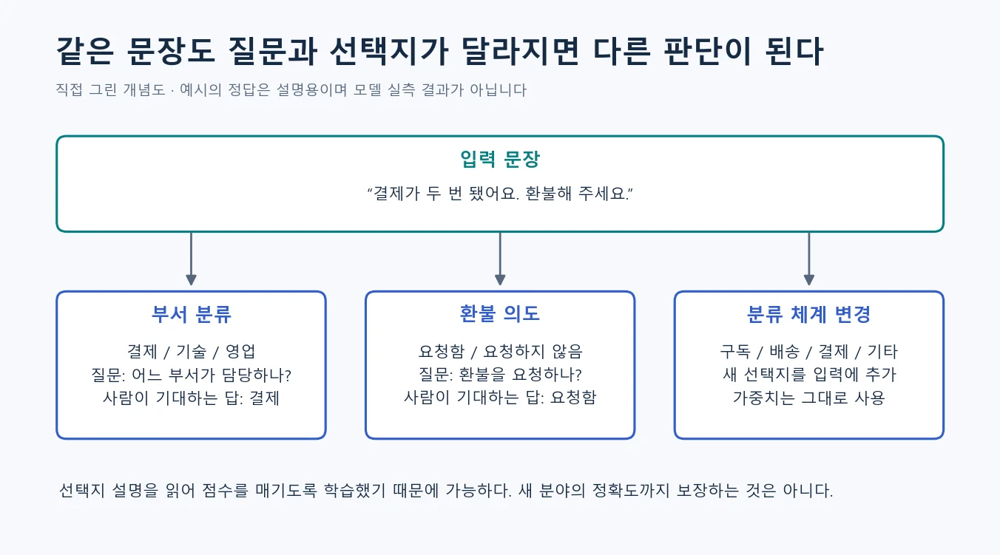
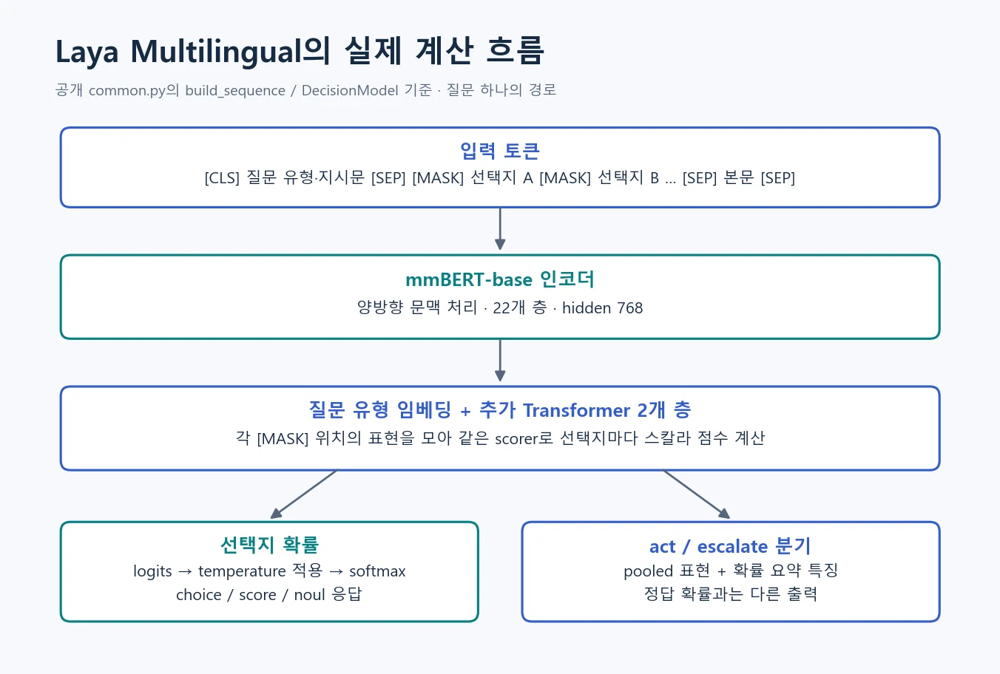
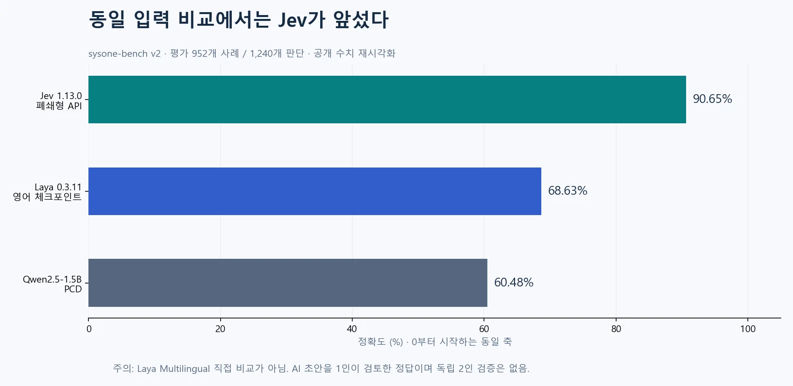
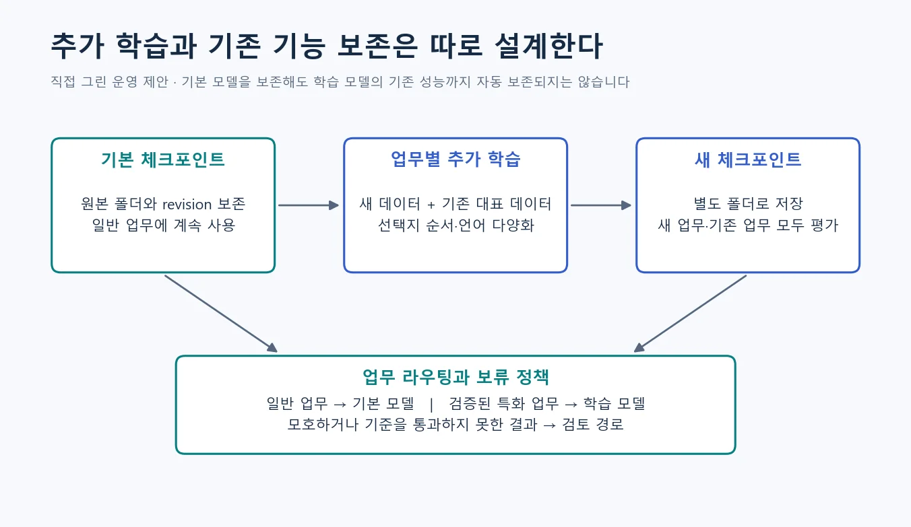
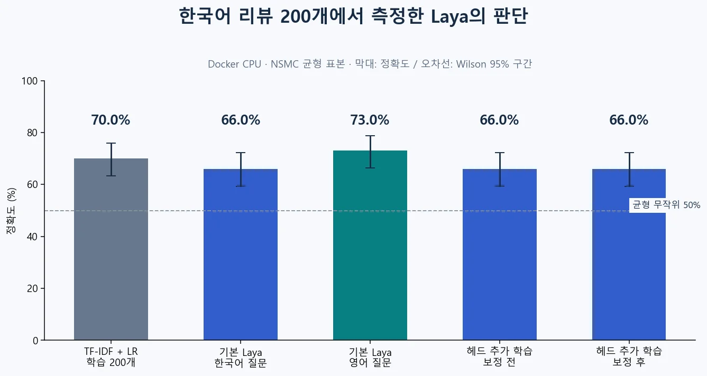
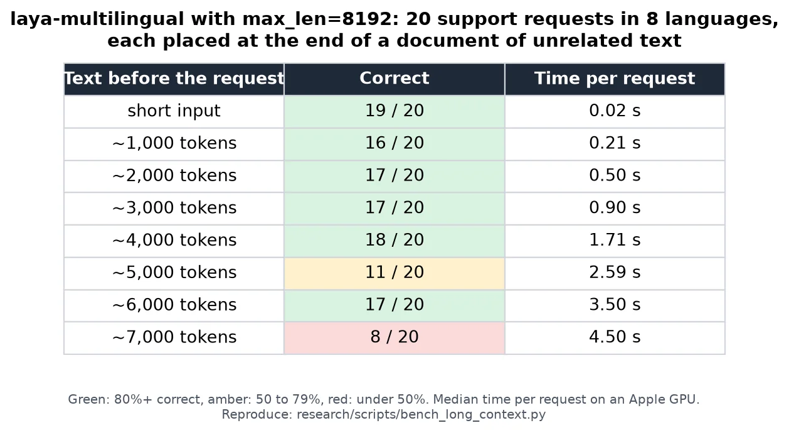
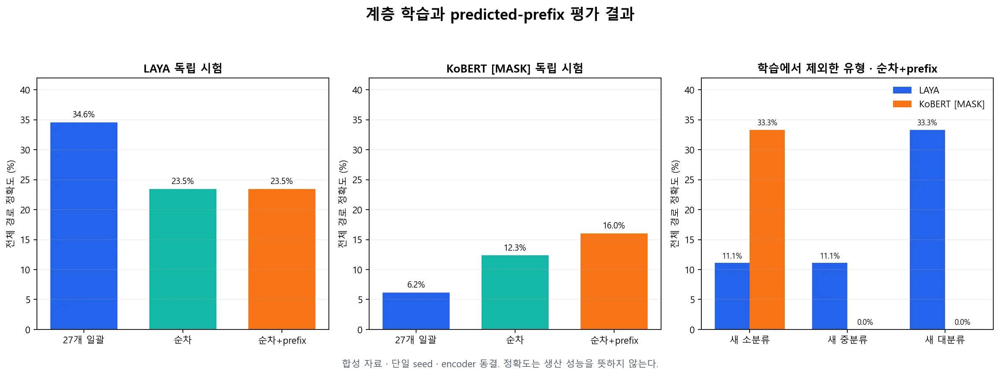

# LAYA Multilingual: 동적 분류의 원리부터 한국어 실측까지

**Jev가 내세운 ‘문장 대신 판단을 반환하는 AI’를 내 환경에서 실행하고 한국어로 검증해 볼 수 있을까?** 이 글은 그 질문에서 출발한다. 대상인 **LAYA는 질문과 후보 설명을 함께 읽고 선택형 판단을 내리는 공개 인코더 모델**이다. Jev와는 별도로 개발된 프로젝트이며 Jev의 가중치를 공개한 모델이 아니다.

고정 BERT 분류기처럼 클래스별 출력 뉴런을 정해 두는 대신, 요청마다 주어진 후보 위치를 같은 채점기로 평가한다. 분류 체계를 바꾸기 쉽고 문장을 한 토큰씩 생성하지 않는다는 점이 주목할 부분이다. 동적 후보 분류 자체가 최초의 발명이라는 뜻은 아니다.

한국어 도입 판단부터 말하면, **실험할 가치는 있지만 이 글의 결과만으로 전면 자동화할 근거는 부족하다.** Docker Compose CPU 환경에서 NSMC 리뷰 200개를 직접 평가했을 때 한국어 질문은 **66.0%**, 같은 한국어 본문에 영어 질문을 붙이면 **73.0%**였다. 이어서 27개 민원 유형용 합성 학습 729개를 만들자 LAYA의 독립 시험 일괄 정확도는 **24.7% → 32.1% → 34.6%**로 올랐다. 대·중·소를 따로 학습하고 앞 단계 예측을 prefix로 넘긴 순차 방식은 **23.5%**에 머물렀다. 실제 `[MASK]` token을 쓴 KoBERT adapter는 계층·prefix 학습 후 순차 정확도가 **6.2%에서 16.0%**로 올랐지만 절대 성능은 낮았다. 학습에서 제외한 9개 유형도 출력층 교체 없이 후보로 추가할 수 있었으나, 유형별 정확도는 0∼44.4%로 불안정했다. 한국어 encoder를 쓴다는 사실이나 동적 후보를 넣을 수 있다는 사실만으로 정확도가 보장되지는 않는다.

분류 기준이 자주 바뀌는 문의 라우팅과 로컬 판단 기능에는 파일럿 후보가 된다. 반면 분류 체계가 안정돼 있고 충분한 라벨이 있다면 기존 전용 분류기를 먼저 비교해야 한다. 한국어 문장 생성·요약·답변 작성은 이 모델이 제공하는 기능이 아니다.

최초 조사일은 **2026년 10월 5일**, 민원 학습 후속 실험일은 **2026년 10월 7일**이다. 글은 등장 배경 → Jev와 LAYA의 관계 → 핵심 아이디어와 BERT 비교 → 아키텍처 → 공개 벤치마크 → 구현 → 한국어·민원 실험 순으로 깊어진다. **공개 코드에서 확인한 사실**, **제작사·외부 사용자의 보고**, **직접 측정한 결과**, **필자의 해석**을 구분했다. 전체 코드·데이터·문항별 예측은 [laya-korean-eval GitHub 저장소](https://github.com/sungreong/laya-korean-eval)에 공개했다.

## 1. 왜 요즘에는 ‘말하는 AI’와 별도로 ‘판단하는 AI’를 만들까

고객이 “결제가 두 번 됐어요. 중복된 건만 환불해 주세요”라고 보냈다고 하자. 고객에게 설명할 답변을 쓰는 단계에서는 자연스러운 문장 생성이 필요하다. 하지만 그 전에 문의를 어느 부서로 보낼지 정하는 단계에서는 **`결제팀`이라는 선택 하나**면 충분하다. 같은 문장을 읽더라도, 다음에 할 일이 다르면 필요한 모델의 출력도 달라진다.

| 처리 방식 | 애플리케이션이 모델에 맡기는 일 | 다음 단계에서 쓰는 결과 |
| --- | --- | --- |
| 생성형 LLM | 상황을 읽고 답변이나 지정된 JSON을 작성 | 생성 결과를 검사한 뒤 사용 |
| 전용 분류기 | 학습 때 정한 클래스 중 하나를 판별 | 클래스 점수와 레이블 |
| Jev·LAYA 같은 판단 모델 | 상황과 이번 요청의 질문·후보를 읽고 선택 | 정해진 형식의 값과 후보 확률 |

이 표는 개념 설명이다. 생성형 모델도 스키마를 제한해 JSON을 만들 수 있고, 기존 분류기도 확률을 반환한다. 차이는 “JSON이 가능한가” 하나가 아니라, **자주 바뀌는 질문과 선택지를 받으면서도 문장 생성 없이 판단을 반환하도록 설계했는가**에 있다. LAYA의 구체적인 구현은 뒤에서 코드로 확인한다.

### 챗봇의 한 번의 답변이 소프트웨어의 여러 판단으로 나뉘면

예를 들어 문의 한 건을 처리하면서 담당 부서, 환불 요청 여부, 긴급도를 각각 판단할 수 있다. 이런 작은 판단을 반복하는 시스템에서는 한 번의 답변 품질 외에도 지연, 호출 비용, 결과 형식, 틀릴 때 검토로 넘길 기준이 중요해진다. 복잡한 추론이 필요 없는 단계까지 긴 생성 과정으로 처리해야 하는지 따져 보게 되는 것이다.

TypeSafe는 바로 이 문제를 제품의 출발점으로 설명한다. 사람이 읽을 답변보다 소프트웨어가 바로 사용할 판단을 중심에 놓겠다는 것이다. 이는 **제작사의 문제 정의**이며, 모든 업무가 그런 방식으로 바뀌었다는 시장 통계는 아니다. [TypeSafe AI primer](https://docs.typesafe.ai/introduction/machine-learning-primer)

여기에 공개 인코더와 다국어 사전학습 모델이 쌓이면서, 작은 판단 기능을 직접 실행하고 특화할 재료도 생겼다. LAYA는 ModernBERT·mmBERT 계열을 이용한다. 따라서 최근의 흐름은 “분류라는 기술이 새로 발명됐다”기보다 **기존 분류 기술과 언어 이해를 자동화에 쓰기 좋은 인터페이스로 묶는 시도**로 이해하는 편이 낫다. 이 문장은 기반 기술과 제품 구성을 연결한 필자의 해석이다. [ModernBERT](https://arxiv.org/abs/2412.13663), [mmBERT](https://arxiv.org/abs/2509.06888)

### Jev가 먼저 나오고, 그다음 LAYA가 나온 것인가

**최근 공개 제품의 이야기를 Jev에서 시작하는 것은 자연스럽다.** TypeSafe는 2026년 9월 15일 Jev의 early access를 발표하면서 빠른 구조화 판단을 하는 모델을 *System One*이라고 소개했다. 이 이름은 빠른 직관적 판단과 숙고를 구분하는 System 1/System 2 비유에서 가져왔다. 뇌의 동작을 그대로 재현했다거나, 업계 전체가 합의한 아키텍처 분류라는 뜻은 아니다. [Jev 공식 발표](https://typesafe.ai/blog/introducing-system-one-models-and-jev)

LAYA 개발자 Nandakishor M도 자신의 공개 글에서 Jev 발표에 대한 반응과 범용 공개 판단 모델을 만들게 된 과정을 설명한다. 동시에 2025년의 자신의 연구를 바탕으로 했다고 밝힌다. 실제로 2025년 3월의 **SalesRLAgent** 논문은 판매 대화의 전환 확률 예측을 다룬다. 이 선행 연구를 현재 LAYA Multilingual과 같은 모델로 취급해서는 안 된다. [개발자의 경위 설명](https://dev.to/nandakishor_m_6cc0adfde9f/i-built-non-autoregressive-decision-models-a-year-ago-then-a-frontier-lab-called-it-a-18me), [SalesRLAgent 논문](https://arxiv.org/abs/2503.23303)

이 글은 **Jev가 내세운 판단 전용 모델의 문제의식 → 이를 공개 구현으로 살펴볼 수 있는 LAYA → 한국어에서의 검증** 순서로 따라간다. 다만 “Jev가 이 기술을 최초로 발명했고 LAYA가 그대로 복제했다”는 계보는 확인되지 않는다. 어느 쪽이 먼저 얼마나 유행했는지를 보여 주는 비교 자료도 수집하지 않았으므로, 공개 순서와 개발자의 설명까지만 근거로 삼는다.

## 2. Jev와 공개 모델 LAYA를 먼저 구분하자

**Jev는 TypeSafe가 운영하는 판단 API다.** 읽을 내용인 `state`와 “어느 부서인가” 같은 형식이 정해진 질문을 보내면, 프로그램이 이용할 값과 확률을 돌려준다. 공식 문서는 선택형 `choice`, 순서형 `score`, 참일 확률을 묻는 `noul`을 설명한다. 사용자는 모델 가중치를 직접 관리하기보다 API를 자신의 코드에 연결한다. [Jev 공식 문서](https://docs.typesafe.ai/introduction)

**LAYA는 코드와 가중치를 받아 직접 실행할 수 있는 별도의 프로젝트다.** 같은 종류의 판단 문제를 풀지만 운영할 장비, 데이터가 처리되는 위치, 추가 학습과 버전 관리를 사용자가 정할 수 있다. 이 글에서 Docker로 실행하고 한국어 자료로 학습하는 대상이 바로 LAYA Multilingual이다. [LAYA 저장소](https://github.com/NandhaKishorM/laya)

비유하면 Jev는 판단 기능을 API 서비스로 호출하는 방식이고, LAYA는 판단 엔진을 가져와 내 환경에서 운영하는 방식이다. 이 비유는 배포와 운영의 차이를 설명하며, 두 모델의 정확도나 내부 구조가 같다는 의미는 아니다.

| 먼저 궁금할 점 | Jev | LAYA Multilingual |
| --- | --- | --- |
| 어디에서 실행하나 | 제공사의 호스팅 API | 내 PC·서버 등 자체 환경 |
| 내부를 확인할 수 있나 | 공개된 인터페이스·설명 범위 | 공개 코드·설정·가중치 |
| 내 데이터로 직접 학습하나 | 이 조사에서 동일한 자체 학습 경로는 확인하지 못함 | 공개 학습 코드로 가능 |
| 운영에서 부담할 것은 | API 연결, 호출 비용, 데이터 전송 조건 | 장비, 배포, 용량, 모델 업데이트 |
| 한국어 품질은 어떻게 판단하나 | 내 업무 자료로 별도 평가 | 내 업무 자료로 별도 평가 |

여기서 **“오픈소스 Jev 대안”과 “Jev 자체의 오픈소스판”은 구별해야 한다.** LAYA 서버는 Jev와 호환되는 HTTP 요청 형식을 지원한다고 설명한다. 이는 클라이언트 연결을 바꾸는 데 도움이 되는 성질이다. 같은 가중치·학습 데이터·내부 알고리즘·성능을 뜻하지 않으며, 응답 필드의 의미와 제약도 따로 확인해야 한다. [LAYA의 Jev 호환 서버 설명](https://github.com/NandhaKishorM/laya/blob/8a6e1328cce2460a0e5aa348ad465bb1b5821cd2/README.md#self-hosting-http-server-jev-compatible)

두 모델 모두 설명할 때 형식의 안정성과 판단의 정확성을 섞기 쉽다. 실제 정답이 결제팀인데 배송팀을 선택했다면, 허용된 레이블을 정확한 형식으로 반환했어도 업무에서는 오답이다. **“형식이 보장된다”는 말은 “판단이 틀리지 않는다”는 말이 아니다.** 확률 역시 그럴듯한 숫자를 받는 것에서 끝나지 않고, 높은 확률의 답이 실제로 얼마나 맞는지 검증해야 한다.

이제 LAYA가 질문과 선택지를 어떻게 읽는지부터 살펴보자. Jev와의 공개 벤치마크는 구조를 이해한 뒤 8절에서 조건과 함께 비교한다.


## 3. Laya는 어떤 일을 하는 모델인가

Laya는 입력을 읽고 미리 정한 형식의 판단을 반환하는 모델이다. 예를 들어 “이 문의는 어느 팀으로 보내야 하나?”, “환불을 요청했나?”, “긴급도는 어느 수준인가?”를 질문할 수 있다. 답변 문장을 한 토큰씩 생성하는 대신 선택지에 점수를 매긴다. 결과를 읽어 프로그램의 분기 조건으로 사용하는 것이 주된 용도다. [공식 프로젝트](https://github.com/NandhaKishorM/laya)

| 질문 형식 | 의미 | 활용 예 |
| --- | --- | --- |
| `choice` | 후보 중 하나를 선택 | 결제팀·기술팀·영업팀 배정 |
| `noul` | 명제가 참일 확률 | 환불 요청 여부 |
| `score` | 순서가 있는 수준을 판단 | 낮음·보통·높음 |

`choice` 하나가 여러 태그를 동시에 고르는 것은 아니다. 환불·불만·긴급이라는 태그를 각각 붙이고 싶다면 독립된 질문으로 나누는 편이 자연스럽다. `score` 역시 자유로운 숫자 예측기로 생각하기보다 순서가 있는 기준에 대한 판단으로 이해하면 된다. 실제 제품에서는 어떤 출력 필드를 쓸지 API 계약을 확인해야 한다. [질문 처리 코드](https://github.com/NandhaKishorM/laya/blob/8a6e1328cce2460a0e5aa348ad465bb1b5821cd2/laya/agent.py)

계열 안에서도 체크포인트를 구별해야 한다. 영어용 `laya`, 다국어용 `laya-multilingual`, 특정 typed-decisions 작업에 추가 학습한 `laya-typed-decisions`는 같은 성능의 다른 이름이 아니다. 이 글의 중심인 Multilingual은 mmBERT-base를 바탕으로 하며 전체 약 3억 2,200만 개 파라미터를 갖는다. 기본 입력 한도는 1,024토큰이고 설정을 바꾸면 최대 8,192토큰을 받을 수 있다. 모델 카드는 100개 이상 언어를 표방하지만, 그 숫자를 모든 언어·업무에서의 성능 보증으로 읽으면 안 된다. [Multilingual 모델 카드](https://huggingface.co/convaiinnovations/laya-multilingual)

## 4. 카테고리를 바꿔도 작동하는 이유

일반적인 지도학습 분류기를 떠올려 보자. 본문을 BERT에 넣고 마지막에 붙인 분류층에서 결제·배송·기술 세 가지 점수를 얻는다. 여기서 출력층의 각 자리는 학습 때 정한 클래스에 대응한다. 네 번째 클래스를 추가하면 보통 출력층과 학습 데이터를 조정한다.

Laya는 카테고리를 입력의 일부로 다룬다. “A는 결제·청구·환불, B는 오류·접속 문제, C는 가격·견적 문의”라는 설명을 본문과 함께 읽는다. 이후 **각 선택지 위치의 표현에 공통 채점기를 적용**한다. 선택지가 세 개면 세 점수, 네 개면 네 점수를 만든다. 클래스마다 별도 출력 뉴런을 늘리는 방식과 다른 지점이다. [입력 구성과 채점기 구현](https://github.com/NandhaKishorM/laya/blob/8a6e1328cce2460a0e5aa348ad465bb1b5821cd2/laya/common.py)



그림 1. 공개 구현을 바탕으로 직접 그린 설명도. 표시된 답은 사람이 기대하는 예시이며 모델의 실측 출력이 아니다.

이를 수식 대신 채점 상황에 비유하면 쉽다. 기존 분류기가 익숙한 세 개의 서랍 중 하나를 고르는 방식이라면, Laya는 매번 전달받은 서랍 설명을 읽고 어디에 넣을지 판단하는 방식이다. 다만 설명을 읽는 능력도 학습으로 얻은 것이다. 새로운 카테고리에 데이터가 전혀 필요 없다는 뜻은 아니다.

### 카테고리 이름보다 구분 기준이 중요하다

“정상 / 이상”만 주면 무엇이 이상인지 알기 어렵다. “정상: 결제 기록과 주문 금액이 일치함 / 확인 필요: 중복 결제 또는 금액 불일치를 주장함”처럼 경계를 설명해야 한다. 이때 모델이 결제 데이터베이스를 직접 조회하는 것은 아니다. 실제 결제 기록이 필요하다면 애플리케이션이 조회한 결과를 입력에 넣어야 한다.

회사 내부 코드만 전달하는 경우도 마찬가지다. `A17`, `B24` 자체에는 의미가 없으므로 각 코드가 무엇을 뜻하는지 설명해야 한다. 사내 규칙이 복잡하거나 사례를 읽어야만 이해되는 기준이라면 제로샷 분류를 출발점으로 삼고 추가 학습을 검토한다. 이는 위 구조에서 도출한 사용 설계 제안이다.

### 선택지를 계속 늘리면 어떻게 될까

선택지 설명은 토큰 예산을 함께 사용한다. 현재 Multilingual 설정의 `head_max_len`은 256이다. 코드에는 선택지가 많아지면 설명을 잘라내는 로직이 있다. “배송 중 파손”, “배송 중 분실”, “배송 중 지연”이 앞부분만 남아 구분되지 않는 상황을 생각하면 된다. 길이를 늘리는 설정은 가능하지만 모델이 그 긴 구성을 잘 처리하는지는 별도 문제다. [설정 파일](https://huggingface.co/convaiinnovations/laya-multilingual/blob/main/rl_agent_config.json), [토큰 구성 코드](https://github.com/NandhaKishorM/laya/blob/8a6e1328cce2460a0e5aa348ad465bb1b5821cd2/laya/common.py)

실무에서는 한 번에 약 20개 이하로 시작하라는 공식 지침을 참고할 수 있다. 수백 개라면 상위 분류를 먼저 고르거나 검색·임베딩으로 후보를 줄인 뒤 세부 분류하는 방법이 있다. 다만 첫 단계가 정답 후보를 버리면 두 번째 모델은 복구할 수 없다. 따라서 최종 정확도와 함께 **후보 목록에 정답이 남아 있는 비율**도 측정해야 한다. [공식 벤치마크와 한계](https://nandhakishorm.github.io/laya/benchmarks/), [shortlist 구현](https://github.com/NandhaKishorM/laya/blob/8a6e1328cce2460a0e5aa348ad465bb1b5821cd2/laya/shortlist.py)

또 하나의 함정은 후보 중에 정답이 없는 경우다. softmax는 주어진 후보들 사이에서 확률을 나눈다. 모든 후보가 부적절해도 그중 하나가 가장 높은 확률을 받을 수 있다. “기타”, “판단할 정보가 부족함”을 후보에 추가하는 실험과, 범위를 벗어난 입력으로 검증하는 과정이 필요하다. 후보 추가 자체가 올바른 보류 판단을 보장하지는 않는다.

## 5. 기존 BERT와 무엇이 다른가

**Laya는 BERT 계열과 단절된 모델이 아니다.** 양방향 인코더를 활용하면서 질문 구성, 선택지 채점, 학습 목적과 응답 인터페이스를 바꾼 시스템에 가깝다. “BERT는 고정 분류만 가능하다”는 설명도 너무 좁다. BERT 계열을 자연어 추론에 학습시키거나 본문과 레이블 설명을 함께 읽게 만들면 제로샷 분류에 사용할 수 있다. [BERT 논문](https://arxiv.org/abs/1810.04805), [제로샷 텍스트 분류 연구](https://arxiv.org/abs/1909.00161)

| 비교 축 | 전형적인 BERT 고정 분류기 | Laya Multilingual |
| --- | --- | --- |
| 입력 | 주로 본문 | 본문과 질문, 선택지 설명 |
| 출력의 의미 | 학습 시 정한 클래스 위치 | 요청에서 주어진 선택지 |
| 새 분류 추가 | 보통 출력층 조정과 재학습 | 입력 선택지 변경 가능, 품질 재검증 필요 |
| 본문 처리 | 양방향 인코더 | mmBERT 양방향 인코더 |
| 학습 단위 | 특정 과제의 라벨 | 여러 유형의 질문과 답 분포 |
| 적합한 상황 | 안정된 분류 체계와 충분한 라벨 데이터 | 자주 바뀌는 질문·분류 체계, 로컬 판단 |

이 표의 왼쪽은 BERT로 만들 수 있는 모든 시스템을 대표하지 않는다. 잘 학습한 전용 분류기가 특정 업무에서 Laya보다 정확하거나 경제적일 수 있다. 실제 비교는 동일한 데이터와 지연시간 조건에서 해야 한다.

계보를 따라가면 이해가 더 쉽다. BERT는 양방향 문맥 표현과 사전학습 후 미세조정이라는 토대를 제공했다. ModernBERT는 긴 문맥과 GPU 효율을 개선했다. mmBERT는 그 흐름을 다국어로 확장했다. Laya Multilingual은 이 다국어 인코더에 질문별 판단을 위한 모듈을 붙였다. mmBERT 논문은 학습 후반에 저자원 언어를 추가하는 전략도 설명하지만, **백본의 사전학습 언어 수를 Laya의 검증된 지원 언어 수로 옮겨 적어서는 안 된다.** [ModernBERT 논문](https://arxiv.org/abs/2412.13663), [mmBERT 논문](https://arxiv.org/abs/2509.06888)

비슷한 문제를 푸는 공개 프로젝트로 GLiClass도 있다. 레이블을 입력으로 받는 효율적인 제로샷 분류 방식이라는 점에서 비교해 볼 만하다. 따라서 Laya의 가치는 “가변 카테고리를 최초로 가능하게 했다”는 주장보다, 여러 판단 형식과 확률·라우팅·학습 도구를 어떻게 묶었는지에서 찾는 편이 정확하다. [GLiClass 공식 저장소](https://github.com/Knowledgator/GLiClass)

### 기능이 아니라 계산 방식으로 비교하기

**고정 BERT 분류기**는 본문 표현에서 정해진 `K`개 클래스의 점수를 만든다. 클래스가 안정돼 있고 충분한 라벨이 있다면 후보 설명을 매번 읽는 비용이 없어 유리하다. 새 업무를 넣을 때 출력 의미와 학습을 다시 맞춰야 한다는 점이 부담이다. Laya는 그 변경 비용을 줄일 수 있지만, 새 업무의 정확도 검증까지 생략해 주지는 않는다.

**NLI 기반 zero-shot cross-encoder**는 본문과 “이 문서는 환불 요청이다” 같은 가설을 묶어 함의 여부를 판단한다. 전형적인 방식은 후보별 쌍을 만들어 `K`번에 해당하는 시퀀스를 처리한다. 배치로 실행할 수 있으므로 K배 wall time이라고 단정할 수는 없다. Laya는 한 질문의 여러 후보를 한 시퀀스에 넣어 이 중복을 줄이는 대신, 후보들이 입력 예산을 나누어 갖는다. [NLI와 제로샷 분류 연구](https://arxiv.org/abs/1909.00161)

**Bi-encoder와 임베딩 유사도**는 본문과 후보 설명을 각각 벡터로 만들고 비교한다. 후보 벡터를 캐시할 수 있어 후보 수가 매우 많을 때 유리하다. 반면 본문과 후보를 함께 읽는 상호작용은 줄어든다. 어떤 업무에서 그 손실이 허용되는지는 평가해야 한다. Laya의 shortlist 기능은 이런 검색 단계와 판단 단계를 결합할 수 있는 지점이다.

**GLiClass 같은 label-conditioned classifier**도 동적으로 주어진 후보를 처리한다. 따라서 동적 후보 자체가 Laya만의 발명은 아니다. 비교할 차이는 지원하는 판단 형식, label/text 상호작용 방식, 학습 데이터, 확률 보정과 배포 도구다. 이 글에서는 GLiClass와 동일 한국어 시험을 돌리지 않았으므로 어느 쪽이 더 정확하다는 순위를 제시하지 않는다. [GLiClass 구현](https://github.com/Knowledgator/GLiClass)

**생성형 LLM의 structured output**은 자유 생성 능력을 유지하면서 출력 스키마를 제한한다. 복잡한 문맥과 설명이 필요한 작업에 활용할 수 있지만, 문자열을 생성하는 경로와 이를 검증하는 비용이 남는다. Laya는 출력 공간을 미리 고정하여 작은 판단을 직접 반환한다. 여기서 type safety와 사실의 정확성은 별개다. 잘못된 부서를 유효한 enum으로 반환하는 것은 여전히 오답이다.

성능 비교에는 구조 외에도 학습 규모가 섞인다. 대규모 라벨로 학습한 한국어 전용 BERT와 제로샷 Laya의 차이를 아키텍처 효과라고 부르거나, 추가 학습한 Laya와 기본 모델을 비교해 순수한 RLCD 효과라고 부르면 안 된다. 뒤의 실험에서 추가 학습 효과를 분리하되, encoder와 데이터가 다른 모든 방법의 우열까지 결론 내리지는 않는다.


## 6. 문의 한 건으로 이해하는 LAYA 아키텍처

LAYA를 이해할 때는 **“질문과 보기가 매번 바뀌는 객관식 문제를 푸는 모델”**을 떠올리면 쉽다. 애플리케이션이 지문·질문·보기를 만들고, 모델은 보기를 비교할 점수를 계산한다. 마지막에 어느 답을 돌려줄지는 라이브러리가 정해진 규칙으로 처리한다. 이것은 동작을 이해하기 위한 비유이며, 내부에 사람처럼 생각하는 단계가 있다는 뜻은 아니다.

전체 흐름은 **입력 묶기 → 문맥 표현 만들기 → 보기마다 채점하기 → 결과 반환**이다. 아래 한 건을 끝까지 따라가 보자.

### ① 본문만 보내지 않고, 질문과 선택지도 함께 보낸다

| 입력의 역할 | 이번 예시 |
| --- | --- |
| 본문 `state` | “결제가 두 번 됐어요. 중복된 건만 환불해 주세요.” |
| 질문 `instructions` | “이 문의를 처리할 담당 부서를 고르세요.” |
| 질문 유형 `type` | `choice`: 후보 중 하나 선택 |
| 선택지 `criteria` | 결제팀: 결제·청구·환불 / 기술팀: 오류·장애 / 영업팀: 가격·견적 |

질문은 **무엇을 판단할지**, 선택지는 **어떤 답 중에서 고를지**, 본문은 **판단할 내용이 무엇인지**를 제공한다. 이 구분이 중요하다. 같은 본문이라도 질문을 “환불을 요청했나?”로 바꾸면 답의 종류부터 달라진다.

`tokenizer`는 이 텍스트를 모델이 처리할 작은 단위인 토큰과 숫자 ID로 바꾼다. 이후 입력 구성 코드가 질문·보기·본문을 한 시퀀스로 묶는다. 토큰은 항상 한 단어나 한 글자와 일치하지 않는다.

```text
질문: 담당 부서를 고르세요
[표시점] 결제팀: 결제·청구·환불
[표시점] 기술팀: 오류·장애
[표시점] 영업팀: 가격·견적
본문: 결제가 두 번 됐어요…
```

여기서 **표시점**은 나중에 각 보기의 표현을 꺼내 읽을 위치다. 실제 구현은 `[MASK]` 토큰을 쓴다. 이 단계에서 정답을 미리 적어 두거나 빈칸에 “결제팀”이라는 단어를 생성하는 것은 아니다.

### ② mmBERT가 질문·보기·본문을 함께 읽는다

`encoder`는 텍스트를 문맥이 반영된 숫자 배열로 바꾸는 신경망이다. LAYA Multilingual에서는 **mmBERT-base**가 이 역할을 맡는다. 본문만 따로 요약한 뒤 부서 사전과 단순 비교하는 구조가 아니라, 질문·선택지·본문이 함께 들어간 입력을 처리한다.

인코더를 통과하면 각 토큰 위치에 768개의 숫자로 된 벡터가 생긴다. 벡터는 모델이 다음 계산에 사용할 표현이다. 첫 숫자가 “환불”, 둘째 숫자가 “배송”처럼 사람이 미리 뜻을 붙인 항목표는 아니다. 학습으로 얻은 여러 특징이 숫자에 분산돼 있다.

attention은 이런 표현을 만들 때 입력의 다른 위치에서 정보를 받아오는 계산이다. 예컨대 환불이라는 본문과 결제팀 설명의 관계를 반영할 수 있다. 다만 이것은 구조가 허용하는 상호작용의 설명이지, 이번 문장에서 실제로 어느 단어에 얼마나 집중했는지를 측정한 결과는 아니다.

### ③ 추가 판단 모듈이 표현을 가공하고, 같은 채점기로 각 보기를 평가한다

mmBERT 뒤에는 질문 유형을 나타내는 embedding과 추가 Transformer 두 층이 있다. embedding은 `choice`·`score`·`noul` 중 어떤 유형인지 나타내는 학습된 숫자 벡터다. 이를 더한 뒤 추가 두 층이 시퀀스 표현을 가공한다. 이 부분을 판단 **head**라고 부른다.

그다음 각 보기 앞의 `[MASK]` 위치만 골라낸다. 코드의 `gather`는 바로 **필요한 위치의 숫자 배열을 모으는 연산**이다. 보기가 세 개면 768차원 벡터 세 개가 모인다. 여기에 같은 `scorer`, 즉 학습된 채점 함수를 적용하면 보기마다 점수가 하나씩 나온다.

```text
결제팀 표시점의 벡터 → 같은 채점기 f → 점수 1개
기술팀 표시점의 벡터 → 같은 채점기 f → 점수 1개
영업팀 표시점의 벡터 → 같은 채점기 f → 점수 1개
```

**부서마다 채점기를 새로 만드는 것이 아니다.** 같은 함수 `f`가 서로 다른 보기의 표현을 채점한다. 여기서 나온 점수를 `logit`이라고 한다. 아직 확률은 아니므로 음수나 1보다 큰 값도 가능하다. [실제 `DecisionModel.forward` 코드](https://github.com/NandhaKishorM/laya/blob/8a6e1328cce2460a0e5aa348ad465bb1b5821cd2/laya/common.py)

### ④ 점수를 확률로 바꾸고, 라이브러리가 결과를 구성한다

아래 숫자는 계산을 설명하려고 만든 **가상 예시이며 실측 결과가 아니다.** 세 보기의 점수가 3, 1, 0이고 보정 온도 T가 1이라고 가정하자.

| 보기 | 가상 점수 logit | softmax로 변환한 확률 |
| --- | --- | --- |
| 결제팀 | 3 | 약 84.4% |
| 기술팀 | 1 | 약 11.4% |
| 영업팀 | 0 | 약 4.2% |

`softmax`는 점수를 양수로 바꾼 뒤 합이 1이 되도록 나눠 주는 함수다. 점수가 높은 보기에 더 큰 확률을 배정한다. `choice`에서는 라이브러리가 가장 높은 후보의 키를 선택하고, 확률과 함께 응답 객체를 만든다. **모델이 “결제팀으로 보내세요”라는 문장을 한 토큰씩 쓰는 과정은 없다.**

확률로 바꿨다는 사실만으로 84.4%가 실제 정답률을 뜻하지는 않는다. 비슷한 확률을 받은 사례들을 모아 정말 그만큼 맞는지 확인해야 한다. `temperature`는 점수 차이를 늘리거나 줄여 확률 분포를 조정한다. 같은 질문에 양의 T 하나를 적용하는 보정은 후보 순위를 바꾸지 않으므로, 틀린 1등 후보를 정답으로 바꾸는 학습과 다르다. 수식은 `p_i = exp(z_i / T) / Σ exp(z_j / T)`다. [Temperature scaling 연구](https://arxiv.org/abs/1706.04599)

### 그렇다면 선택지를 네 개로 늘려도 되는 이유는?

핵심은 **고정된 답의 자리**와 **입력에 들어온 보기의 자리**의 차이다.

| 전형적인 BERT 고정 분류기 | LAYA의 선택지 채점 |
| --- | --- |
| 본문 표현에서 미리 정한 세 클래스의 점수를 계산 | 입력에서 보기 세 개의 위치를 골라 같은 함수로 채점 |
| 새 클래스는 보통 출력층과 학습을 조정 | 네 번째 보기의 설명과 표시점을 입력에 추가 가능 |
| 출력 자리의 의미는 학습 때 정해짐 | 출력의 의미는 이번 요청의 후보 키와 연결됨 |

예를 들어 “배송팀: 택배 위치·배송 지연”을 추가하면, LAYA는 새 입력을 다시 처리하고 표시점 네 개를 채점한다. **늘어나는 것은 채점할 보기의 수이며 채점기 자체의 출력 크기는 여전히 1이다.** 다만 새로운 보기가 전체 문맥에 들어오므로 기존 세 보기의 점수도 바뀔 수 있다. 새 보기의 점수만 계산해서 이전 결과에 덧붙이는 구조로 생각하면 안 된다.

새 카테고리를 넣을 수 있다는 것이 그 업무를 정확히 안다는 뜻은 아니다. 후보가 늘수록 설명이 입력 예산을 더 사용하고 서로 비슷한 후보를 구분하기 어려워질 수 있다. 또한 BERT 계열로도 동적 후보 분류를 구성할 수 있으므로, 이 비교는 **전형적인 고정 분류 head와 LAYA의 구현** 사이의 차이다.

### 이제 실제 아키텍처 그림에 연결해 보자



그림 2. 위 네 단계에 실제 모듈 이름을 붙인 그림. Laya 커밋 `8a6e1328`의 `build_sequence`, `DecisionModel`을 기준으로 작성했다. 입력 토큰 → 함께 읽는 mmBERT → 추가 판단 모듈과 공통 채점기 → 확률·결과의 순서로 읽으면 된다.

그림 오른쪽의 **`act_head`는 별도의 출력 가지**다. 시퀀스 첫 위치의 표현과 후보 분포의 요약 정보를 받아 행동 관련 점수를 계산한다. 답을 고르는 scorer와는 다른 모듈이며, 실제 환불을 실행하거나 담당자에게 전송하는 기능은 애플리케이션이 구현한다. 이 헤드가 있다고 해서 보류 판단의 품질이 자동 보장되지는 않는다.

질문이 여러 개라면 일반 경로에서 **질문마다 위 입력 묶음을 따로 구성**한다. 한 배치로 처리할 수는 있어도 본문의 인코더 계산을 모든 질문이 한 번만 공유한다고 보면 안 된다. 문장 생성이 없다는 장점과, 질문 수만큼 계산할 입력이 늘어난다는 사실을 함께 이해해야 한다.

### 추가 학습은 이 그림의 어디를 바꾸나

전체 미세조정은 인코더와 판단 모듈의 가중치를 함께 바꿀 수 있다. 이 글의 실험은 **mmBERT 인코더를 동결하고 뒤의 판단 모듈을 학습**했다. 즉, 문맥 표현을 만드는 백본은 유지하면서 후보를 판단하는 쪽을 조정한 것이다. 사용한 loss는 후보 점수를 학습시키며 `act_head`에 직접 정답 신호를 주지 않는다. 이 때문에 “추가 학습했다”는 말만으로 그림의 모든 모듈이 개선됐다고 할 수 없다.

여기까지 이해했다면 다음은 같은 흐름을 구현 용어와 크기로 확인하는 부분이다. `head_max_len`의 head는 **입력 앞부분의 질문·선택지 예산**을 가리키고, `Transformer head`는 **추가 신경망 모듈**을 뜻한다. 이름이 비슷하지만 서로 다른 설정이다.


### Component의 책임과 실제 입출력

| Component | 받는 값 | 책임과 출력 |
| --- | --- | --- |
| 상태 직렬화·tokenizer | 문자열, dict, list | 텍스트·토큰 ID 구성. DB나 웹을 대신 조회하지 않음 |
| 질문 정규화 | type, instructions, criteria | 질문 유형 검사, 선택지 표현과 순서 확정 |
| `build_head` / `build_sequence` | 질문 토큰, 본문 토큰, 길이 예산 | `[MASK]` 위치와 본문을 배치하고 잘림 정보 생성 |
| mmBERT encoder | input IDs, attention mask | 질문·선택지·본문의 문맥 표현 |
| type embedding + Transformer head | 문맥 표현, 질문 유형 ID | 세 질문 유형에 맞게 표현 가공 |
| 공통 option scorer | 각 marker 위치의 벡터 | 후보마다 logit 하나 생성 |
| 확률 보정·응답 변환 | logits, temperature, 후보 키 | choice, score 또는 noul과 확률 |
| act head | pooled 벡터, 분포 요약 특징 | 행동 확률. 답의 정확도와 동일하지 않음 |

근거: [common.py](https://github.com/NandhaKishorM/laya/blob/8a6e1328cce2460a0e5aa348ad465bb1b5821cd2/laya/common.py), [agent.py](https://github.com/NandhaKishorM/laya/blob/8a6e1328cce2460a0e5aa348ad465bb1b5821cd2/laya/agent.py). 역할을 코드에서 읽어 정리한 것이며, 별도 논문에 제시된 공식 component 명명 체계는 아니다.

### 실제 크기와 텐서 경로

대상 설정의 mmBERT-base는 22개 층, hidden size 768, attention head 12개, vocabulary 256,000개다. global attention 간격은 3개 층, local attention 설정은 128이며 최대 position은 8,192다. 이 설정은 최대 길이의 품질 보증이 아니다. Laya의 기본 `max_len=1024`는 별도의 실행 예산이다. [고정 revision의 인코더 설정](https://huggingface.co/convaiinnovations/laya-multilingual/blob/1720e3e3357cfe1e281542e223f8273b0890ca34/encoder/config.json)

배치 크기를 B, 입력 길이를 L, 후보 수를 K라고 하면 인코더 표현은 `[B, L, 768]`이다. 질문 유형 3개의 embedding을 더하고 추가 Transformer 2개 층을 통과한다. marker를 모으면 `[B, K, 768]`, `LayerNorm → Linear(768,768) → GELU → Linear(768,1)` 채점 뒤에는 `[B,K]`가 된다. 후보 수 K가 바뀌어도 마지막 Linear의 출력 차원은 1이다. 이것이 동적 후보를 가능하게 하는 핵심 계산이다.

행동 헤드는 첫 위치 표현에 최고 확률, 상위 후보 간 차이, 정규화 엔트로피, 정규화 후보 수를 붙여 772차원 입력을 만들고 `Linear(772,256) → GELU → Linear(256,2)`를 적용한다. 이 모듈이 존재한다는 사실만으로 보류 판단의 정확성이 검증되는 것은 아니다. 코드에서 분포 특징은 어떤 보정·임계값 경로를 거치는지 함께 확인해야 한다. [DecisionModel 구현](https://github.com/NandhaKishorM/laya/blob/8a6e1328cce2460a0e5aa348ad465bb1b5821cd2/laya/common.py)

### 출력 필드는 이름보다 계산을 확인한다

앞의 예시는 `choice`를 따라갔다. 코드의 `score`는 수준 인덱스의 **기댓값**을 반환하며 수준별 확률과 legend도 제공한다. 따라서 정수 argmax와 같은 값이라고 가정하면 안 된다. `noul`은 참에 해당하는 확률을 반환한다.

`answer_confidence`는 선택지 분포의 최고 확률을 바탕으로 한다. 현재 버전의 `confidence`는 choice/score에서는 정규화 엔트로피 기반이고, noul에서는 최고 확률이다. 또 `action.act_probability`가 따로 있다. 세 값을 섞어 하나의 임계값 정책에 넣으면 다른 의미를 비교하게 된다. [출력 변환 코드](https://github.com/NandhaKishorM/laya/blob/8a6e1328cce2460a0e5aa348ad465bb1b5821cd2/laya/agent.py)

### 설계 이유와 그 대가

공개 구현이 확인해 주는 사실은 가변 후보 채점과 비자기회귀 출력이다. 여기서 읽어 낼 수 있는 설계상의 효과는 다음과 같다. 아래는 저자의 설계 해석이며, 제작진의 미공개 의도를 설명하는 것은 아니다.

- 후보마다 같은 scorer를 쓰면 카테고리 개수가 바뀌어도 출력층의 차원을 다시 정할 필요가 줄어든다. 대신 후보의 설명 품질에 의존한다.
- 본문과 후보를 함께 처리하면 단순 임베딩 유사도보다 풍부한 상호작용을 표현할 수 있다. 대신 레이블 벡터를 미리 계산해 두는 bi-encoder처럼 후보 계산을 완전히 분리하기 어렵다.
- 자유 생성을 없애면 결과 형식을 맞추기 쉽고 출력 토큰 반복 생성 비용도 없어진다. 대신 설명 문장, 요약, 자유로운 정보 추출은 이 인터페이스의 역할이 아니다.
- 확률을 반환하면 검토 경로를 설계할 수 있다. 그러나 확률이 실제 오류 위험을 반영하는지는 업무별로 측정해야 한다.

### Computational Complexity

복잡도는 단순화한 dense 연산 모델로 계산한다. 실제 속도는 attention 커널, 패딩, 정밀도, 장치와 메모리 이동에 달려 있다. `L`은 질문과 본문을 합친 길이, `d`는 hidden width, `w`는 local attention window, `E`는 인코더 층 수, `G`는 그중 global attention 층 수, `H`는 추가 헤드 층 수, `K`는 후보 수다.

ModernBERT 계열의 local/global attention 구성을 기준으로 인코더의 주요 연산량은 다음처럼 나타낼 수 있다.

```text
encoder ≈ O(E·L·d² + (E−G)·L·w·d + G·L²·d)
추가 Transformer head ≈ O(H·L·d² + H·L²·d)
marker gather + option scorer ≈ O(K·d²)
```

여기서 Laya의 추가 두 층은 공개 코드의 `nn.TransformerEncoderLayer`로, 본문을 포함한 시퀀스 전체에 적용된다. 인코더에 local attention이 있다고 해서 전체 Laya 모델의 모든 attention이 길이에 선형인 것은 아니다. 입력을 길게 할 때 헤드의 dense attention 비용도 생각해야 한다. 이는 코드를 바탕으로 한 점근적 분석이며 실측 성능 법칙은 아니다. [ModernBERT 논문](https://arxiv.org/abs/2412.13663), [Laya head 구현](https://github.com/NandhaKishorM/laya/blob/8a6e1328cce2460a0e5aa348ad465bb1b5821cd2/laya/common.py)

질문이 `Q`개라면 현재 일반 경로는 질문별 시퀀스를 만든다. 상태 tokenization을 재사용할 수 있지만 **본문의 인코더 hidden state를 모든 질문에서 한 번만 계산한다고 볼 수는 없다.** 각 시퀀스에 포함된 질문과 후보가 다르기 때문이다. 총 연산은 대략 질문별 비용의 합이며, 배치 처리로 wall time을 줄일 수 있다. `K`가 늘면 scorer뿐 아니라 입력 길이도 늘거나 선택지 설명이 더 많이 잘린다.

### Memory와 Latency

총 321,908,995개 파라미터라면 가중치만 FP32에서 약 1.20 GiB, FP16에서 약 0.60 GiB다. 이 값은 `파라미터 수 × 원소 크기` 계산이며 프로세스 전체 메모리가 아니다. tokenizer, 임시 텐서, attention workspace, 프레임워크와 allocator 메모리가 더 들어간다. 전체 파라미터를 AdamW로 학습하면 gradient와 optimizer 상태도 추가되므로 추론 메모리만 보고 학습 장비를 정할 수 없다.

attention score를 명시적으로 보관하는 구현의 메모리는 길이의 제곱 항을 가질 수 있다. SDPA나 fused attention이 이를 줄일 수 있어 실제 메모리 사용량을 `L²` 하나로 단정하는 것도 부정확하다. 긴 입력과 여러 질문을 동시에 배치하면 가중치 외 메모리도 중요해진다.

비자기회귀라는 특성은 출력 토큰 수만큼 decoder를 반복 호출하는 작업을 없애 준다. 그렇다고 기존 BERT 분류기보다 항상 빠른 것은 아니다. 같은 크기의 고정 분류기는 후보 설명을 읽지 않아도 되고 추가 두 층도 없을 수 있다. 이 글의 뒤쪽 CPU 실험에서는 로딩 시간, 첫 실행, 반복 추론을 구분하고 같은 데이터에서 매우 가벼운 전통적 분류기도 함께 측정한다.


## 7. RLCD는 무엇을 학습시키나

RLCD는 Reinforcement Learning for Calibrated Decisions의 약자다. 쉽게 말하면 정답 선택뿐 아니라 **확률을 얼마나 적절하게 배분했는지**도 학습 신호로 삼겠다는 접근이다. 예를 들어 실제로 애매한 사례에 100% 확신을 반복하는 모델보다, 애매함을 확률에 반영하는 모델을 목표로 한다.

공개 Laya 학습 구현은 목표 확률 분포와의 soft cross-entropy에, 잡음을 넣은 logit 샘플을 proper scoring rule로 평가하는 항을 결합한다. proper scoring rule은 이상적인 조건에서 자신의 믿음에 맞는 확률을 보고하는 것이 유리하도록 설계된 평가 규칙이다. 이름에 강화학습이 들어간다고 해서 모델이 인터넷을 돌아다니거나 실제 업무를 스스로 경험하는 것은 아니다. 공개 예제는 준비된 질문과 목표 분포를 사용한다. [Laya 학습 안내](https://nandhakishorm.github.io/laya/finetune/)

이 설명에서 놓치기 쉬운 부분이 두 가지 있다. 첫째, Laya의 공개 RLCD 구현을 Jev의 비공개 학습법과 동일한 알고리즘이라고 단정할 근거는 없다. 둘째, RLCD라는 이름만으로 보정 성능이 증명되지는 않는다. 기본 Multilingual 설정의 temperature는 모두 1.0이며, 배포 모델의 과신도 알려져 있다. [Jev 공식 발표](https://typesafe.ai/blog/introducing-system-one-models-and-jev), [Multilingual 설정](https://huggingface.co/convaiinnovations/laya-multilingual/blob/main/rl_agent_config.json)

실제로 사용자 이슈 #741에서는 같은 설정의 학습을 비교했을 때 soft CE만 사용한 실험보다 RLCD 항을 더한 실험의 명확한 이득을 찾지 못했다고 보고했다. 단일 실험을 일반 법칙으로 확대할 수는 없지만, 내 데이터에서도 두 방법을 비교해야 할 이유는 된다. 조사한 최신 코드에는 `loss="soft-ce"`와 `loss="rlcd"` 선택지가 모두 있다. [비교 실험 이슈](https://github.com/NandhaKishorM/laya/issues/741), [학습 모듈](https://github.com/NandhaKishorM/laya/blob/8a6e1328cce2460a0e5aa348ad465bb1b5821cd2/laya/train.py)

## 8. Jev와 LAYA의 공개 성능 비교는 어떻게 읽어야 하나

앞에서 API와 자체 실행의 차이를 살펴봤다면, 이제 실제 성능 비교의 조건을 보자. 자체 호스팅에 API 청구서가 없다는 이유로 비용을 0원으로 적으면 계산이 틀어진다. 빠른 GPU에서 실행한 LAYA와 다른 지역에서 호출한 Jev의 응답시간을 단순 나누어 모델 자체 속도 차이라고 주장해서도 안 된다. 입력 길이, 질문 수, 배치, 정밀도, 워밍업과 네트워크 시간을 함께 봐야 한다.

### 서로 다른 시험지를 비교하지 말자

Laya 공식 README의 일부 Jev 비교는 Jev를 직접 호출한 동일 조건 실험이 아니라 제3자가 발표한 숫자를 인용한 것이다. 질문·표본 수가 다르고, typed-decisions에서는 추가 학습한 체크포인트도 등장한다. 따라서 그 표만으로 “기본 Multilingual이 Jev보다 우수하다”고 결론 낼 수 없다. [공식 비교의 조건](https://github.com/NandhaKishorM/laya#laya-with-routing-vs-jev)

독립 프로젝트 `sysone-bench` v2는 동일 입력으로 평가한 결과를 공개했다. 평가 분할은 952개 사례, 1,240개 판단이다. Jev 1.13.0은 90.65%, Laya 0.3.11은 68.63%, Qwen2.5-1.5B PCD는 60.48%의 정확도를 기록했다. 이때 Laya는 **영어용 `convaiinnovations/laya`**이고, Multilingual이나 Router의 결과가 아니다. [v2 원본 보고서](https://github.com/instax-dutta/sysone-bench/blob/master/results/v2/report-20260926/REPORT.md)



그림 3. 공개 결과를 직접 재시각화했다. Laya Multilingual의 성능으로 읽으면 안 된다. 정답은 AI 초안을 한 사람이 검토해 만들었으며, 독립된 두 번째 검토자나 다국어 원어민 검증은 없었다. [데이터 제작 설명](https://github.com/instax-dutta/sysone-bench#how-the-ground-truth-was-made)

이 결과의 의미는 “항상 Jev가 낫다”보다 “동일 입력으로 비교하면 홍보 표와 다른 결과가 나올 수 있다”에 있다. 실무 도입이라면 같은 한국어 문의에 기본 Multilingual, 학습한 Multilingual, 기존 BERT 분류기, Jev를 모두 적용하고 업무별 정확도와 비용을 비교하는 것이 좋다. 이 비교 설계는 필자의 제안이며, 해당 네 모델을 직접 비교한 한국어 실험 결과는 이번 글에 없다.

## 9. 직접 사용하려면

실행 환경은 Docker Compose로 통일했다. 아래 명령은 이 글의 전용 폴더에서 실행한다. 모델과 데이터가 준비된 상태에서는 네트워크 없이 동작한다. 새 장비에서 자료를 준비하는 방법과 고정 버전은 [README](README.md)에 정리했다.

```bash
docker compose build
docker compose run --rm evaluate python examples/quickstart.py
# 실험 결과를 덮어쓰지 않고 새 결과 디렉터리에 재실행
docker compose run --rm -e LAYA_RESULTS_DIR=evaluation/results-rerun -e LAYA_FINETUNED_DIR=evaluation/models/finetuned-rerun evaluate
```

아래는 API 구조를 설명하는 예시다. 기사 실험과 같은 로컬 체크포인트를 읽는다. `pipeline()`의 자동 생성 예제를 추측해 적용하기보다 공식 `laya.load()` 인터페이스를 사용한다.

```python
import json
import laya

agent = laya.load("evaluation/models/base", device="cpu")

state = {"body": "결제가 두 번 됐어요. 중복된 건만 환불해 주세요."}
questions = {
    "department": {
        "type": "choice",
        "instructions": "고객 문의를 처리할 담당 부서를 고르세요.",
        "criteria": {
            "billing": "결제, 청구, 중복 결제, 환불",
            "technical": "오류, 장애, 로그인 문제",
            "sales": "가격, 견적, 구매 전 상담",
            "other": "위 부서에 해당하지 않는 문의",
        },
    },
    "refund_requested": {
        "type": "choice",
        "instructions": "고객이 돈을 돌려달라고 요청하나요?",
        "criteria": {
            "A": "환불을 요청한다",
            "B": "환불을 요청하지 않는다",
        },
    },
}

result = agent.predict(state, questions)
print(json.dumps(result, ensure_ascii=False, indent=2))
print(result["answers"]["department"]["choice"])
```

사람이 기대하는 답은 `billing`과 `A`다. 이 글에서 실제 추론 결과로 측정한 값은 아니다. 확률 예시를 임의로 써 놓으면 측정값처럼 보이므로 출력 숫자는 싣지 않았다. 이 예시의 두 질문 전체는 설명용이며, 동봉한 quickstart는 담당 부서 질문 하나를 실행한다. 로컬 로드와 첫 실행, 워밍업 이후 지연을 나눠 재자.

환불 여부를 `noul` 대신 두 후보의 `choice`로 표현한 데는 이유가 있다. 공개 사용자 이슈에서 `true/false`, `yes/no` 같은 레이블 표현에 따라 답이 치우치는 문제가 보고됐고, 중립적인 키로 바꿔 비교하는 진단 방법이 제시됐다. 이는 특정 입력에 대한 회피 방법이지 모든 입력에서 더 정확하다는 보증이 아니다. [사용자 이슈 #156](https://github.com/NandhaKishorM/laya/issues/156)

`max_len=8192`는 긴 입력에 사용할 수 있는 설정이다. 이 값은 본문에만 온전히 배정되는 길이가 아니라 질문과 선택지, 특수 토큰을 포함하는 전체 입력 한도임을 기억하자. 여러 언어를 함께 다루는 서비스라면 공식 `Router`를 사용할 수도 있지만, 한국어만 다룬다면 먼저 Multilingual을 명시적으로 로드해 평가하는 편이 결과를 해석하기 쉽다.

## 10. 내 업무에 맞춰 추가 학습하는 과정

추가 학습은 카테고리 이름을 등록하는 과정이라기보다 **내 업무에서 무엇이 정답인지 반복해서 보여 주는 과정**이다. 단순한 선택지 변경으로 충분한지 먼저 확인하고, 실제 오류가 모이는 경계 사례를 중심으로 데이터를 만든다.

기본 데이터 형식은 `state`, `questions`, `gold`다. `gold`에는 질문별 정답 분포가 들어간다. 아래는 사람이 결제팀을 정답으로 표시한 한 건의 예시다.

```json
{
  "state": {"body": "결제가 중복됐으니 환불해 주세요."},
  "questions": {
    "department": {
      "type": "choice",
      "instructions": "담당 부서를 고르세요.",
      "criteria": {
        "billing": "결제, 청구, 환불",
        "technical": "오류, 장애, 로그인"
      }
    }
  },
  "gold": {
    "department": {
      "probabilities": {"billing": 1.0, "technical": 0.0}
    }
  }
}
```

1.0과 0.0은 사람이 준 범주형 정답을 one-hot 분포로 표현한 것이다. 애매한 사례의 실제 불확실성까지 정확하게 측정했다는 뜻은 아니다. 여러 판정자의 분포나 교사 모델의 확률을 사용할 수도 있지만, 교사 모델의 확신 자체가 정답은 아니므로 검수해야 한다. [목표 분포 처리 코드](https://github.com/NandhaKishorM/laya/blob/8a6e1328cce2460a0e5aa348ad465bb1b5821cd2/laya/train.py)

학습 절차는 다음처럼 잡을 수 있다.

1. 분류 기준과 애매한 경계를 문서화하고 실제 사례를 수집한다.
2. 같은 고객·대화·원본 문서가 서로 다른 분할에 걸치지 않도록 train, calibration, test를 나눈다.
3. 기본 모델을 시험 자료에서 평가해 출발점을 남긴다.
4. 학습 자료로 미세조정한다. 처음에는 작은 실행으로 메모리와 데이터 형식을 확인한다.
5. 학습에 사용하지 않은 calibration 자료로 temperature를 맞춘다.
6. 최종 test에서 새 업무와 기존 업무, 언어별 결과를 모두 확인한다.
7. 새 폴더에 저장하고 기본 모델과 구분해 배포한다.

공식 노트북은 2×T4 환경의 예제를 제공한다. 조사한 코드에는 단일 장치용 `laya.train` 모듈도 있다. 주요 설정은 `TrainConfig`로 지정할 수 있다.

```python
from laya.train import TrainConfig

config = TrainConfig(
    epochs=2,              # 시작점 예시, 최적값 아님
    micro_batch=1,
    grad_accum=16,
    encoder_lr=1e-5,
    head_lr=5e-5,
    loss="soft-ce",       # 같은 자료로 rlcd와 비교 가능
    shuffle_options=("choice",),
    freeze_encoder=False,
    seed=42,
)
```

옵션 순서를 섞으면 첫 번째 선택지를 습관적으로 고르는 편향을 줄이는 데 도움이 될 가능성이 있다. 여기서는 순서 자체가 의미인 `score`까지 무조건 섞지 않고 `choice`만 대상으로 한다. 학습률과 배치 크기는 장비·문장 길이·자료 규모에 맞춰 조정해야 하므로 위 숫자를 권장 최적값으로 받아들이지 말자.

동봉한 `examples/train_domain.py`는 이미 나눈 세 파일을 받아 학습·보정·저장하는 예제다. 공식 편의 함수의 보정 분할은 질문 단위이므로, 한 문서에 여러 질문이 있을 때 같은 문서가 학습과 보정에 걸칠 수 있다. 이를 피하려고 예제에서는 입력 파일을 먼저 분리하고 동일 `state`의 교차 포함을 검사한다. 유사 문서와 같은 고객의 다른 문의까지 잡아 주는 것은 아니므로 데이터 준비 단계의 그룹 분할도 필요하다. [학습 구현](https://github.com/NandhaKishorM/laya/blob/8a6e1328cce2460a0e5aa348ad465bb1b5821cd2/laya/train.py)

저장할 때는 가중치만 복사하면 부족하다. `model.safetensors`, `encoder/`, `tokenizer/`, `rl_agent_config.json`을 함께 보존해야 한다. 보정 설정과 토큰 예산이 빠지면 같은 가중치를 다른 조건으로 실행하게 된다. [공식 학습 안내](https://nandhakishorm.github.io/laya/finetune/)

이번 글에서 실제로 실행한 설정은 아래 12절에 별도로 명시했다. 위 `TrainConfig`는 전체 미세조정의 사용 예이며, 실제 측정은 CPU에서 인코더를 동결하고 헤드를 학습한 결과다. `examples/train_domain.py`는 별도 업무에 적용할 템플릿으로 문법을 확인했으며, 실험을 수행한 스크립트는 `research/run_evaluation.py`다.

## 11. 추가 학습해도 기존 기능을 계속 쓸 수 있나

이 질문에는 두 가지 답이 필요하다.

**원본 모델을 따로 남겨 두면 원본은 계속 사용할 수 있다.** 새 업무용 모델을 다른 경로에 저장하고 업무에 따라 선택하면 된다. 예를 들어 일반 문의는 기본 모델, 내부 청구 코드 분류는 특화 모델로 보낼 수 있다.

**추가 학습한 모델 하나가 기존 기능까지 같은 성능으로 유지하는지는 보장되지 않는다.** 새 업무에 맞게 가중치가 바뀌면서 이전 과제나 언어의 성능이 떨어질 수 있다. 이를 catastrophic forgetting, 파국적 망각이라고 부른다. 특정 도메인의 데이터만 반복할수록 어떤 능력을 잃었는지 별도 시험이 필요하다. [망각에 관한 대표 연구](https://arxiv.org/abs/1612.00796)



그림 4. 직접 그린 운영 제안. 기본 모델과 특화 모델을 모두 메모리에 올리면 메모리 사용량도 늘어난다. 그림의 업무 라우팅은 애플리케이션 설계이며, 기본 `Router`가 회사의 업무 구분을 자동으로 배워 준다는 뜻은 아니다.

기존 기능을 유지하려면 기존 과제의 대표 자료를 새 학습에 섞고, 학습 전후 같은 시험으로 회귀를 확인하는 접근을 고려할 수 있다. 인코더를 동결하면 백본의 가중치는 보존되지만, 판단 헤드가 바뀌므로 최종 답까지 그대로라는 보장은 없다. LoRA·어댑터도 가능한 연구 방향이지만 여기서 확인한 표준 학습 예제에 설정 하나만 추가하면 끝나는 기능처럼 소개하지는 않겠다.

운영 기준은 “새 업무 정확도 상승” 하나로 잡지 않는 편이 좋다. 기존 주요 업무의 정확도 하락, 언어별 편차, 높은 확신을 가진 오답, 보류되는 비율을 함께 본다. 예를 들어 “새 업무가 좋아져도 기존 환불 판정의 오류가 늘면 배포하지 않는다”처럼 제품이 허용하는 조건을 먼저 정할 수 있다. 구체적 허용치는 업무 비용에 따라 정해야 한다.

## 12. 한국어 성능 실험

### Introduction

제작사의 MASSIVE 평가에서 후보 20개 조건의 한국어 정확도는 영어 체크포인트 11.0%, Multilingual 49.0%로 보고됐다. **제작사 공개 결과**이며 이 글에서 재현한 값은 아니다. MASSIVE 의도 분류와 아래 NSMC 감성 분류는 시험지가 다르므로 두 정확도를 모델 개선 폭처럼 빼서 비교하지 않는다. [대상 모델 카드](https://huggingface.co/convaiinnovations/laya-multilingual)

한국어에는 짧은 생략 표현, 부정 범위, 문장 끝에서 드러나는 태도, 영문 제품명과의 혼합 등 실제 입력에서 확인할 문제가 있다. 다국어 백본을 사용한다는 사실만으로 이 조건의 성능이 증명되지는 않는다. 그래서 이 글에서는 공개 한국어 자료의 작은 표본과 별도의 자체 진단 자료로 동작을 확인했다.

검증할 가설은 추론 전에 정했다. [사전 계획과 환경 변경 기록](research/evaluation-protocol.md)

- **H1**: 한국어 리뷰에서 기본 Laya Multilingual의 정확도는 균형 무작위 기준 50%를 넘는가?
- **H2**: 같은 한국어 본문에 한국어 또는 영어 지시문·후보 설명을 주면 판단이 유지되는가?
- **H3**: 한국어 200건으로 판단 헤드만 추가 학습하면 같은 도메인의 새 리뷰에서 정확도가 개선되는가?
- **H4**: 감성 분류를 학습한 뒤에도 별도 업무인 부서 분류의 답이 유지되는가?
- **H5**: 긴 한국어 입력 뒤쪽의 정답 근거가 기본 토큰 예산을 벗어나면 판단에 어떤 변화가 생기는가?

### Methods

#### Model과 환경

모델은 `convaiinnovations/laya-multilingual`, revision `1720e3e3357cfe1e281542e223f8273b0890ca34`다. Laya 코드는 `8a6e1328`에 고정했다. PyTorch 2.8.0 CPU, Transformers 4.56.1, FP32, eager 실행을 사용했다. GPU·양자화·compile은 사용하지 않았다.

Windows 11의 Docker Desktop Linux 컨테이너에서 **Docker Compose**로 실행했다. 호스트 CPU는 AMD Ryzen 7 PRO 7840U, 물리 메모리는 약 32GB다. Docker 엔진에서 보이는 메모리와 컨테이너 한도는 호스트 전체 RAM과 구분한다. Compose에는 CPU quota 4, memory limit 8GiB를 지정했고, Torch 내부 스레드 4개·inter-op 스레드 1개로 설정했다. 모델과 데이터는 미리 준비하고 평가 중 네트워크는 차단했다. 이미지 ID, 실제 HostConfig, 패키지 목록을 결과 폴더에 남겼다.

사용자가 Docker Compose를 지정하기 전에 시작한 Windows 네이티브 실행은 중단했다. 그 로그는 `evaluation/local-preliminary/`에 격리했고 **아래 Results에는 컨테이너 결과만 사용**했다. 데이터와 질문, 학습 설정을 예비 결과에 맞춰 바꾸지는 않았다.

#### Dataset과 Baseline

공개 벤치마크는 **NSMC 영화 리뷰 감성 분류**다. NSMC는 150,000개 학습·50,000개 시험 리뷰를 제공하며, 중립 평점을 제외한 긍정·부정 라벨을 사용한다. 이 글은 전체 평가가 아니라 작은 균형 표본 평가다. 빈 리뷰와 동일 본문 중복을 제거하고, 공식 train과 test 사이에 같은 본문이 있는 경우 test에서 배제했다. seed 42로 다음 표본을 정했다. [NSMC 공식 README](https://github.com/e9t/nsmc)

| 자료 | 개수 | 용도 |
| --- | --- | --- |
| 공식 train의 학습 표본 | 200, 긍정·부정 각 100 | Laya 헤드와 전통적 분류기 학습 |
| 공식 train의 별도 보정 표본 | 80, 각 40 | 학습 후 temperature 추정 |
| 공식 test의 평가 표본 | 200, 각 100 | 모든 감성 분류 결과 비교 |
| 자체 한국어 부서 분류 | 24 | 학습 전후 다른 업무의 회귀 진단 |

자체 진단은 일반 표현·부정·대화 문맥·한영 혼합·전문용어·번역투 6개 묶음에 각 4문항이다. 모델 출력 확인 전에 작성하고 정답을 지정했다. 독립적인 한국어 평가자의 검수는 없었다. 각 묶음의 의미·정답 분포가 완전히 대응하는 쌍은 아니므로 “번역투가 자연어보다 쉽다” 같은 인과적 결론을 낼 수 없다. 진단 예시와 정답은 모두 공개했다. [실험 데이터](evaluation/data/diagnostics.jsonl)

기준선은 무작위·다수 클래스 기대 정확도 50%, 그리고 **같은 200건**으로 학습한 문자 2–5gram TF-IDF + Logistic Regression이다. 후자는 `C=1`, `max_iter=1000`, `random_state=42`다. 한국어 BERT를 같은 조건으로 학습하거나 Jev를 호출하는 실험은 수행하지 않았다. 따라서 아래 표는 모든 대안의 순위표가 아니다.

#### Prompt와 Sampling Parameter

한국어 질문은 “영화 리뷰 전체의 감정이 긍정인지 부정인지 고르세요.”로 고정했다. 후보 키 `A`에는 긍정·만족·추천, `B`에는 부정·불만족·비추천의 설명을 붙였다. 영어 조건에서는 같은 본문과 A/B 키를 유지하고 질문과 후보 설명을 영어로 바꿨다. 한국어와 영어 prompt의 정확한 문자열은 `evaluation/data/questions.json`에 보존했다.

자유 생성이 없으므로 `top_p`, 생성 `temperature`, 출력 토큰 수 같은 sampling parameter는 **해당 없음**이다. 답은 후보 점수의 argmax로 정한다. 확률 보정 temperature는 생성 샘플링 온도와 다르며, 기본 조건에서는 배포 설정인 T=1을 사용했다. 표본 추출·학습 RNG seed는 42다.

#### 학습과 Evaluation Procedure

모델의 인코더를 동결하고 추가 판단 모듈을 soft cross-entropy로 2 epochs 학습했다. micro-batch 4, gradient accumulation 4, head learning rate `1e-4`, choice 후보 순서 섞기를 사용했다. 새 레이어를 무작위로 다시 만드는 실험이 아니라 배포된 판단 모듈에서 이어서 학습했다. `act_head`에는 이 loss가 직접 정답 신호를 제공하지 않는다. **이번 실험은 RLCD와 soft CE의 비교도, 인코더 전체를 학습한 결과도 아니다.**

학습 전 한국어 prompt·영어 prompt·부서 분류를 실행하고, 학습 후 한국어 prompt와 부서 분류를 다시 실행했다. 최종 2 epoch 결과를 사용했으며 test를 보고 epoch나 학습률을 골라 바꾸지 않았다. 이후 별도 80건으로 temperature를 추정하고 감성 분류를 한 번 더 평가했다. 입력 예산은 기본 1,024토큰, 질문·후보 예산은 256토큰이다.

긴 문맥은 별도의 탐색 진단이다. 관련 없는 한국어 공지 약 1,200토큰의 앞이나 뒤에 중복 결제 환불 요청을 넣고, 전체 입력 한도 1,024와 2,048을 비교했다. 한 요청을 네 조건으로 실행한 것이므로 긴 문맥 벤치마크 정확도로 제시하지 않는다. 입력 생성 코드와 네 조건의 응답은 `research/run_evaluation.py`, `evaluation/results/long_context.json`에서 확인할 수 있다.

#### Metric

정확도와 macro F1, 정확도의 Wilson 95% 구간을 계산했다. ECE는 최고 후보 확률을 10개의 같은 폭 구간으로 나눠 해당 구간의 실제 정답률과 비교했다. Brier는 클래스별 제곱 오차를 **합산**하는 정의를 사용했다. 다른 정의로 평균한 Brier와 수치를 그대로 비교하면 안 된다. confidence 0.9 이상인 표본 수·비율·정확도도 별도로 계산했다.

지연은 단일 요청에서 tokenization부터 응답 구성까지의 wall time이다. 각 감성 평가에서 3회 워밍업을 제외하고 p50·p95를 계산했다. 다운로드·모델 로드·학습은 추론 시간에 넣지 않았다. 지연의 반복 평균, GPU 성능, 동시 사용자 처리량은 측정하지 않았다. 정확도 차이는 같은 표본끼리 비교했으며 표본 수가 작은 점을 해석에 반영한다.

질문 언어 차이는 사후 탐색 분석으로 짝지은 bootstrap 20,000회(seed 42), exact McNemar 검정을 계산했다. 다중 비교 보정은 하지 않았다. 따라서 p값 하나로 보편적인 영어 prompt 우위를 확정하지 않는다. 출력 확률은 라이브러리가 반올림한 응답 값을 사용했다. [분석 코드](research/analyze_results.py)

### Results

아래는 **이 글에서 Docker로 측정한 결과**다. 외부 벤치마크 수치는 포함하지 않았다. [원본 summary](evaluation/results/summary.json)

#### NSMC 시험 리뷰 200개

| 조건 | 정답 | 정확도와 Wilson 95% 구간 | Macro F1 |
| --- | --- | --- | --- |
| TF-IDF + Logistic Regression | 140/200 | 70.0% [63.3, 75.9] | 0.700 |
| 기본 Laya · 한국어 질문 | 132/200 | 66.0% [59.2, 72.2] | 0.658 |
| 기본 Laya · 영어 질문 | 146/200 | 73.0% [66.5, 78.7] | 0.729 |
| 헤드 추가 학습 · 보정 전 | 132/200 | 66.0% [59.2, 72.2] | 0.658 |
| 헤드 추가 학습 · 보정 후 | 132/200 | 66.0% [59.2, 72.2] | 0.658 |

한국어·영어 질문 사이에서 답이 달라진 리뷰는 44개였다. 한국어 질문만 맞힌 것은 15개, 영어 질문만 맞힌 것은 29개였다. 영어−한국어 정확도 차이는 +7.0%p, 탐색적 paired bootstrap 95% 구간은 +0.5∼+13.5%p, exact McNemar의 미보정 p값은 0.0488이었다. 기본 모델과 추가 학습 모델의 한국어 질문 최종 선택은 200개 모두 같았다. [짝지은 분석](evaluation/results/paired-analysis.json)



그림 5. 동일 NSMC 시험 표본 200개. 오차 막대는 각 정확도의 Wilson 구간이다. 서로 다른 모델의 차이에 대한 구간은 아니며, 질문 언어 차이는 별도로 짝지어 분석했다.

#### 확률 보정과 높은 확신의 답

| 조건 | ECE ↓ | Brier 합 ↓ | 확률 ≥0.9 개수 | 해당 답의 정확도 |
| --- | --- | --- | --- | --- |
| TF-IDF + Logistic Regression | 0.1725 | 0.4712 | 0/200 | 해당 없음 |
| 기본 Laya · 한국어 질문 | 0.0862 | 0.3933 | 3/200 | 100.0% |
| 기본 Laya · 영어 질문 | 0.0869 | 0.3565 | 70/200 | 87.1% |
| 헤드 추가 학습 · 보정 전 | 0.0784 | 0.3931 | 4/200 | 100.0% |
| 헤드 추가 학습 · 보정 후 | 0.0628 | 0.3915 | 7/200 | 100.0% |

80개 보정 자료에서 얻은 choice temperature는 0.8575였다. 보정 전후 정답 수는 132개로 같았다. 2 epoch 평균 학습 loss는 각각 0.5929, 0.6496이었다.

#### 자체 한국어 진단

| 입력 묶음 | 기본 모델 정답 | 추가 학습 후 정답 |
| --- | --- | --- |
| 일상적인 한국어 표현 | 3/4 | 3/4 |
| 부정 표현 | 3/4 | 3/4 |
| 이전 대화와 현재 요청 | 1/4 | 1/4 |
| 한영 혼합 | 3/4 | 3/4 |
| 전문용어 | 4/4 | 4/4 |
| 번역투 입력 | 2/4 | 2/4 |

총 24개 중 16개를 맞혔고, 학습 전후 24개의 선택 결과는 같았다. 한국어/영어 의미쌍 6개를 특수 토큰 없이 tokenization했을 때 합계는 한국어 69토큰, 영어 44토큰이었다. [진단 응답](evaluation/results/base_diagnostic_predictions.json), [토큰 측정](evaluation/results/tokenization.json)

#### 긴 문맥의 네 조건

네 조건 모두 실제 요청의 정답은 `billing`이다. 본문은 1,229토큰이며, 질문·후보 등은 추가 143토큰을 사용했다.

| 요청 위치 | 전체 입력 한도 | 버린 본문 토큰 | 선택 결과 | 단일 실행 지연 |
| --- | --- | --- | --- | --- |
| 앞 | 1,024 | 348 | billing | 1,743ms |
| 앞 | 2,048 | 0 | billing | 2,610ms |
| 뒤 | 1,024 | 348 | technical | 1,746ms |
| 뒤 | 2,048 | 0 | billing | 2,744ms |

[네 조건의 실제 응답](evaluation/results/long_context.json)

#### CPU 시간과 메모리

| 조건 | p50 | p95 |
| --- | --- | --- |
| TF-IDF + Logistic Regression | 0.73ms | 2.08ms |
| 기본 Laya · 한국어 질문 | 194.62ms | 473.55ms |
| 기본 Laya · 영어 질문 | 155.70ms | 248.71ms |
| 헤드 추가 학습 · 보정 전 | 165.16ms | 242.84ms |
| 헤드 추가 학습 · 보정 후 | 162.12ms | 230.33ms |

모델 로드는 15.28초, 추가 학습은 89.79초였다. 기본 한국어 평가 직후 프로세스 RSS는 1,776.65MiB, 학습 직후는 2,129.02MiB였다. 이 과정에서 기록한 프로세스 peak RSS는 2,366.50MiB였다. 이는 컨테이너 전체 메모리·호스트 사용량·GPU VRAM이 아니다. Laya 가중치의 실측 파라미터 수는 321,908,995개였다.

### Discussion

**H1은 이번 표본에서 지지됐다.** 한국어 질문 정확도 66%의 Wilson 구간은 50%보다 높았다. 하지만 같은 소량 라벨을 받은 문자 기반 분류기가 점 추정에서 70%를 보였다. TF-IDF 대비 Laya의 −4%p 차이에 대한 짝지은 bootstrap 구간은 −13∼+5%p여서 우열을 확정할 수 없다. 적어도 “최신 모델이므로 기존 분류기를 바로 대체하면 된다”는 근거는 얻지 못했다. 제로샷 Laya와 지도학습 기준선이라는 조건 차이도 함께 읽어야 한다.

**H2의 판단 불변성은 관찰되지 않았다.** 본문을 그대로 둬도 질문 언어를 바꾸면 22%의 답이 달라졌다. 영어 지시문이 학습 분포와 더 잘 맞았거나 후보 설명의 세부 표현이 달랐을 가능성이 있다. 이는 원인을 확인한 결과가 아니라 추론이다. 한국어/영어를 각각 하나씩만 사용했으므로 언어 효과와 개별 문구 효과를 분리하지 못했다. 여러 동의 표현을 개발 세트에서 비교하고 최종 시험을 새로 해야 한다.

**H3의 개선은 나타나지 않았다.** 헤드 추가 학습 뒤 확률은 바뀌었지만 최종 선택은 그대로였다. loss도 둘째 epoch에서 더 높았다. 표본 부족, 동결 범위, 학습률·순서 섞기와 정규화 조건 등이 가능한 설명이지만 이 실험은 원인을 분리하지 않았다. 이를 “LAYA는 한국어 학습이 안 된다”거나 “더 오래 학습하면 반드시 좋아진다”는 결론으로 읽으면 안 된다. 전체 인코더 학습, 더 큰 데이터, soft CE/RLCD, 여러 seed를 같은 분할에서 비교하는 후속 실험이 필요하다.

**H4에서는 관측된 퇴행이 없었다.** 24개 부서 분류 답이 유지됐으나, 원래도 8개가 틀렸고 자료가 작다. 기존 능력이 전부 보존됐다는 검증은 아니다. 기본 체크포인트를 별도로 유지하고 다른 도메인·언어의 회귀 자료를 늘려야 한다. 기본 모델을 계속 쓰는 것은 가능하며, 새 가중치가 기본 가중치를 덮어쓰도록 저장할 필요도 없다.

**H5는 토큰 잘림의 영향을 보여 줬다.** 뒤쪽 요청이 잘린 조건의 오답은 입력 처리 단계에서 근거를 잃은 사례다. 2,048로 늘리면 정답이 됐지만 지연도 늘었다. 단 한 요청이므로 2,048토큰의 한국어 장문 성능을 입증하지는 않는다. 실서비스에서는 `usage.truncated`와 `state_tokens_dropped`를 감시하고 문서 분할·검색으로 근거를 보존해야 한다.

확률 0.9 임계값도 그대로 옮길 수 없었다. 기본 한국어 조건에서 해당 답은 3개뿐인데 모두 정답이었다고 “90% 이상은 안전하다”고 결론 낼 수 없다. 영어 조건은 70개를 선택했지만 실제 정확도는 87.1%였다. 업무가 바뀌면 coverage와 오류율을 함께 다시 측정해야 한다. 보정 후 ECE가 작아졌어도 정확도 개선과 같지는 않으며 80개 보정 표본 자체의 불확실성도 크다.

한국어 항목별로는 다음까지 말할 수 있다. 리뷰 이해는 NSMC 소표본에서, 부정·문맥·혼합 언어·전문용어·번역투 입력은 24개 편의 표본에서 관찰했다. 현재 요청 우선 지시는 4개 중 1개만 맞혀 후속 검증 대상이다. 다만 전문용어 4/4와 비교해 언어현상 자체의 난이도 차이를 추정할 수는 없다. **한국어 생성과 출력 문장의 자연스러움은 N/A**이며 번역투는 입력 이해의 문제로만 다뤘다. 여섯 의미쌍에서 토큰 비율은 1.57배였지만 한국어 전체의 평균 비용은 아니다.

이번 지연 수치는 한 번의 순차 실행이며 한국어→영어→학습 후 순서가 고정됐다. CPU의 부하·캐시·온도와 입력 길이 차이가 섞이므로 영어 prompt가 본질적으로 빠르거나 학습이 가속을 가져왔다고 설명하지 않는다. 저장된 미세조정 체크포인트는 공식 저장 함수가 FP16으로 내보냈고, 본문의 학습 후 수치는 메모리의 FP32 가중치를 평가한 것이다. **내보낸 모델을 다시 로드한 성능은 별도로 측정하지 않았다.**

이 밖에도 NSMC는 고객센터 업무를 대표하지 않으며 사전학습 자료와의 중복을 확인하지 못했다. 무작위 seed 하나, 시험 200개, 생성한 진단 24개, 제한된 라벨·질문 수만 사용했다. Jev·한국어 전용 BERT·GLiClass의 동일 조건 실측, 후보 수 5/20/50 비교, 후보 밖 정답과 보류, 공격적 지시문, 다중 질문 처리량, 실제 트래픽의 tail latency는 아직 평가하지 않았다. 이 글은 한국어 파일럿의 시작점이다.

### 참고: 제작사의 장문 실험은 별도 증거다



그림 6. 공식 저장소의 원본 참고 그림. 8개 언어의 요청 20개, Apple GPU 조건의 **제작사 보고**이며 위 Docker CPU 실험과 합산하지 않는다. PNG 원본을 보존하고 WebP로 최적화했다. 내용은 변경하지 않았다. 최대 길이 지원과 정확도 유지는 별개의 조건이다. [원본 그림과 코드](https://github.com/NandhaKishorM/laya/blob/8a6e1328cce2460a0e5aa348ad465bb1b5821cd2/assets/long_context_8192.png)

## 13. 후속 실험: 27개 민원 유형을 학습하면 얼마나 좋아질까

영화 리뷰 실험만으로는 실제 문의 라우팅 가치를 판단하기 어렵다. 그래서 콜센터와 인터넷 상담의 민원 요약을 받아 `대분류 → 중분류 → 소분류` 경로를 예측하는 후속 실험을 추가했다. 실행 코드, 생성 자료, epoch별 예측과 원 결과는 모두 [실험 GitHub 저장소](https://github.com/sungreong/laya-korean-eval)에 있다.

### 검증할 가설과 분류 체계

가설은 두 가지였다. 첫째, **민원 유형에 맞춘 다양한 학습 자료를 추가하면 LAYA의 27개 동적 후보 분류가 개선되는가?** 둘째, **한국어 특화 KoBERT의 실제 `[MASK]` hidden vector를 LAYA처럼 후보 점수로 학습하면 비슷한 장점을 얻는가?**

분류 체계는 대분류 3개, 대분류마다 중분류 3개, 중분류마다 소분류 3개다. 따라서 모델이 최종적으로 구분해야 하는 경로는 `3 × 3 × 3 = 27개`다. 아래 표는 실험에 사용한 전체 분류표다. 실제 지자체의 공식 분류표가 아니라 비교 실험을 위해 만든 가상 체계다.

| 대분류(3) | 중분류(9) | 소분류(27) |
| --- | --- | --- |
| **생활환경** | 청소·폐기물 | 생활쓰레기 수거 · 불법투기 · 대형폐기물 배출 |
|  | 소음·악취 | 공사장 소음 · 영업장 소음 · 악취 |
|  | 공원·녹지 | 수목 관리 · 공원시설 파손 · 공원 청결 |
| **도로·교통** | 주정차 | 불법주정차 · 주차시설 이용 · 견인·과태료 이의 |
|  | 도로시설 | 노면·보도 파손 · 가로등 고장 · 도로 배수 |
|  | 대중교통 | 버스 운행 · 정류장 시설 · 운수종사자 응대 |
| **행정·복지** | 민원행정 | 증명서 발급 · 온라인 민원 장애 · 처리 지연·공무원 응대 |
|  | 복지지원 | 지원 자격 · 지급 누락·지연 · 신청·제출 서류 |
|  | 공공시설 | 이용 예약 · 시설 고장 · 운영·이용 불편 |

예를 들어 “종량제 봉투를 내놓았는데 수거되지 않았다”의 정답은 단순히 `생활쓰레기 수거` 하나가 아니라 다음과 같은 완전한 경로다.

```text
생활환경(대) → 청소·폐기물(중) → 생활쓰레기 수거(소)
```

### 같은 계층을 두 가지 방법으로 예측했다

이번 실험은 같은 27개 유형을 **27개 일괄 방식**과 **대→중→소 순차 방식**으로 각각 평가했다. 두 방법의 단계별 정확도는 의미가 다르다.

| 구분 | 27개 일괄 예측(`flat27`) | 대→중→소 순차 예측(`cascade`) |
| --- | --- | --- |
| 모델 호출 | 1회 | 3회 |
| 첫 질문 | 27개의 완전한 경로 중 어느 것인가? | 3개 대분류 중 어느 것인가? |
| 다음 질문 | 없음 | 선택된 대분류 아래 중분류 3개, 이어서 소분류 3개를 질문 |
| 최종 출력 | 선택된 소분류에서 대·중·소 경로를 복원 | 세 번 고른 값을 이어 대·중·소 경로 생성 |
| 단계별 평가지표 | 최종 선택 경로의 대·중 prefix도 맞았는지 사후 계산 | 각 단계에서 실제로 고른 대분류와 그 아래 후보가 맞았는지 계산 |
| 장점 | 상위 후보를 잘못 골라도 27개 전체에서 정답 경로를 직접 선택할 수 있음 | 매번 후보가 3개라 입력이 짧고 어떤 단계에서 틀렸는지 추적하기 쉬움 |
| 위험 | 후보 27개의 설명이 길어지고 서로 비슷해짐 | 앞 단계를 틀리면 정답 중·소분류가 다음 후보에서 사라져 복구할 수 없음 |

순차 방식의 실제 흐름은 다음과 같다.

```text
민원 요약
  └─ 1단계: 생활환경 / 도로·교통 / 행정·복지 중 하나 선택
       └─ 2단계: 선택한 대분류 아래 중분류 3개 중 하나 선택
            └─ 3단계: 선택한 중분류 아래 소분류 3개 중 하나 선택
                 └─ 최종 대→중→소 경로
```

따라서 순차 방식에서 “중분류를 잘 인식했는가”는 **대분류까지 맞힌 사례 중 중분류도 맞힌 비율**, “소분류를 잘 인식했는가”는 **대·중 경로까지 맞힌 사례 중 소분류도 맞힌 비율**로 함께 봐야 한다. 전체 표본 대비 누적 정확도만 보면 앞 단계의 실패와 현재 단계의 구분 능력이 섞이기 때문이다.

학습 729개와 validation 243개는 27개 유형을 같은 수로 구성했다. 각 유형에 학습 27개, validation 9개가 있다. 정식 인터넷 민원, 콜센터 대화체, 짧은 메모, 긴 배경, 간접 요청, 이미 해결된 과거 문제, 한영 혼합, 모바일 축약, 여러 이슈 중 우선 요청을 섞었다. 시험은 별도로 만든 90개이며, 이 중 81개는 단일 정답, 9개는 정보가 부족해 여러 경로가 가능한 사례다. 완전히 같은 문장은 분할 사이에 없지만, 같은 작성자가 만든 합성 문장이므로 의미상 유사성과 템플릿 흔적은 남는다.

### 어떤 사례를 넣었나

| 사례 성격 | 민원 요약 예시 | 이 사례가 확인하는 것 |
| --- | --- | --- |
| 명확한 표현 | “종량제 봉투를 정해진 시간에 내놓았으나 이틀째 수거되지 않았다.” | 분류명과 가까운 직접 표현 |
| 간접 표현 | “집 앞 나무의 긴 가지가 전선에 닿을 듯 흔들린다.” | `수목 관리`를 직접 말하지 않아도 의도를 읽는지 |
| 복합 맥락 | “본인인증과 서류 제출은 끝났고, 지금은 약속한 지원금의 미입금만 확인하고 싶다.” | 과거 절차보다 현재 요청을 우선하는지 |
| 정보 부족 | “복지 신청이 안 되지만 화면 오류인지 필수 서류 문제인지 기록에 없다.” | 억지로 한 답을 고르기보다 추가 질문이 필요한 상황 |

명확한 첫 사례에서 기본 LAYA는 `불법투기`로 틀렸지만, 민원 학습 후에는 `생활환경 → 청소·폐기물 → 생활쓰레기 수거`를 맞혔다. 반면 간접적인 나무 사례는 학습 후 대분류와 중분류까지는 맞았지만 최종 유형을 `공원시설 파손`으로 골랐다. 복합 지원금 사례도 `행정·복지 → 복지지원`까지 좁혔으나 `지급 누락·지연` 대신 `신청·제출 서류`를 골랐다. 개선된 숫자만 볼 것이 아니라 **어느 단계에서 틀렸는지** 함께 봐야 하는 이유다.

정보 부족 9개는 단일 정답 정확도에서 제외했다. 예를 들어 화면 오류와 제출 서류가 모두 가능한 복지 신청 사례에서 모델이 허용 경로 하나를 골랐더라도, 실제 상담에서는 원인을 묻는 추가 질문이 필요하다. 이 실험은 보류나 재질문 정책을 학습시키지 않았으므로 허용 경로 적중을 자동 처리 성공률로 해석하지 않았다.

### 1차 학습: 27개 일괄 분류부터 확인했다

mmBERT encoder는 동결하고 배포된 LAYA decision head만 soft cross-entropy로 5 epoch 학습했다. micro-batch 4, gradient accumulation 4, head learning rate `1e-4`, seed 42다. 243개 validation의 전체 경로 정확도를 우선하고 동률이면 NLL이 낮은 epoch을 선택했다. 90개 시험셋은 선택 과정에서 보지 않았다. 선택된 5 epoch 모델은 FP16으로 저장한 뒤 다시 불러와 평가했다.

여기서 “유형을 학습했다”는 것은 숫자 라벨 `L01`∼`L27`만 붙였다는 뜻이 아니다. 각 학습 입력에는 민원 요약과 함께 **27개 소분류의 이름·자연어 설명**이 후보로 들어갔다. 정답 ID는 loss를 계산하기 위한 one-hot 목표로 사용했다.

```text
본문: 민원 요약: 배출일에 내놓은 종량제 봉투가 남아 있다…

후보 L01: 생활쓰레기 수거 — 정해진 장소에 배출한 일반 종량제 쓰레기의 수거 누락
후보 L02: 불법투기 — 무단으로 버린 쓰레기의 조사와 제거
후보 L03: 대형폐기물 배출 — 가구 등 대형폐기물 배출 신고와 수수료 안내
… 나머지 후보를 포함해 총 27개

학습 정답: L01=1, 나머지 후보=0
```

다만 이 학습은 `대분류 → 중분류 → 소분류`를 세 단계로 각각 감독한 계층 학습은 아니다. 학습 질문은 27개 소분류를 한 번에 비교하는 `flat27` 하나였다. 순차 시험에서는 대분류 후보에 하위 중분류 목록을, 중분류 후보에 하위 소분류 목록을 설명으로 제공하고, 마지막 단계에는 소분류의 자연어 설명을 제공했다. 즉 **설명이 있는 일괄 분류로 head를 학습한 뒤, 같은 head가 계층별 질문에도 전이되는지 평가한 것**이다.

따라서 순차 방식이 24.7%에서 23.5%로 개선되지 않은 결과를 “설명을 붙여도 계층 학습이 실패했다”고 표현하면 부정확하다. 단계별 supervision과 계층 일관성 loss를 사용하지 않았기 때문이다. 대·중·소 각각의 학습 질문을 추가하거나, 부모 경로가 맞을 때 자식 loss를 계산하는 계층 전용 학습은 별도의 후속 실험이다.


그림 7. 같은 합성 학습·validation 분할에서 측정한 학습 loss, validation 정확도와 NLL. 두 모델의 loss 절댓값은 구조가 다르므로 직접적인 우열 지표가 아니다. [원 결과와 문항별 예측](https://github.com/sungreong/laya-korean-eval/tree/main/results/complaint-training-2026-10-07)

| 모델·추론 방식 | 대분류 정확도 | 대+중 경로 | 전체 대+중+소 경로 | CPU p50 |
| --- | ---: | ---: | ---: | ---: |
| 기본 LAYA · 27개 일괄 | 56.8% | 45.7% | 24.7% (20/81) | 1.45초 |
| 기본 LAYA · 대→중→소 | **60.5%** | 38.3% | 24.7% (20/81) | 1.11초 |
| 민원 학습 LAYA · 27개 일괄 | **67.9%** | **56.8%** | **32.1% (26/81)** | 1.61초 |
| 민원 학습 LAYA · 대→중→소 | 58.0% | 33.3% | 23.5% (19/81) | 0.96초 |

일괄 방식은 기본 모델보다 6개를 더 맞히고 기존 정답 20개를 잃지 않았다. 차이는 +7.4%p, 탐색적 paired bootstrap 95% 구간은 +2.5∼+13.6%p, exact McNemar p=0.031이었다. 반면 순차 방식은 학습 전 20/81(24.7%)에서 학습 후 19/81(23.5%)로 1건, 1.2%p 낮아졌다. 표본이 작고 합성 자료이며 여러 비교에 대한 보정을 하지 않았으므로 이 값을 실서비스 개선 폭이나 실제 성능 저하 폭으로 옮길 수는 없다.

단계별 성공 여부를 건수와 조건부 정확도로 다시 풀면 차이가 더 잘 보인다.

| LAYA 조건 | 대분류 성공 | 대분류 성공 후 중분류 성공 | 대·중 성공 후 소분류 성공 | 최종 경로 성공 |
| --- | ---: | ---: | ---: | ---: |
| 학습 전 · 27개 일괄 | 46/81 (56.8%) | 37/46 (80.4%) | 20/37 (54.1%) | 20/81 (24.7%) |
| 학습 전 · 대→중→소 | 49/81 (60.5%) | 31/49 (63.3%) | 20/31 (64.5%) | 20/81 (24.7%) |
| 민원 학습 후 · 27개 일괄 | 55/81 (67.9%) | 46/55 (83.6%) | 26/46 (56.5%) | 26/81 (32.1%) |
| 민원 학습 후 · 대→중→소 | 47/81 (58.0%) | 27/47 (57.4%) | 19/27 (70.4%) | 19/81 (23.5%) |

일괄 방식의 조건부 수치는 세 번 추론한 결과가 아니라, 한 번 선택한 최종 경로를 대·중·소 prefix로 나눠 계산한 값이다. 반면 순차 방식은 실제로 세 번 질문했다. 학습 전 순차 방식은 대분류 49건, 대+중 31건, 전체 경로 20건을 맞혔다. 학습 후에는 각각 47건, 27건, 19건으로 줄었다. 마지막 단계의 조건부 성공률만 64.5%에서 70.4%로 높아졌지만, 마지막 단계까지 정답 후보를 유지한 표본 자체가 31건에서 27건으로 줄어 최종 성능은 개선되지 않았다. 후보가 단계마다 3개라는 사실만으로 계층 전체의 정확도가 좋아지는 것은 아니다.

같은 민원 한 건의 실제 trace도 이 오류 전파를 보여 준다.

> **입력:** “종량제 봉투를 정해진 시간에 내놓았으나 이틀째 수거되지 않아 수거를 요청함.”  
> **정답:** 생활환경 → 청소·폐기물 → 생활쓰레기 수거

| 추론 방식 | 모델이 실제로 한 선택 | 결과 |
| --- | --- | --- |
| 27개 일괄 | 27개 경로를 한 번에 비교해 `생활쓰레기 수거` 21.34%, `불법투기` 20.99%로 계산 | 정답 경로 선택 |
| 대→중→소 순차 · 1단계 | 생활환경 3.14%, 도로·교통 5.60%, **행정·복지 91.26%** | 대분류에서 실패 |
| 대→중→소 순차 · 2단계 | 잘못 선택된 행정·복지 아래에서 **민원행정 98.85%** 선택 | 정답 중분류는 후보에서 사라짐 |
| 대→중→소 순차 · 3단계 | 민원행정 아래에서 `처리 지연·공무원 응대` 선택 | 최종 오답 |

이 한 사례는 일괄 방식이 항상 우월하다는 증거가 아니다. 다만 계층식 분류를 평가할 때 최종 정확도만 보지 말고 **대분류 정확도, 대+중 누적 정확도, 대·중이 맞았다는 조건에서의 소분류 정확도, 첫 오류가 발생한 단계**를 함께 기록해야 한다는 점을 보여 준다. 계층 구조로 출력 경로의 모양은 보장할 수 있어도, 그것이 모델이 계층 의미를 정확히 학습했다는 증거는 아니다.

### 특이 사례: `배수구`라는 단어와 실제 요청이 충돌했을 때

반대로 계층 방식이 도움이 된 사례도 있었다.

> **입력:** “배수구 주변에서 냄새가 나지만 물이 넘치거나 막히지는 않았으며, 냄새의 원인을 조사해 달라고 함.”  
> **정답:** 생활환경 → 소음·악취 → 악취

이 문장에는 `배수구`와 `냄새`가 함께 등장한다. 민원인은 배수 문제가 아니라고 명시했지만, 27개 일괄 방식은 `도로·교통 → 도로시설 → 도로 배수`를 **62.86%**로 골랐다. 정답인 `생활환경 → 소음·악취 → 악취`는 **11.44%**였다.

계층 방식은 같은 입력을 다음과 같이 분류해 정답을 맞혔다.

| 단계 | 비교한 후보 | 선택과 확률 |
| --- | --- | --- |
| 대분류 | 생활환경 / 도로·교통 / 행정·복지 | **생활환경 96.47%** |
| 중분류 | 청소·폐기물 / 소음·악취 / 공원·녹지 | **소음·악취 89.53%** |
| 소분류 | 공사장 소음 / 영업장 소음 / 악취 | **악취 70.56%** |

측정 결과만 보면, 27개를 동시에 비교할 때는 `배수구`와 `도로 배수`의 표면적 연관성이 부정 표현인 “넘치거나 막히지는 않았다”보다 강하게 작용한 패턴이 나타났다. 후보를 계층별 세 개로 제한하자 각 단계에서 정답 경로가 유지됐다. 다만 이 설명은 출력 확률에서 도출한 **해석**이다. attention이나 attribution을 측정하지 않았으므로 모델이 실제로 특정 단어만 보고 판단했다고 단정할 수 없다.

앞의 종량제 봉투 사례에서는 일괄 방식만 맞았고, 이 배수구 냄새 사례에서는 계층 방식만 맞았다. 따라서 한 방식이 언제나 낫다고 결론 내리기보다, **상위 단계 오류 전파**와 **많은 후보 사이의 표현 혼동**이라는 서로 다른 실패 유형을 실제 업무 자료에서 함께 측정해야 한다.

### 1차 KoBERT: 실제 `[MASK]`를 후보 marker로 쓸 수 있나

기술적으로는 가능하다. 이번 구현은 [SKTBrain KoBERT](https://github.com/SKTBrain/KoBERT)에 후보마다 실제 `[MASK]` token을 넣었다. tokenizer에서 확인한 mask token ID는 `4`였고, 모든 예측 trace에서 marker 위치의 ID가 실제로 `4`인지 검사했다.

```text
민원 요약 + 지시문 + ([MASK] 후보 설명 × N)
        ↓ frozen KoBERT encoder
각 [MASK] 위치의 768차원 hidden vector
        ↓ 모든 후보가 공유하는 MLP scorer
N개 logit → softmax → 하나 선택
```

후보가 27개면 `[MASK]` hidden vector 행렬은 `27 × 768`, 공유 scorer는 각 행을 하나의 logit으로 바꾼다. 후보를 네 개로 바꾸면 같은 scorer를 네 번 적용해 네 개 logit을 만든다. 후보 수가 달라져도 출력층 파라미터 수가 고정된다는 점은 LAYA의 동적 후보 방식과 닮았다. 그러나 KoBERT의 원래 `[MASK]` 목표는 가려진 단어 복원이지, 후보 설명의 업무 적합도 판정이 아니다. 이 scorer는 별도로 학습해야 한다.

또한 KoBERT의 최대 길이는 512 token이다. 27개 후보 설명을 그대로 넣은 첫 실행은 574 token이 되어 중단됐다. 최종 실험은 민원 본문에 최대 128 token을 예약하고 후보마다 같은 예산을 나눴다. 시험의 일괄 방식에서는 후보당 14 token만 남아 설명 일부가 잘렸다.

| KoBERT 실제 `[MASK]` 방식 | 결과 |
| --- | ---: |
| 학습 전 validation | 6.2% |
| 가장 높은 validation · 1 epoch | 7.8% |
| 독립 시험 · 27개 일괄 | 4.9% (4/81) |
| 독립 시험 · 대→중→소 | 6.2% (5/81) |

따라서 결론은 둘로 나뉜다. **실제 `[MASK]` 위치를 모아 후보 수만큼 점수를 계산하는 것은 된다.** 하지만 KoBERT에 이 입출력 형식과 729개 합성 자료만 붙여서는 LAYA의 판단 능력을 재현하지 못했다. encoder 동결, 짧아진 후보 설명, decision 목적의 사전학습 부재가 함께 영향을 줬을 가능성이 있다. 이는 원인 후보에 대한 해석이며, KoBERT의 한국어 이해 능력 자체가 낮다는 결론이 아니다.

고정된 27개 유형만 운영한다면 일반적인 KoBERT `[CLS] → 27 logits` 분류기나 계층별 전용 분류기가 더 단순한 비교 대상이다. 추론 때 새로운 후보 설명을 추가해야 할 때만 `[MASK]` 공유 scorer의 유연성이 의미가 있다. 그래서 다음 2차 실험에서는 대·중·소 supervision과 prefix를 추가하고, 학습에서 제외한 새 유형을 추론 때만 넣어 직접 확인했다.

### 2차 학습: 대·중·소를 각각 가르치고 prefix도 넣었다

1차 실험의 약점은 27개 일괄 질문만 학습했다는 점이다. 이를 보완하려고 **기존 시험 문장을 학습에 재사용하지 않고**, 원래 학습 729개와 validation 243개를 네 가지 과제 보기로 확장했다.

| 학습 과제 | 후보 수 | 모델이 배우는 질문 |
| --- | ---: | --- |
| `flat27` | 27 | 완전한 대→중→소 경로 중 하나 선택 |
| `major3` | 3 | 대분류 하나 선택 |
| `middle3` | 3 | 정답 대분류 아래 중분류 하나 선택 |
| `leaf3` | 3 | 정답 중분류 아래 소분류 하나 선택 |

원문 729개마다 네 보기를 만들면 2,916개 task view가 된다. 한 epoch에는 중복 노출을 줄이기 위해 `flat27`, `major3`, `middle3`, `leaf3`를 각각 243개씩 균형 표집했다. 총 972개 행이지만 고유 민원 문장은 729개다. 모든 문장은 숫자 라벨만 붙인 것이 아니라 **후보 이름과 구별 가능한 자연어 설명**을 함께 입력했다. 독립 시험 90개와 뒤의 미등록 유형 시험 27개는 학습·validation에 들어가지 않았고 exact text overlap은 0건이다.

#### 앞 단계 선택을 prefix로 주는가

그렇다. 다만 **학습과 실제 추론에서 prefix의 출처가 다르다.** 학습에서는 안정적으로 각 단계를 익히도록 정답 부모를 넣는 teacher forcing을 사용했다.

```text
1단계 입력
민원 요약: 정해진 날 내놓은 종량제 봉투가 남아 있다
후보: 생활환경 / 도로·교통 / 행정·복지
→ 정답: 생활환경

2단계 학습 입력
민원 요약: ...
이전 단계 선택 대분류: 생활환경          # gold prefix
후보: 청소·폐기물 / 소음·악취 / 공원·녹지
→ 정답: 청소·폐기물

3단계 학습 입력
민원 요약: ...
이전 단계 선택 대분류: 생활환경
이전 단계 선택 중분류: 청소·폐기물      # gold prefix
후보: 생활쓰레기 수거 / 불법투기 / 대형폐기물 배출
→ 정답: 생활쓰레기 수거
```

실제 시험에는 정답을 알 수 없으므로 1단계에서 **모델이 예측한 대분류**를 2단계 prefix로, 2단계에서 **모델이 예측한 중분류**를 3단계 prefix로 넘겼다. 코드의 `cascade_prefix`가 이 경로다. 비교용 `cascade`는 후보군만 이전 선택 아래로 제한하고 prefix 문장은 넣지 않는다.

```text
추론: 대분류 예측값 → 2단계 prefix → 중분류 예측값 → 3단계 prefix → 소분류
```

이 방식은 앞 단계 결정을 명시해 문맥을 이어 주지만, 첫 예측이 틀리면 잘못된 값을 더 강하게 반복한다. 학습 때는 gold prefix만 보다가 시험 때 predicted prefix를 받는 차이도 생긴다. 이를 **exposure bias**라고 하며, scheduled sampling이나 틀린 부모 prefix를 섞은 학습을 후속 비교할 이유다.

#### Docker 컨테이너를 나눠 얼마나 학습했나

LAYA와 KoBERT는 같은 CPU·메모리를 놓고 동시에 경쟁하지 않도록 별도 Docker Compose 컨테이너에서 각각 실행했다. 두 모델 모두 encoder는 동결하고 공유 decision scorer만 학습했다. 1차 모델에서 이어서 prefix 없는 계층 과제를 2 epoch 학습한 뒤, gold prefix 과제를 1 epoch 더 학습했다. seed는 43 하나다.

| 모델 | 계층 2 epoch | prefix 1 epoch | 추가 학습 시간 |
| --- | ---: | ---: | ---: |
| LAYA | 약 95.3분 | 약 44.9분 | 약 140.2분 |
| KoBERT `[MASK]` | 약 47.3분 | 약 21.9분 | 약 69.2분 |

마지막 prefix 학습의 teacher-forced validation은 다음과 같았다. 이는 정답 부모를 넣은 단계별 측정이라 predicted-prefix 독립 시험보다 쉬운 조건이다.

| 모델 | 27개 일괄 | 대분류 3개 | 중분류 3개 | 소분류 3개 |
| --- | ---: | ---: | ---: | ---: |
| LAYA | 41.6% | 63.4% | 58.0% | 67.5% |
| KoBERT `[MASK]` | 13.2% | 52.7% | 55.6% | 59.7% |



그림 8. 대·중·소 계층 학습과 prefix 추가 학습을 마친 뒤의 독립 시험. 오른쪽은 학습에 없던 유형을 추론 때만 후보 설명으로 추가한 27개 사례다. [원 결과와 문항별 예측](https://github.com/sungreong/laya-korean-eval/tree/main/results/hierarchical-prefix-2026-10-07)

#### Results: 정답을 모르는 실제 조건에서는 어땠나

아래 표는 모델 선택에 쓰지 않은 기존 독립 시험 81개에서 측정했다. `순차+prefix`는 gold가 아니라 앞 단계의 **실제 예측값**을 넘겼다.

| 모델·상태 | 추론 | 대분류 | 대+중 경로 | 전체 경로 | CPU p50 |
| --- | --- | ---: | ---: | ---: | ---: |
| 기본 LAYA | 27개 일괄 | 56.8% | 45.7% | 24.7% (20/81) | 1.45초 |
| 1차 flat 학습 LAYA | 27개 일괄 | 67.9% | 56.8% | 32.1% (26/81) | 1.61초 |
| **계층+prefix 학습 LAYA** | **27개 일괄** | **69.1%** | **59.3%** | **34.6% (28/81)** | 1.39초 |
| 계층+prefix 학습 LAYA | 순차 | 59.3% | 35.8% | 23.5% (19/81) | 0.85초 |
| 계층+prefix 학습 LAYA | 순차+predicted prefix | 59.3% | 37.0% | 23.5% (19/81) | 0.91초 |
| 1차 KoBERT `[MASK]` | 27개 일괄 | 33.3% | 11.1% | 4.9% (4/81) | 0.72초 |
| 계층+prefix 학습 KoBERT | 27개 일괄 | 33.3% | 14.8% | 6.2% (5/81) | 0.45초 |
| 계층+prefix 학습 KoBERT | 순차 | 53.1% | 23.5% | 12.3% (10/81) | 0.44초 |
| **계층+prefix 학습 KoBERT** | **순차+predicted prefix** | **53.1%** | **25.9%** | **16.0% (13/81)** | 0.46초 |

LAYA의 일괄 결과는 1차 학습 32.1%에서 34.6%로 2건 늘었다. 하지만 순차 LAYA는 23.5%로 그대로였고 prefix도 최종 정답 수를 늘리지 못했다. KoBERT는 계층 과제를 직접 학습한 뒤 순차 12.3%, predicted-prefix 16.0%로 1차 순차 결과 6.2%보다 높아졌다. 그래도 절대 정확도는 낮다. 한 seed의 작은 합성 시험이므로 이 차이에 통계적·운영적 의미를 부여하지 않았다.

#### 학습에 전혀 없던 유형도 후보 설명만 추가할 수 있나

구조적으로는 가능하다. 기존 27개에 추론 때만 9개를 추가해 총 36개 소분류로 만들었다. 새 유형은 세 종류로 나눴다.

| 미등록 유형 종류 | 추가 예 | 학습에 없던 부분 | 사례 수 |
| --- | --- | --- | ---: |
| 새 소분류 | 재활용 분리배출, 도로공사 안전, 복지상담 예약 | 기존 중분류 아래 소분류만 새로 추가 | 9 |
| 새 중분류 | 유기동물 구조, 자전거도로 장애물, 지방세 납부 | 기존 대분류 아래 중·소분류 추가 | 9 |
| 새 대분류 | 건축물 붕괴 위험, 직업훈련, 도서관 대출 | 대·중·소 경로 전체 추가 | 9 |

각 유형은 직접 표현, 간접 표현, 다른 문제를 섞은 복합 문맥 한 건씩 만들었다. 27개 모두 학습·validation·기존 시험과 문장이 겹치지 않는다. 일괄 방식에서는 36개 설명을 한 번에 채점했고, 순차 방식은 새 대·중·소 후보를 해당 단계에 넣었다. 고정 `27 logits` head라면 출력층을 36개로 바꾸고 재학습해야 하지만, 공유 scorer는 파라미터 모양을 바꾸지 않았다.

| 모델·추론 | 새 소분류 | 새 중분류 | 새 대분류 | 전체 |
| --- | ---: | ---: | ---: | ---: |
| 기본 LAYA · 일괄 36개 | 22.2% | 55.6% | 0.0% | 25.9% (7/27) |
| 계층+prefix LAYA · 일괄 36개 | 22.2% | 66.7% | 0.0% | 29.6% (8/27) |
| 계층+prefix LAYA · 순차 | 11.1% | 22.2% | 33.3% | 22.2% (6/27) |
| 계층+prefix LAYA · 순차+prefix | 11.1% | 11.1% | 33.3% | 18.5% (5/27) |
| 계층+prefix KoBERT · 일괄 36개 | 0.0% | 0.0% | 0.0% | 0.0% (0/27) |
| 계층+prefix KoBERT · 순차 | 33.3% | 44.4% | 0.0% | 25.9% (7/27) |
| 계층+prefix KoBERT · 순차+prefix | 33.3% | 0.0% | 0.0% | 11.1% (3/27) |

이 결과는 **새 후보를 계산 그래프에 넣을 수 있음**을 확인하지만, **새 후보를 잘 일반화함**을 입증하지 않는다. 유형별 3건이라 Wilson 구간도 매우 넓다. 특히 KoBERT 일괄 36개는 모두 틀렸고 입력 27건 모두에서 길이 제한에 따른 후보 설명 truncation이 발생했다. LAYA도 일괄 방식의 새 대분류를 하나도 맞히지 못했다. 반대로 일부 순차 결과가 우연히 높게 나온 유형도 있어 더 큰 holdout 없이는 순위를 해석하면 안 된다.

#### Discussion: prefix는 왜 항상 좋아지지 않았나

prefix는 다음 단계에 “앞에서 무엇을 골랐는지”를 명시한다. 그러나 후보군도 이미 예측한 부모 아래 세 개로 제한되어 있어 정보가 중복된다. 앞 단계가 틀리면 정답 후보가 사라지는 데 더해 잘못된 부모 문장이 입력에 반복된다. teacher-forced validation과 predicted-prefix 시험의 차이가 큰 이유로 볼 수 있지만, attribution 실험을 하지 않았으므로 원인으로 단정하지 않는다.

관측된 패턴은 모델마다 달랐다. LAYA는 일괄 성능이 조금 올랐지만 순차에서는 prefix의 최종 이득이 없었다. KoBERT는 기존 시험에서 prefix가 순차보다 3건 더 맞혔지만 미등록 유형에서는 7건에서 3건으로 줄었다. 따라서 prefix 사용 여부는 규칙으로 정할 문제가 아니라, **gold-prefix 단계 정확도와 predicted-prefix end-to-end 정확도를 둘 다 측정해 선택할 하이퍼파라미터**에 가깝다.

### 이 결과만으로 모델의 우열을 결론 내릴 수 있나

결론 내리기에는 부족하다. 이 결과는 특정 가설을 확인하기 위한 **소규모 테스트 케이스**다. 실제 서비스 성능이나 LAYA와 KoBERT 전체의 우열을 대표하지 않는다.

| 한계 | 결과에 미칠 수 있는 영향 |
| --- | --- |
| 작성자가 만든 합성 학습·시험 자료 | 실제 상담 표현, 기관별 규정, 라벨 오류와 분포 변화를 충분히 반영하지 못함 |
| 단일 정답 시험 81개 | 유형별 표본이 3개뿐이라 몇 건의 변화로 정확도가 크게 움직임 |
| 독립 라벨 검수 없음 | 정답 체계와 애매한 사례 처리 기준에 작성자의 판단이 개입됨 |
| CPU 4개·메모리 8GiB | 긴 탐색과 반복 학습을 제한함 |
| encoder 동결, 단일 seed | 전체 fine-tuning, 여러 seed, 더 넓은 learning rate·구조 탐색 결과를 알 수 없음 |
| 순차 학습은 gold prefix 사용 | 실제 predicted prefix의 오류 분포를 학습에서 충분히 보지 못함 |
| 미등록 유형별 3건 | 새 유형 일반화의 평균 성능이나 유형 간 편차를 추정하기 어려움 |
| 고정 `[CLS] → 27 logits` KoBERT 미실험 | 일반적인 지도학습 KoBERT와의 공정한 성능 비교가 아직 없음 |
| LAYA와 KoBERT의 사전학습 목표 차이 | 이번 차이를 encoder 언어 능력 하나로 설명할 수 없음 |

따라서 “LAYA가 KoBERT보다 우수하다”거나 “계층 학습이면 항상 좋아진다”는 결론은 이 실험에서 나오지 않는다. 관측된 사실은 **LAYA 일괄 방식이 24.7% → 32.1% → 34.6%로 변했고, LAYA 순차 방식은 최종 23.5%에 머물렀으며, KoBERT `[MASK]` predicted-prefix 방식은 1차 순차 6.2%에서 최종 16.0%가 됐다**는 것까지다. 자원 제약, 단일 seed, 합성 자료와 작은 시험셋 때문에 모두 탐색적 수치다.

### 그래도 재사용 가능한 장점은 어디에 있나

필자의 가설은 다음과 같다. **입력과 질문, 후보 설명의 관계를 잘 표현하도록 학습된 encoder와 명확한 유형 설명이 있다면, 공통 scorer를 사용하는 구조는 고정 분류 head보다 다양한 유형 체계에 재사용하기 쉽다.** 후보가 27개에서 28개로 바뀌어도 마지막 출력층을 `27 → 28`로 다시 만들 필요 없이, 새 후보 설명을 입력에 추가해 같은 scorer로 채점할 수 있기 때문이다. 부서명이나 업무 코드가 기관마다 달라도 설명을 함께 제시할 수 있고, 유형 정의가 자주 바뀌는 초기 라우팅 업무에서는 이 유연성이 실질적인 장점이 될 수 있다.

이 주장은 아키텍처에서 도출한 **합리적인 가설**이다. 이번 미등록 유형 실험은 출력층을 바꾸지 않고 설명만으로 새 후보를 채점할 수 있다는 구현상의 장점까지는 확인했다. 그러나 정확도는 유형과 추론 방식에 따라 0%도 나왔으므로 성능상의 장점까지 입증하지는 못했다. 특히 “좋은 encoder”는 일반적인 한국어 문장 표현만 잘 만드는 encoder가 아니라, **본문과 자연어로 쓴 유형 설명을 비교해 업무 적합도를 판단하도록 학습된 encoder**여야 한다. KoBERT 실험은 한국어 MLM encoder에 `[MASK]`와 작은 scorer를 붙이는 것만으로는 그 능력이 자동으로 생기지 않는다는 점을 보여 줬다.

정리하면 선택 기준은 다음과 같다.

- 유형 27개가 고정되고 라벨 자료가 충분하면 일반적인 KoBERT `[CLS] → 27 logits` 분류기를 먼저 기준선으로 둔다.
- 기관·고객마다 유형이 달라지거나 운영 중 후보를 자주 추가해야 한다면, 유형 설명을 입력으로 받는 LAYA식 공유 scorer의 가치가 커진다.
- 이번 9개 unseen-category holdout은 구현 가능성만 확인했다. 실제 장점을 주장하려면 더 많은 미등록 유형과 실제 민원, 여러 seed로 반복해야 한다.
- Production 판단 전에는 실제 민원, 독립 검수, 여러 seed, 전체 encoder 학습, 고정 KoBERT 기준선, 비용·지연 측정을 같은 분할에서 비교해야 한다.

### GitHub에서 그대로 재현하기

저장소 주소는 **[github.com/sungreong/laya-korean-eval](https://github.com/sungreong/laya-korean-eval)**이다. 모델 체크포인트는 용량 때문에 Git에 넣지 않았고, 준비 스크립트가 고정 revision으로 내려받는다.

```bash
git clone https://github.com/sungreong/laya-korean-eval.git
cd laya-korean-eval
python research/prepare_complaint_training.py
docker compose build
docker compose --profile setup run --rm prepare
docker compose --profile setup run --rm prepare python research/prepare_kobert.py
docker compose --profile test run --rm test

# LAYA 민원 학습과 독립 시험
docker compose run --rm evaluate python research/train_complaints.py --epochs 5 --out evaluation/complaint-training-diverse-e5
docker compose run --rm evaluate python research/run_complaints.py --model evaluation/complaint-training-diverse-e5/selected-model --out evaluation/complaints-domain-trained

# 실제 [MASK] KoBERT 학습과 같은 시험
docker compose run --rm evaluate python research/train_kobert_mask.py --epochs 5 --head-layers 0 --head-lr 0.001 --out evaluation/kobert-mask-direct-e5
docker compose run --rm evaluate python research/run_kobert_complaints.py --checkpoint evaluation/kobert-mask-direct-e5/selected-model --out evaluation/kobert-mask-direct-test

# 대·중·소 계층 자료와 gold-prefix 학습 자료 생성
python research/prepare_hierarchical_training.py
python research/prepare_prefix_hierarchical_training.py
python research/prepare_unseen_complaints.py

# LAYA 계층 2 epoch + prefix 1 epoch + predicted-prefix 시험
docker compose run --rm evaluate python research/train_hierarchical_complaints.py --epochs 2 --base-model evaluation/complaint-training-diverse-e5/selected-model --data datasets/complaints/hierarchical-training --out evaluation/complaint-hierarchical-balanced-e2
docker compose run --rm evaluate python research/train_hierarchical_complaints.py --epochs 1 --base-model evaluation/complaint-hierarchical-balanced-e2/selected-model --data datasets/complaints/hierarchical-prefix-training --out evaluation/complaint-hierarchical-prefix-e1
docker compose run --rm evaluate python research/run_complaints.py --model evaluation/complaint-hierarchical-prefix-e1/selected-model --out evaluation/complaints-hierarchical-prefix-final --methods flat27 cascade cascade_prefix

# KoBERT도 별도 컨테이너에서 같은 순서로 실행
docker compose run --rm evaluate python research/train_hierarchical_kobert_mask.py --epochs 2 --base-checkpoint evaluation/kobert-mask-direct-e5/selected-model --data datasets/complaints/hierarchical-training --out evaluation/kobert-mask-hierarchical-balanced-e2
docker compose run --rm evaluate python research/train_hierarchical_kobert_mask.py --epochs 1 --base-checkpoint evaluation/kobert-mask-hierarchical-balanced-e2/selected-model --data datasets/complaints/hierarchical-prefix-training --out evaluation/kobert-mask-hierarchical-prefix-e1
docker compose run --rm evaluate python research/run_kobert_complaints.py --checkpoint evaluation/kobert-mask-hierarchical-prefix-e1/selected-model --fixture datasets/complaints/unseen --out evaluation/unseen-kobert-hierarchical-prefix
```

저장소에는 taxonomy, 학습·validation JSONL, 독립 시험 90개, 미등록 유형 시험 27개, 실행 스크립트, epoch별 예측과 그래프가 함께 있다. 모델 체크포인트는 포함하지 않았다. 전체 1·2차 학습을 재현하려면 이 환경의 CPU 기준으로 LAYA 약 5시간 11분, KoBERT 약 2시간 29분이 걸렸다는 점을 고려해야 한다.

## 14. 실제 사용자들은 무엇을 경험했나

공개 후기를 읽을 때는 “써 보니 좋다”보다 입력·버전·장비·측정 조건이 남아 있는 자료가 도움이 된다. 아래는 그 기준으로 고른 사례다. 모두 다른 사용자의 공개 보고이며, 이 글의 작성자가 같은 조건으로 재현한 결과는 아니다.

### 점수형 질문의 선택지 위치 편향

이슈 #131의 사용자는 Multilingual이 `score` 질문에서 첫 번째 수준을 거의 선택하지 않는 현상을 보고했다. 영어 입력까지 포함한 290건에서 첫 번째 항목 선택이 0건이었다는 보고다. 전체 모델의 일반적 실패율로 해석할 수는 없지만, 낮음·보통·높음 같은 평가를 붙일 때 순서와 표현을 바꿔 시험해야 한다는 구체적인 신호다. [원문과 재현 설명](https://github.com/NandhaKishorM/laya/issues/131)

### 같은 뜻인데 레이블 이름에 따라 답이 달라짐

이슈 #156에서는 긍정적인 문장에서도 `true/false` 계열의 이름 때문에 부정 방향으로 치우치는 사례가 나왔다. 뜻을 유지하고 선택지 이름만 바꿔 비교하는 실험이 유용하다. “선택지의 의미를 읽는다”는 설계 의도와 “표면 표현에 둔감하다”는 성질은 같은 말이 아니다. [원문](https://github.com/NandhaKishorM/laya/issues/156)

### 추가 학습의 효과와 퇴행이 함께 나타난 사례

방글라어 전자상거래 음성 상담용 프로젝트는 여러 체크포인트의 결과를 공개했다. 전체 스크립트가 섞인 intent 시험 1,091건에서 기본 모델 29.9%, R1 85.5%, R2 37.1%를 보고했다. 한편 작은 고정 확인 세트 23건에서는 R2가 R1보다 높았다. 한 부분의 개선만 보면 다른 부분의 큰 하락을 놓칠 수 있다는 사례다. 다만 표만으로 하락의 원인을 망각 하나로 확정할 수는 없다. [실험 보고서](https://huggingface.co/nafiullah/laya-multilingual-bn-ecom-voice/blob/main/results/FINETUNE_RESULTS.md)

같은 보고서는 일부 주문 확인 자료가 미검수 상태라고 밝혔고, 프로젝트가 정한 전체 성공 기준은 통과하지 못했다. 따라서 이 숫자를 상용 고객센터의 검증된 성공 사례로 포장하면 안 된다. 공개된 실패 조건까지 함께 읽는 것이 더 유익하다.

사용자 경험에서 공통으로 보이는 과제는 단순하다. 모델을 연결하는 일은 짧은 코드로 시작할 수 있지만, 질문 표현을 안정시키고 확률을 보정하고 실패를 분류하는 작업이 뒤따른다. 모델 도입 시간을 평가할 때는 이 검증 작업도 포함해야 한다.

## 15. 어떤 논문부터 읽으면 좋을까

개발자의 선행 연구는 확인했지만, 현재 배포된 LAYA Multilingual 구현 자체를 상세히 설명하는 별도의 대표 학술 논문은 이번 조사에서 확인하지 못했다. 그래서 **Laya 자체는 코드·모델 카드로 확인하고, 기반 기술과 비교 대상은 논문으로 읽는 방식**을 권한다. 검색되는 동명의 EEG용 Laya 논문은 이 모델의 논문이 아니다.

| 읽을 자료 | 이 글에서 답하는 질문 |
| --- | --- |
| [SalesRLAgent, 2025](https://arxiv.org/abs/2503.23303) | 개발자가 언급한 판매 대화 확률 예측 선행 연구는 무엇인가 |
| [Confidence-Aware Routing, 2025](https://arxiv.org/abs/2510.01237) | 생성 전 불확실성에 따른 경로 선택이라는 선행 문제의식은 무엇인가 |
| [BERT, 2018](https://arxiv.org/abs/1810.04805) | 양방향 인코더와 사전학습·미세조정은 무엇인가 |
| [ModernBERT, 2024](https://arxiv.org/abs/2412.13663) | BERT 계열의 긴 문맥과 실행 효율은 어떻게 발전했나 |
| [mmBERT, 2025](https://arxiv.org/abs/2509.06888) | 다국어 백본과 언어별 학습 배합은 어떻게 만들어졌나 |
| [제로샷 텍스트 분류, 2019](https://arxiv.org/abs/1909.00161) | 레이블을 자연어로 표현하는 분류는 어떤 맥락에 있나 |
| [On Calibration of Modern Neural Networks, 2017](https://arxiv.org/abs/1706.04599) | 정확도와 확률 보정이 왜 다른가 |
| [Overcoming Catastrophic Forgetting, 2016/2017](https://arxiv.org/abs/1612.00796) | 추가 학습이 기존 과제에 어떤 영향을 줄 수 있나 |
| [Evaluating and Benchmarking the System One Model Jev, 2026](https://arxiv.org/abs/2609.37647) | Jev를 다양한 실제 과제로 시험하면 어떤 특성이 드러나나 |
| [Just Ask Jev, 2026](https://arxiv.org/abs/2609.29429) | 질문 표현과 입력 정보를 분리해 실패 탐지 능력을 어떻게 평가하나 |
| [OpenJev-RLCD, 2026](https://arxiv.org/abs/2609.38850) | 공개 연구에서 RLCD를 어떻게 구현하고 검증하려 하나 |

뒤의 2026년 자료들은 arXiv 프리프린트로 읽었다. 특히 OpenJev-RLCD는 별도 연구진의 구현이며 Jev 내부를 공개한 공식 논문도, Laya와 동일한 학습 구조를 증명하는 문서도 아니다.

Jev 평가 논문은 37개 데이터셋을 다루며 선택형 확률과 이진 판단의 고정 임계값 문제가 다르게 나타난다고 보고한다. 확률 하나를 얻었다고 모든 업무에 0.5나 0.9라는 같은 기준을 붙일 수 없다는 점을 생각하게 한다. 이 연구 역시 Laya Multilingual과의 직접 대결로 소개하면 안 된다. [Jev 평가 논문 본문](https://arxiv.org/html/2609.37647v1)

개발자의 [경위 설명 글](https://dev.to/nandakishor_m_6cc0adfde9f/i-built-non-autoregressive-decision-models-a-year-ago-then-a-frontier-lab-called-it-a-18me)은 Jev 발표와 프로젝트의 관계를 이해하는 자료다. 다만 그 글이 설명하는 ModernBERT-large 기반 모델과 이 글의 mmBERT-base Multilingual은 구분해야 한다. 그 글의 최초성·속도·보정 관련 주장도 현재 체크포인트의 검증 결과로 옮기지 않았다. 두 선행 논문은 연구 배경이며 현재 LAYA나 Jev가 동일한 알고리즘이라는 증거가 아니다.

## 16. 그래서 지금 도입할 가치가 있는가

**핵심 혁신은 무엇인가?** 자연어 질문·동적 후보·공통 채점·형식화된 확률 출력을 작은 인코더 기반 판단 시스템으로 묶었다는 데 있다. 고정 클래스의 출력층을 매번 수정하는 부담을 줄인다. 동적 분류 자체는 NLI와 label-conditioned 모델에서도 가능한 접근이다.

**실제로 무엇이 좋아졌는가?** 후보를 입력으로 바꾸고 자유 생성 없이 구조화된 판단을 반환하는 사용 방식은 코드에서 확인했다. 민원 도메인 729개로 head를 학습하고 계층·prefix 과제를 추가하자 27개 일괄 시험은 24.7%에서 32.1%, 다시 34.6%로 변했다. 하지만 LAYA 순차 계층 분류는 최종 23.5%였고, prefix도 정답 수를 늘리지 못했다. KoBERT `[MASK]` 순차 방식은 6.2%에서 16.0%로 변했지만 여전히 낮았다. 데이터와 추론 방식에 따라 이득이 달랐다.

**한국어에서도 장점이 유지되는가?** 한국어 텍스트에 동적 후보를 적용하고 민원 자료로 추가 학습할 수는 있었다. 정확도는 질문 표현과 과제에 민감했고, NSMC 표본은 66∼73%, 민원 27개 유형의 최종 일괄 결과는 34.6%였다. KoBERT adapter의 최종 predicted-prefix 결과는 16.0%였다. 한국어 전용 encoder만으로 동적 판단 장점이 유지되지는 않았고, 다른 언어의 점수나 사전학습 규모를 품질의 대용 지표로 쓰면 안 된다.

**좋은 encoder와 유형 설명이 있다면 기존 KoBERT보다 다양하게 활용할 수 있는가?** 가능성이 있다는 판단은 구조적으로 합당하다. 출력 뉴런마다 유형을 고정하는 대신 자연어 유형 설명을 같은 scorer로 평가하므로, 유형을 추가하거나 기관별 분류표로 바꾸기 쉽다. 실제로 이번 실험은 학습에 없던 유형 9개를 출력층 수정 없이 추가했다. 다만 정확도는 불안정했고 0%인 조건도 있었다. 일반 MLM encoder의 품질만으로는 부족하며, 본문·질문·유형 설명의 적합도를 학습한 encoder와 구별력 있는 설명이 필요하다.

**어디에 쓰면 좋은가?** 후보가 적고 기준이 자주 바뀌는 문의 라우팅, 로컬 문서의 선택형 태깅, 사람이 검토할 항목의 1차 분류가 파일럿 후보다. 안정된 업무에 충분한 라벨이 있으면 전용 BERT나 가벼운 분류기가 유리할 수 있다. 후보 수가 매우 많으면 검색으로 줄이는 방법을, 설명·요약이 필요하면 생성 모델을 함께 검토한다. 이는 구조와 실험에 근거한 도입 의견이다.

**Production에 지금 적용할 가치가 있는가?** 제한된 업무를 병행 처리하며 가설을 검증하는 단계에는 있다. 합성 자료, 작은 시험셋, CPU 자원, 단일 seed와 동결 학습이라는 한계 때문에 이 자료만으로 자동 처리 권한을 전면 위임할 근거는 부족하다. 입력 잘림과 버전 고정, 확률 보정, 사람에게 넘기는 조건, 오류 로그, 기본 모델로 되돌리는 경로까지 포함해 업무별 기준을 통과해야 한다. Docker 재현성은 품질 보증을 대신하지 않는다.

**추가로 무엇을 확인해야 하나?** 실제 한국어 문의를 독립 검수한 시험 세트, 더 큰 unseen-category holdout, 틀린 부모 prefix를 섞은 학습, 질문의 여러 표현, 선택지 순서·수, 여러 seed의 추가 학습, 고정 27분류 KoBERT와의 비교, 기존 과제 회귀, 동일 조건의 Jev 비교와 부하 시험이다. 그 결과가 있어야 이 모델의 유연성이 운영 비용과 오류 감소로 이어지는지 판단할 수 있다.

전체 출처와 저장한 자료 목록은 [자료 수집 기록](sources.md), 최신 실행 코드와 산출물은 [GitHub 저장소](https://github.com/sungreong/laya-korean-eval)에 정리했다.
